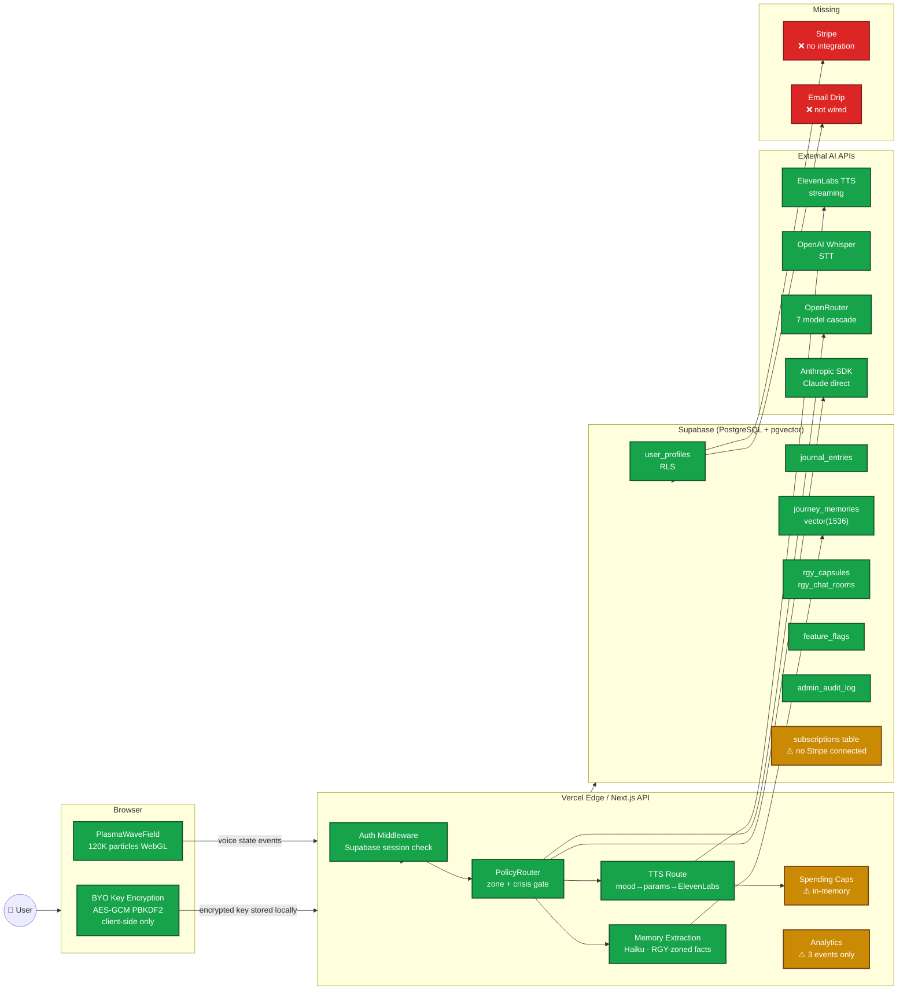

# Cubiqo — Current Architecture State (as of 2026-02-21)

**Author:** MO (CTO / Co-Founder)  
**Based on:** Direct code inspection — 157 API routes, 44 DB migrations, 80 components

## Colour Legend

| Colour | Meaning |
|--------|---------|
| 🟢 **Green** | Production-ready — fully implemented, tested, live |
| 🟡 **Yellow** | Partial — implemented but has a critical flaw or gap |
| 🔴 **Red** | Missing — does not exist; is a launch blocker or legal risk |
| ⚫ **Grey** | Placeholder — UI exists but no working backend |

---

## Diagram 1 — Full System Architecture (Current State)

```mermaid
flowchart TD
    classDef green  fill:#16a34a,color:#fff,stroke:#14532d,stroke-width:2px
    classDef yellow fill:#ca8a04,color:#fff,stroke:#713f12,stroke-width:2px
    classDef red    fill:#dc2626,color:#fff,stroke:#7f1d1d,stroke-width:2px
    classDef gray   fill:#6b7280,color:#fff,stroke:#374151,stroke-width:2px
    classDef title  fill:#1e293b,color:#94a3b8,stroke:#334155,stroke-width:1px

    %% ── USER ENTRY ──────────────────────────────────────────────────────────
    subgraph ENTRY["🌐 User Entry Points"]
        LAND["Landing Page\n/page.tsx"]:::green
        ONBD["Onboarding\n/onboarding"]:::yellow
        AUTH["Auth (Magic Link)\n/auth · Supabase"]:::green
        PRICE["Pricing Page\n/pricing (static)"]:::yellow
    end

    %% ── CORE PRODUCT LAYER ───────────────────────────────────────────────────
    subgraph CORE["💎 Core Product Layer"]
        CHAT["Chat / Voice\n/chat · ElevenLabs TTS\nWhisper STT"]:::green
        JOURNAL["Journal CRUD\n/journal · 24h gate\nentries/history/stats"]:::green
        JHISTUI["Journal History UI\n/journal/history page"]:::yellow
        CUBE["3D Plasma Cube\nPlasmaWaveField\n120K particles"]:::green
        VOICE_SM["Voice State Machine\nREADY→LISTEN→THINK→SPEAK"]:::green
        VOICE_MOD["Voice Modulation\nMadhyama Marg\nMood → TTS params"]:::green
        MEMORY["Journey Memory\npgvector · consent\nembeddings"]:::green
        AGENTS["AI Agents\n/agents · agent-portal"]:::green
        JOB["Job Hunt\n/job-hunt"]:::green
        BYO["BYO Mode\nAES-256-GCM client\nencryption"]:::green
        FILES["File Upload\n/files"]:::green
        MULTIMODAL["Multimodal\nimage+voice+text"]:::green
    end

    %% ── SOCIAL ARMY ──────────────────────────────────────────────────────────
    subgraph ARMY["⚔️ Social Army (Commander Tier)"]
        SA_WORKER["Content Worker\nsocial-army/worker.ts"]:::yellow
        SA_POSTER["Poster (Puppeteer)\nposter.ts — posts DIRECTLY\nno review gate ⚠️"]:::yellow
        SA_QUEUE["Content Queue\nSupabase table"]:::green
        SA_GFX["GFX Toolz\ngfxtoolz.js"]:::green
    end

    %% ── DEVELOPER / API LAYER ────────────────────────────────────────────────
    subgraph DEV["🔑 Developer / API Layer"]
        CUBIKEY_PAGE["CubiKey Page\n/cubikey\nBETA placeholder only"]:::gray
        CUBIKEY_SPEC["CubiKey Intent Router\nspec exists in CUBIKEY_SPEC.md\nnot yet built"]:::gray
        POLICY_ROUTER["PolicyRouter\nZone: YELLOW/GREEN/RED\nFREEDOM/TEAL"]:::green
        LLM_ROUTER["LLM Router\n7 providers\nAnthropic/OpenAI/Groq\nGoogle/OpenRouter"]:::green
    end

    %% ── RGY SYSTEM ───────────────────────────────────────────────────────────
    subgraph RGY["🎨 RGY Matching System"]
        RGY_CAPS["RGY Capsules\ncolour:intent:keywords\nDB + SQL functions"]:::green
        RGY_MATCH["Staged Matching\ncolour→intent→keyword\n→geofence→vector"]:::green
        RGY_ROOMS["Chat Rooms\ngeofenced · expiring"]:::green
        RGY_PROMATCH["ProMatch Discovery\nopportunity scoring"]:::green
    end

    %% ── INFRASTRUCTURE ───────────────────────────────────────────────────────
    subgraph INFRA["⚙️ Infrastructure"]
        FF["Feature Flags\nDB-backed · % rollout"]:::green
        RATE["Rate Limiting\nper-route"]:::green
        AUDIT["Audit Logging\nadmin_audit_log"]:::green
        SEC["Security Headers\nCSP · Permissions-Policy\n(fixed PR #185)"]:::green
        CAPS_MEM["Spending Caps\n$200 Anthropic/$200 ElevenLabs\n⚠️ IN-MEMORY ONLY\nresets on deploy"]:::yellow
        ANALYTICS["Analytics\nonly 3 events tracked\nno funnel · no retention"]:::yellow
        SUPABASE["Supabase (PostgreSQL)\n44 migrations · RLS\npgvector"]:::green
        VERCEL["Vercel\nEdge Functions\nCI/CD"]:::green
    end

    %% ── MISSING CRITICAL LAYER ───────────────────────────────────────────────
    subgraph MISSING["❌ Missing — Launch Blockers"]
        STRIPE["Stripe Billing\nDOES NOT EXIST\n0 npm packages"]:::red
        TOS["Terms of Service\nno live /terms page\nno ToS document"]:::red
        PRIVACY_PAGE["Privacy Policy Page\n/privacy not live\ndoc exists as .md only"]:::red
        EMAIL_DRIP["Email Drip\nno Day1/3/7/14/30\nsequence"]:::red
        REFERRAL["Referral Programme\nno referral_code\nin user_profiles"]:::red
        COOKIE["Cookie Consent Banner\nGDPR required\nnot implemented"]:::red
        STATUS["Status Page\nnot implemented"]:::red
        SUPPORT["Support Email\nsupport@cubiqo.ai\nnot active"]:::red
    end

    %% ── CONNECTIONS ──────────────────────────────────────────────────────────
    LAND --> AUTH
    AUTH --> ONBD
    ONBD --> CORE
    CHAT --> POLICY_ROUTER
    POLICY_ROUTER --> LLM_ROUTER
    CHAT --> VOICE_MOD
    VOICE_MOD --> CUBIKEY_PAGE
    JOURNAL --> MEMORY
    AGENTS --> LLM_ROUTER
    SA_WORKER --> SA_QUEUE
    SA_QUEUE --> SA_POSTER
    RGY_CAPS --> RGY_MATCH
    RGY_MATCH --> RGY_ROOMS
    CORE --> SUPABASE
    ARMY --> SUPABASE
    RGY --> SUPABASE
    INFRA --> SUPABASE
    PRICE -.->|"no checkout behind it"| STRIPE
```

---

## Diagram 2 — Data Flow (Current State)

---

## Component Readiness Summary Table

| Component | File / Route | Status | Critical Issue |
|-----------|-------------|--------|----------------|
| Auth (magic link) | `/auth` + Supabase | ✅ Green | — |
| 3D Plasma Cube | `PlasmaWaveField.tsx` | ✅ Green | — |
| Voice state machine | `VoiceStateIndicator.tsx` | ✅ Green | — |
| Voice modulation | `voice-modulation.ts` | ✅ Green | — |
| TTS (ElevenLabs) | `/api/tts` | ✅ Green | Security headers fixed PR#185 |
| STT (Whisper) | `/api/stt` | ✅ Green | — |
| PolicyRouter | `policy-router.ts` | ✅ Green | — |
| LLM Router (7 providers) | `llm-router.ts` | ✅ Green | — |
| BYO Key Encryption | `src/lib/byo/` | ✅ Green | — |
| Journal CRUD | `/api/journal/entries` | ✅ Green | — |
| Journal History API | `/api/journal/history` | ✅ Green | — |
| Journey Memory (vector) | `/api/journey/` | ✅ Green | — |
| RGY Capsule Matching | `rgy_capsules_and_matching.sql` | ✅ Green | — |
| AI Agents | `/api/agents/` | ✅ Green | — |
| Browser Automation | `/api/browser/` | ✅ Green | — |
| Feature Flags | `/api/feature-flags/` | ✅ Green | — |
| Security Headers | `middleware.ts` + `headers.ts` | ✅ Green | Fixed PR #185 |
| Audit Logging | `admin_audit_log` table | ✅ Green | — |
| Rate Limiting | per-route middleware | ✅ Green | — |
| Spending Caps (concept) | `spending-caps.ts` | 🟡 Yellow | **In-memory → resets on deploy** |
| Analytics | `events.ts` | 🟡 Yellow | **Only 3 events; no funnel** |
| Journal History UI | `/journal/history` page | 🟡 Yellow | Not connected to API |
| Onboarding | `/onboarding` | 🟡 Yellow | localStorage only; no email |
| Social Army poster | `poster.ts` | 🟡 Yellow | **No human-review gate in code** |
| Pricing page | `/pricing` | 🟡 Yellow | Static; no checkout behind it |
| CubiKey page | `/cubikey` | ⚫ Grey | Placeholder UI only |
| CubiKey API | spec only | ⚫ Grey | Not built |
| Stripe / Billing | — | 🔴 **RED** | **Does not exist at all** |
| Terms of Service | — | 🔴 **RED** | **Legal blocker** |
| /privacy live page | — | 🔴 **RED** | Doc exists; no live route |
| Email Drip | — | 🔴 **RED** | Not implemented |
| Referral Programme | — | 🔴 **RED** | No referral_code column |
| Cookie Consent | — | 🔴 **RED** | GDPR required |
| Status Page | — | 🔴 **RED** | Not implemented |
| Support Channel | — | 🔴 **RED** | Not set up |
