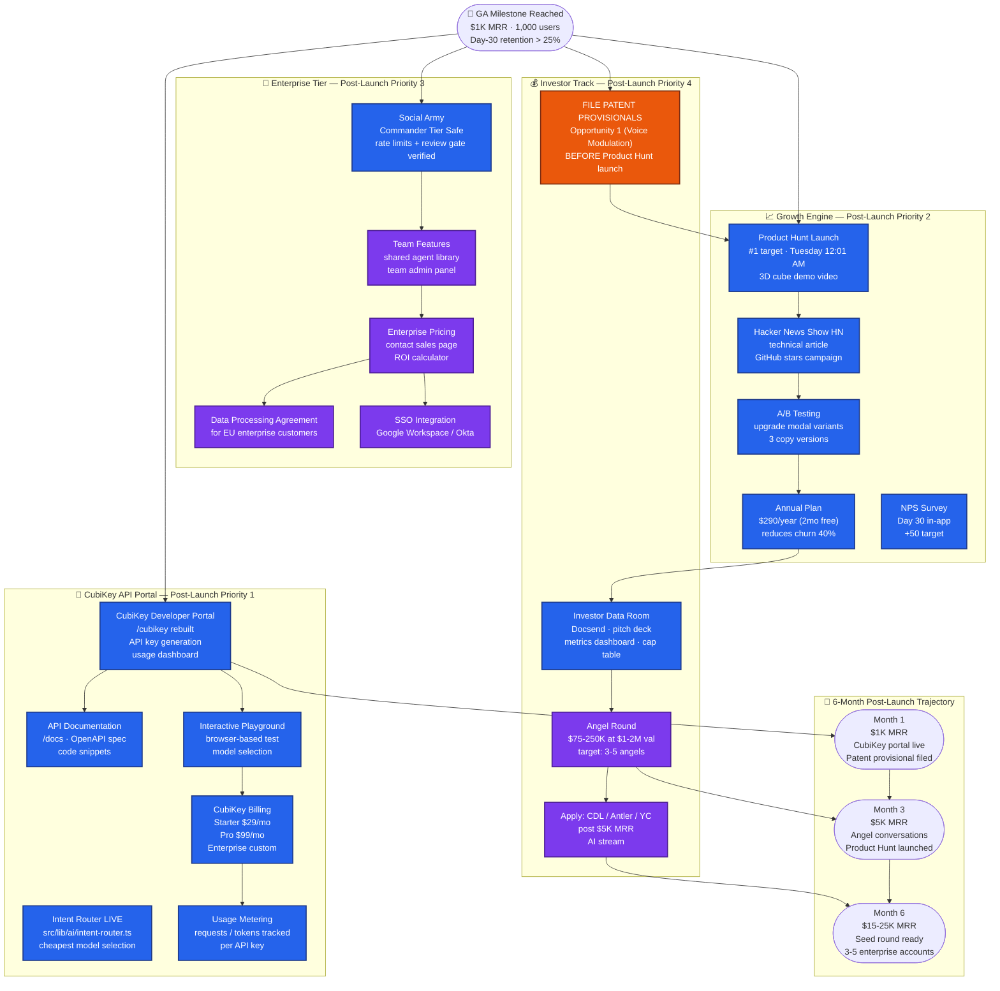

# Cubiqo — Architecture Roadmap: Pre-Launch → Post-Launch

**Author:** MO (CTO / Co-Founder)  
**Companion to:** `CUBIQO_ARCHITECTURE_CURRENT.md` (where we are)  
**Date:** 2026-02-21

## Priority Colour Legend

| Colour | Priority | Meaning |
|--------|----------|---------|
| 🔴 **Red / P0** | Launch blocker | Must be done before ANY user can pay or before legal exposure begins |
| 🟠 **Orange / P1** | Launch quality | Must be done before Product Hunt / Beta announcement |
| 🟡 **Yellow / P2** | Pre-launch enhancement | Should be done before GA; can slip to Week 1 post-launch if needed |
| 🟢 **Green** | Already done | No work required |
| 🔵 **Blue / Post-Launch** | Post-launch priority | Build after first $1K MRR |
| 🟣 **Purple / Post-Launch** | Long-term | Build toward seed round / enterprise |

---

## Diagram 1 — Pre-Launch Target Architecture (What Must Be Built)

```mermaid
flowchart TD
    classDef done    fill:#16a34a,color:#fff,stroke:#14532d,stroke-width:2px
    classDef p0      fill:#dc2626,color:#fff,stroke:#7f1d1d,stroke-width:2px
    classDef p1      fill:#ea580c,color:#fff,stroke:#7c2d12,stroke-width:2px
    classDef p2      fill:#ca8a04,color:#fff,stroke:#713f12,stroke-width:2px
    classDef post    fill:#2563eb,color:#fff,stroke:#1e3a8a,stroke-width:2px
    classDef purple  fill:#7c3aed,color:#fff,stroke:#4c1d95,stroke-width:2px

    %% ── LEGAL & COMPLIANCE ──────────────────────────────────────────────────
    subgraph LEGAL["⚖️ Legal & Compliance — P0 (Must ship first)"]
        TOS["Terms of Service\n/terms live page\n10 required clauses\n+lawyer review"]:::p0
        PRIV["Privacy Policy\n/privacy live page\nlink from footer + login"]:::p0
        COOKIE["Cookie Consent Banner\nfirst-visit GDPR gate"]:::p0
        REFUND["Refund Policy\nStripe requires this\nbefore payments"]:::p0
        AI_DISC["AI Disclaimer Badge\n'AI-generated · May be\ninaccurate' on every response"]:::p0
        JOURNAL_CRISIS["Journal Crisis Line\nin journal UI\n988 / 116 123 / 1-833-456-4566"]:::p0
        SA_CONSENT["Social Army Consent Screen\none-time checkbox before\nfirst activation"]:::p0
        AGE_GATE["Age Gate at Signup\n'I am 13 or older' checkbox"]:::p1
        GDPR_EXPORT["GDPR Data Export\n/api/user/export endpoint"]:::p1
        GDPR_DELETE["GDPR Data Delete\n/api/user/delete endpoint"]:::p1
    end

    %% ── BILLING ─────────────────────────────────────────────────────────────
    subgraph BILLING["💳 Billing — P0 (No revenue without this)"]
        STRIPE_PKG["Install stripe npm package\n+ STRIPE_SECRET_KEY env"]:::p0
        STRIPE_CHECKOUT["Stripe Checkout\nPro $29/mo · Lifetime $399\nCommander $499/mo"]:::p0
        STRIPE_WEBHOOK["/api/webhooks/stripe\nsubscription_created\nsubscription_cancelled\nupgrade/downgrade"]:::p0
        STRIPE_PORTAL["Billing Portal\n/settings → billing tab\nself-service cancel\n(EU legally required)"]:::p0
        SUB_TIER["subscription_tier column\nSTRIPE_CUSTOMER_ID in\nuser_profiles"]:::p0
        FEATURE_GATE["Feature gates enforced\ncheck subscription_tier\nbefore Pro features"]:::p0
        USAGE_COUNTER["Usage counters in UI\n'7/10 free voice messages'\nshown in real-time"]:::p0
        UPGRADE_MODAL["Upgrade modal at 90%\nnot 100% of limit"]:::p1
    end

    %% ── INFRASTRUCTURE FIXES ─────────────────────────────────────────────────
    subgraph INFRA["⚙️ Infrastructure Fixes — P0"]
        CAPS_DB["Spending Caps → Supabase\nmove from in-memory\nto DB (1 day fix)"]:::p0
        ANALYTICS_10["Analytics → 10+ events\nuser_signed_up\nfirst_voice_message\nfirst_journal_entry\nupgrade_modal_shown\nsubscription_created"]:::p0
        SA_GATE["Social Army Review Gate\nenforce human-approval\nin poster.ts code"]:::p0
    end

    %% ── ONBOARDING ──────────────────────────────────────────────────────────
    subgraph ONBOARD["🚀 Onboarding — P1"]
        WELCOME_EMAIL["Welcome Email\nafter signup\nResend / Loops"]:::p1
        FIRST_VALUE["First Value Moment\n< 10 min to Aha\nguided first voice message"]:::p1
        BYO_GUIDE["BYO Setup Guide\ninline tooltip + 3-step modal\nhow to get OpenAI key"]:::p1
        ONBD_PROGRESS["Progress Indicator\n'Step 2 of 3'"]:::p1
    end

    %% ── RETENTION ───────────────────────────────────────────────────────────
    subgraph RETENTION["📧 Retention — P1"]
        EMAIL_DRIP["Email Drip Sequence\nDay 1 · 3 · 7 · 14 · 30"]:::p1
        JOURNAL_HISTORY_UI["Journal History UI\nconnect existing API\nstreak counter"]:::p1
        STREAK["Streak System\njournaling streak\nvoid detection"]:::p2
    end

    %% ── TRUST ───────────────────────────────────────────────────────────────
    subgraph TRUST["🔒 Trust Signals — P1/P2"]
        STATUS_PAGE["Status Page\nBetteruptime free tier\nstatus.cubiqo.ai"]:::p1
        SUPPORT_EMAIL["support@cubiqo.ai\nauto-response SLA\n< 24 hours"]:::p1
        PUBLIC_METRICS["Public Metrics\n/open · user count\nMRR · uptime"]:::p2
        REFERRAL["Referral Programme\nreferral_code column\n$10/$10 give/get"]:::p2
    end

    %% ── ALREADY DONE ────────────────────────────────────────────────────────
    subgraph DONE["✅ Already Production-Ready"]
        AUTH_DONE["Auth (Magic Link)"]:::done
        CHAT_DONE["Chat + Voice + TTS"]:::done
        JOURNAL_DONE["Journal CRUD + History API"]:::done
        CUBE_DONE["3D Plasma Cube"]:::done
        VOICE_SM_DONE["Voice State Machine"]:::done
        VOICE_MOD_DONE["Voice Modulation (Madhyama Marg)"]:::done
        MEMORY_DONE["Journey Memory (pgvector)"]:::done
        RGY_DONE["RGY Capsule Matching"]:::done
        FF_DONE["Feature Flags"]:::done
        SECURITY_DONE["Security Headers (PR #185)"]:::done
        AGENTS_DONE["AI Agents System"]:::done
        BYO_DONE["BYO Mode (AES-256-GCM)"]:::done
        AUDIT_DONE["Audit Logging"]:::done
    end

    %% ── CRITICAL PATHS ───────────────────────────────────────────────────────
    TOS --> STRIPE_PKG
    REFUND --> STRIPE_CHECKOUT
    STRIPE_PKG --> STRIPE_CHECKOUT
    STRIPE_CHECKOUT --> STRIPE_WEBHOOK
    STRIPE_WEBHOOK --> SUB_TIER
    SUB_TIER --> FEATURE_GATE
    FEATURE_GATE --> USAGE_COUNTER
    CAPS_DB --> ANALYTICS_10
    ANALYTICS_10 --> EMAIL_DRIP
    WELCOME_EMAIL --> FIRST_VALUE
    FIRST_VALUE --> EMAIL_DRIP
    JOURNAL_HISTORY_UI --> STREAK
    STATUS_PAGE --> PUBLIC_METRICS
    PUBLIC_METRICS --> REFERRAL
```

---

## Diagram 2 — Post-Launch Target Architecture (After First $1K MRR)

---

## Priority Action Summary

### P0 — Must complete before ANY user can pay (Days 1–7)

| Action | Owner | Days | Why |
|--------|-------|------|-----|
| Install Stripe npm + env key | Blossom | 0.5 | Gate for everything billing |
| Terms of Service live at /terms | MO (draft) + lawyer | 3–5 | Stripe requires it; legal exposure |
| Stripe checkout (Pro/Commander/Lifetime) | Blossom | 2 | No revenue without this |
| Stripe webhook + subscription_tier column | Blossom | 1 | Gates features on tier |
| Refund Policy page | MO | 0.5 | Stripe requires it |
| Spending caps → Supabase | Blossom | 1 | **Financial risk in prod** |
| Social Army review gate in code | Blossom | 2 | Legal/reputational risk |
| /privacy live page | Bubbles | 0.5 | GDPR required |
| Cookie consent banner | Bubbles | 1 | GDPR required |
| AI disclaimer badge | Bubbles | 0.5 | Required by ToS clause |
| Journal crisis line | Bubbles | 0.5 | Mental-health data obligation |

### P1 — Must complete before Beta/Product Hunt announcement (Days 7–21)

| Action | Owner | Days | Why |
|--------|-------|------|-----|
| Analytics → 10+ events | Blossom | 3 | Cannot steer without data |
| Welcome email on signup | Blossom | 1 | Day-30 retention |
| Email drip Day 1/3/7/14/30 | Blossom + MO | 3 | 20–30% retention improvement |
| Feature gates enforced per tier | Blossom | 2 | Pro features must actually gate |
| Usage counters in UI | Bubbles | 2 | Highest-ROI conversion tactic |
| Upgrade modal at 90% limit | Bubbles | 1 | 20–30% conversion lift |
| Journal History UI connected | Bubbles | 2 | Primary Pro upsell trigger |
| BYO setup guide inline | Bubbles | 1 | Reduces Day-1 abandonment |
| Status page (Betteruptime) | MO | 0.5 | Trust signal |
| support@cubiqo.ai active | MO | 0.5 | Cannot go GA without support |
| Social Army consent screen | Bubbles | 1 | Before Commander tier opens |
| Age gate at signup | Bubbles | 0.5 | COPPA/GDPR |

### P2 — Pre-GA enhancement (Days 21–30)

| Action | Owner | Days | Why |
|--------|-------|------|-----|
| Referral programme | Blossom + Bubbles | 3–4 | 20–30% of signups from referral |
| Public metrics /open page | MO | 1 | Trust signal + press hook |
| GDPR data export/delete | Blossom | 2 | Legal compliance |
| Billing portal in /settings | Bubbles | 1 | EU legally required for cancel |
| Annual plan option ($290/yr) | Blossom | 1 | Reduces churn 40% |
