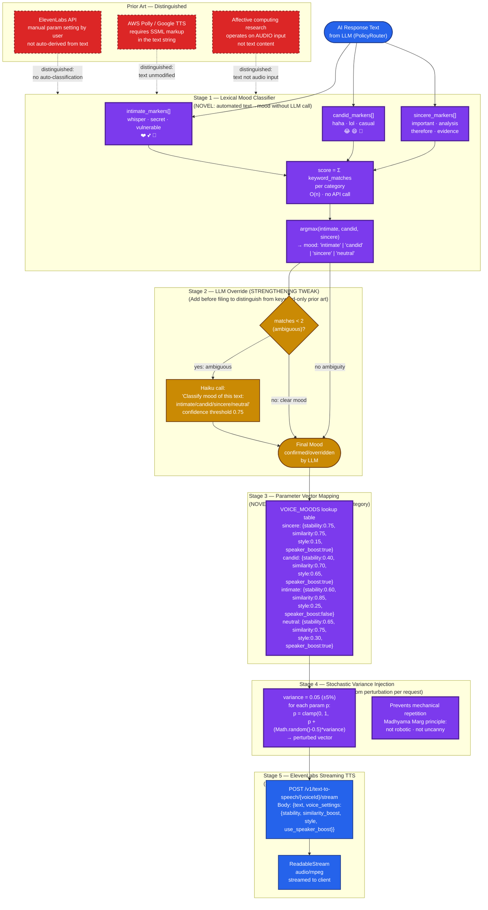
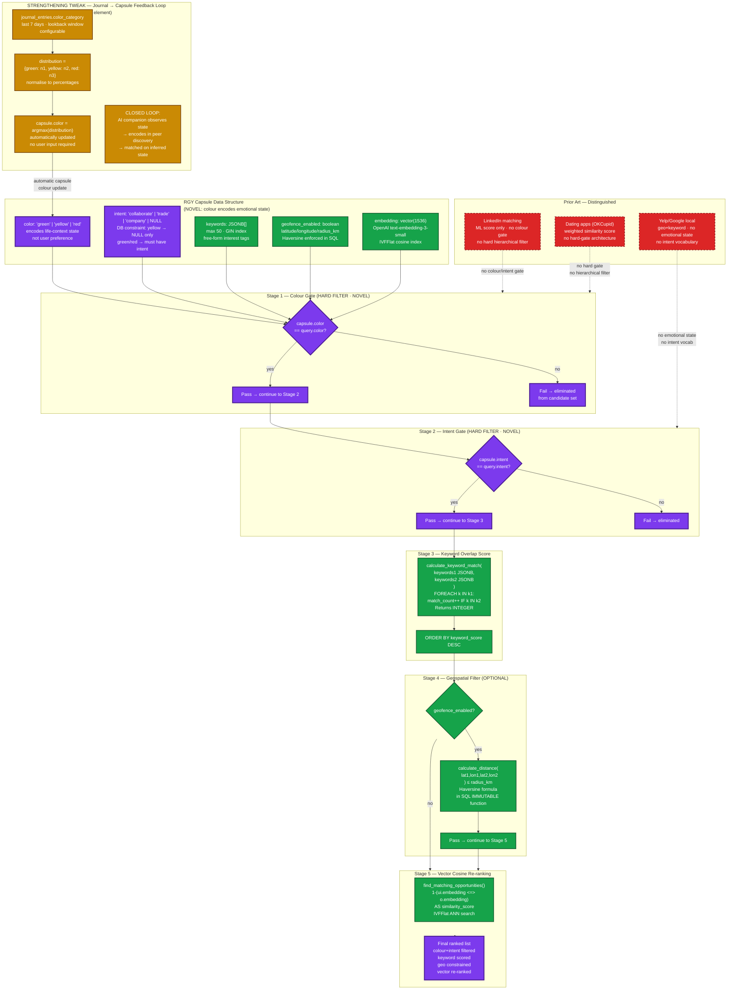
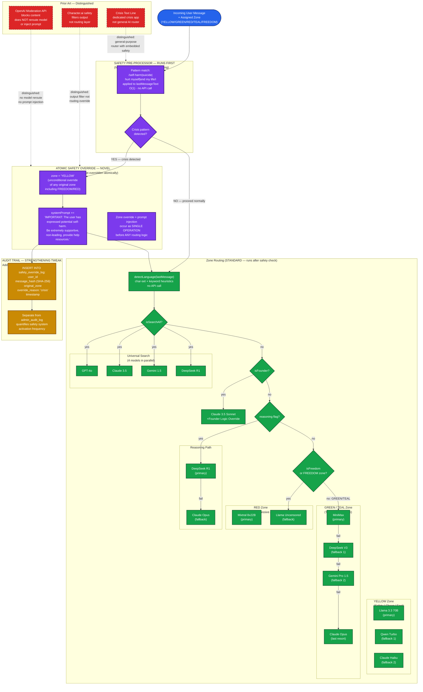
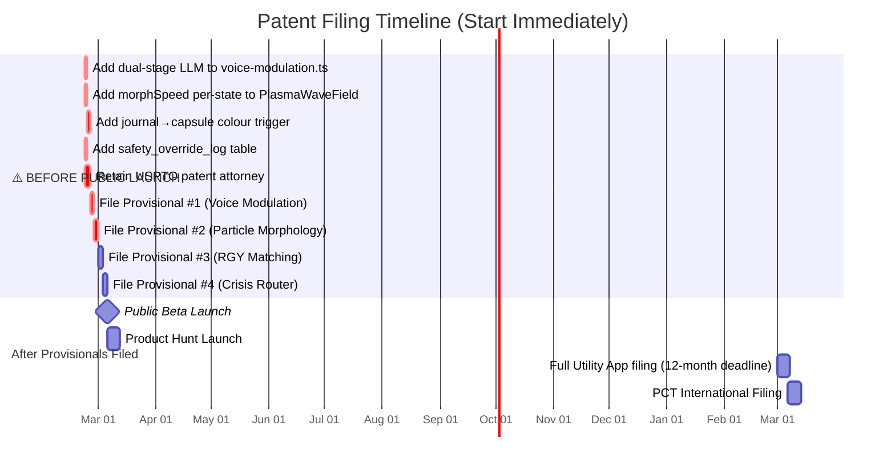

# Cubiqo — Patent Flow Diagrams

**Author:** MO (CTO / Co-Founder)  
**Companion to:** `PATENT_OPPORTUNITIES.md`  
**Date:** 2026-02-21  
**Purpose:** Technical flow diagrams for each of the 4 patentable opportunities, including the specific code paths, the novel technical combination being claimed, and the implementation specifications needed to strengthen each claim before filing.

> **⚠️ File provisional patents BEFORE any public demo, blog post, or Product Hunt launch.**  
> Public disclosure destroys international novelty rights in most jurisdictions permanently.

---

## Colour Legend for Diagrams

| Colour | Meaning |
|--------|---------|
| 🟣 **Purple** | The novel patentable step / combination |
| 🟢 **Green** | Already implemented in code — prior art risk assessed |
| 🟡 **Yellow** | The strengthening tweak — adds to build before filing |
| 🔵 **Blue** | Standard infrastructure / not claimed |
| 🔴 **Red** | Prior art references (how we distinguish) |

---

## Patent 1 — Content-Adaptive TTS Parameter Modulation
### *"Madhyama Marg Voice Synthesis"*
**Files:** `src/lib/voice-modulation.ts` · `/api/tts/route.ts`  
**Approval estimate:** 62–70%



### Implementation Specification for Filing

**Files to touch before provisional filing:**

```typescript
// src/lib/voice-modulation.ts — ADD: dual-stage classifier
export async function detectVoiceMoodWithConfirmation(
  text: string,
  byoKey?: string
): Promise<VoiceMood> {
  // Stage 1: keyword classification (existing)
  const keywordMood = detectVoiceMood(text)   // existing function
  const matches = countTopMatches(text)        // new helper

  // Stage 2: LLM confirmation for ambiguous cases (NEW — add before filing)
  if (matches < 2) {
    const confirmed = await confirmMoodWithLLM(text, byoKey)  // new function
    return confirmed ?? keywordMood
  }
  return keywordMood
}

// NEW: confirmMoodWithLLM() — Haiku API call with threshold
// NEW: addNaturalVariation() already exists ✓ — document it explicitly
// DOCUMENT: the VOICE_MOODS calibration table origin (madhyama marg philosophy)
```

**What to send attorney:**
- `src/lib/voice-modulation.ts` (full file)
- `/api/tts/route.ts` (full file)
- `VOICE_MODULATION.md` (philosophical basis + calibration rationale)
- This diagram
- Date evidence: git commit timestamps proving pre-disclosure creation

---

## Patent 2 — AI-State-Driven 3D Particle Morphology System
### *"Plasma Cube Voice Avatar"*
**Files:** `src/components/cube/PlasmaWaveField.tsx` · `EnergyCubeScene.tsx`  
**Approval estimate:** 58–66%

```mermaid
flowchart TD
    classDef novel   fill:#7c3aed,color:#fff,stroke:#4c1d95,stroke-width:3px
    classDef done    fill:#16a34a,color:#fff,stroke:#14532d,stroke-width:2px
    classDef tweak   fill:#ca8a04,color:#fff,stroke:#713f12,stroke-width:2px
    classDef infra   fill:#2563eb,color:#fff,stroke:#1e3a8a,stroke-width:2px
    classDef priorart fill:#dc2626,color:#fff,stroke:#7f1d1d,stroke-width:2px,stroke-dasharray:5 5

    subgraph INIT["Initialisation (mount-time)\n120,000 Particles · NOVEL"]
        WAVE_POS["wavePositions[]\nFloat32Array(PARTICLE_COUNT × 3)\nribbon layers · layerDepth\nlayerDensity"]:::novel
        CUBE_POS["cubePositions[]\nFloat32Array(PARTICLE_COUNT × 3)\npolyhedral solid geometry"]:::novel
        DUAL["Both arrays stored\nSIMULTANEOUSLY in memory\nat mount — not generated\non demand"]:::novel
        COLORS["colors[] per-particle\nFloat32Array(PARTICLE_COUNT × 3)\ninitialised to neutral palette"]:::novel
        SOUL["soul nodes[]\n200 secondary particles\nindependent orbit system"]:::done
    end

    subgraph STATE_MACHINE["AI Conversational State Machine\n(external driver)"]
        IDLE["animationState: 'idle'\ntargetMorph = 0.0"]:::infra
        LISTEN["animationState: 'listening'\ntargetMorph = 1.0"]:::infra
        THINK["animationState: 'thinking'\ntargetMorph = 1.0"]:::infra
        SPEAK["animationState: 'speaking'\ntargetMorph = 1.0"]:::infra
    end

    subgraph PALETTE["Colour Palette Selection\n(STATE → COLOUR · NOVEL)"]
        P_NEUTRAL["neutral:\n#00ffff · #0088ff\n#8800ff · #ff00ff\n#ff0088 · #ff4400"]:::novel
        P_THINKING["thinking:\n#00ffff · #00aa88\n#4400ff · #8800ff\n#ff8800 · #ffaa00"]:::novel
        P_SPEAKING["speaking:\n#00ff88 · #00aa88\n#0088ff · #8800ff\n#ff0088 · #ffff00"]:::novel
        P_LISTENING["listening:\n#00ffcc · #00ffff\n#0088ff · #8800ff\n#ff00ff · #ff0088\n#ff8800"]:::novel
    end

    subgraph MORPH_TWEAK["Morph Rate (STRENGTHENING TWEAK)\nAdd before filing"]
        MORPH_RATE["morphSpeed = state === 'listening' ? 0.04\n: state === 'thinking' ? 0.02\n: state === 'speaking' ? 0.03\n: 0.06  // idle → wave, faster"]:::tweak
        REASON2["State-parameterised morph RATE\nnot just morph TARGET\nnot in any prior art"]:::tweak
    end

    subgraph RENDER_LOOP["Render Loop (useFrame · 60fps)\nNOVEL COMBINATION"]
        LERP["position = lerp(\n  wavePos[i],\n  cubePos[i],\n  morphProgress\n) per particle"]:::novel
        UPDATE_COLOR["assign palette[i % palette.length]\nto color buffer"]:::novel
        GPU["WebGL GPU update\npoints.geometry.attributes\n.position.needsUpdate = true"]:::infra
    end

    subgraph PRIOR2["Prior Art — Distinguished"]
        SIRI["Apple Siri orb\npre-animated asset\nnot real-time particles"]:::priorart
        ECHO["Amazon Echo ring\nLED colour only\nno geometry morphology"]:::priorart
        CORTANA["Microsoft Cortana\npre-rendered video\nnot GPU particle system"]:::priorart
    end

    WAVE_POS & CUBE_POS --> DUAL
    DUAL & COLORS & SOUL --> INIT

    IDLE & LISTEN & THINK & SPEAK --> MORPH_RATE
    LISTEN --> P_LISTENING
    THINK --> P_THINKING
    SPEAK --> P_SPEAKING
    IDLE --> P_NEUTRAL

    MORPH_RATE --> LERP
    P_NEUTRAL & P_LISTENING & P_THINKING & P_SPEAKING --> UPDATE_COLOR
    LERP & UPDATE_COLOR --> GPU

    SIRI & ECHO & CORTANA -.->|"distinguished:\npre-baked / no\nstate-driven morphology"| RENDER_LOOP
```



### Implementation Specification for Filing

```typescript
// src/components/cube/PlasmaWaveField.tsx — ADD before filing:

// TWEAK: State-parameterised morph speed (makes claim more specific)
const MORPH_SPEEDS: Record<AIState, number> = {
  neutral:   0.06,  // fast snap to wave (idle)
  listening: 0.04,  // moderate — attentive urgency
  thinking:  0.02,  // slow — deliberate, pondering
  speaking:  0.03,  // medium — confident
  error:     0.08,  // fast — alarm urgency
}

// In useFrame:
// const speed = MORPH_SPEEDS[aiState]
// morphProgress.current = lerp(morphProgress.current, targetMorph.current, speed)
```

**What to send attorney:**
- `PlasmaWaveField.tsx` (full component)
- `EnergyCubeScene.tsx` (state mapping)
- Screen recording of the morph in action (timestamp = prior-creation evidence)
- PARTICLE_COUNT constant (120,000 — establishes scale of technical contribution)

---

## Patent 3 — Hierarchical Context Capsule Matching with Geospatial Constraint
### *"RGY Staged Peer Discovery"*
**Files:** `supabase/migrations/20260218000200_rgy_capsules_and_matching.sql`  
**Approval estimate:** 55–64%



### Implementation Specification for Filing

```sql
-- supabase/migrations/YYYYMMDD_journal_capsule_feedback.sql
-- ADD before filing: journal → capsule colour auto-update

CREATE OR REPLACE FUNCTION sync_capsule_color_from_journal(p_user_id UUID)
RETURNS VOID AS $$
DECLARE
  green_count INTEGER;
  yellow_count INTEGER;
  red_count INTEGER;
  dominant_color TEXT;
BEGIN
  -- Count journal entries by color_category (last 7 days)
  SELECT
    COUNT(*) FILTER (WHERE color_category = 'green'),
    COUNT(*) FILTER (WHERE color_category = 'yellow'),
    COUNT(*) FILTER (WHERE color_category = 'red')
  INTO green_count, yellow_count, red_count
  FROM journal_entries
  WHERE user_id = p_user_id
    AND timestamp >= NOW() - INTERVAL '7 days';

  -- Determine dominant colour
  IF green_count >= yellow_count AND green_count >= red_count THEN
    dominant_color := 'green';
  ELSIF red_count >= yellow_count THEN
    dominant_color := 'red';
  ELSE
    dominant_color := 'yellow';
  END IF;

  -- Update user's active capsule colour
  UPDATE rgy_capsules
  SET color = dominant_color, updated_at = NOW()
  WHERE user_id = p_user_id AND is_active = true;
END;
$$ LANGUAGE plpgsql;

-- Trigger: run after every journal_entries INSERT
CREATE TRIGGER trg_sync_capsule_color
AFTER INSERT ON journal_entries
FOR EACH ROW EXECUTE FUNCTION sync_capsule_color_from_journal(NEW.user_id);
```

**What to send attorney:**
- `20260218000200_rgy_capsules_and_matching.sql` (full migration)
- `src/lib/rgy-matching/discovery-service.ts`
- The journal→capsule feedback trigger above (add before filing)
- This diagram showing the pipeline

---

## Patent 4 — Safety-First Conversational AI Routing with Crisis Override
### *"Crisis Escalation Router"*
**File:** `src/lib/ai/policy-router.ts`  
**Approval estimate:** 52–60%



### Implementation Specification for Filing

```typescript
// src/lib/ai/policy-router.ts — ADD before filing:

// NEW: Safety audit trail (separate table from admin_audit_log)
interface SafetyOverrideEvent {
  user_id: string | null
  message_hash: string         // SHA-256 of message (privacy-preserving)
  original_zone: ZoneColor
  override_reason: 'crisis_pattern_match'
  pattern_matched: string      // which pattern triggered (not full message)
  timestamp: string
}

private static async logSafetyOverride(
  event: SafetyOverrideEvent
): Promise<void> {
  // Insert into dedicated safety_override_log table
  // (create migration: safety_override_log with RLS)
  const supabase = await createClient()
  await supabase.from('safety_override_log').insert(event)
}

// IN route() method, after crisis detection:
if (selfHarmPatterns.test(lastMessageText)) {
  await PolicyRouter.logSafetyOverride({
    user_id: config.userId ?? null,
    message_hash: await sha256(lastMessageText),  // hash, never store raw
    original_zone: zone,
    override_reason: 'crisis_pattern_match',
    pattern_matched: 'self_harm_vocabulary',
    timestamp: new Date().toISOString()
  })
  zone = 'YELLOW'
  systemPrompt += '...'
}
```

**Migration to add before filing:**

```sql
-- supabase/migrations/YYYYMMDD_safety_override_log.sql
CREATE TABLE safety_override_log (
  id UUID PRIMARY KEY DEFAULT gen_random_uuid(),
  user_id UUID REFERENCES auth.users(id),  -- nullable (anon users)
  message_hash TEXT NOT NULL,              -- SHA-256 (not raw message)
  original_zone TEXT NOT NULL,
  override_reason TEXT NOT NULL DEFAULT 'crisis_pattern_match',
  pattern_matched TEXT NOT NULL,
  created_at TIMESTAMPTZ DEFAULT NOW()
);

-- RLS: admin-only read
ALTER TABLE safety_override_log ENABLE ROW LEVEL SECURITY;
CREATE POLICY "admin_read_safety_log" ON safety_override_log
  FOR SELECT USING (auth.jwt()->'app_metadata'->>'role' = 'admin');
```

**What to send attorney:**
- `policy-router.ts` (full file)
- The `safety_override_log` migration above (implement it before filing)
- This diagram
- Evidence that the override is *pre-routing* (before zone selection) — this is the novel architecture claim

---

## Filing Timeline and Pre-Filing Checklist



### Pre-Filing Code Checklist (Must complete before attorney drafts claims)

- [ ] `voice-modulation.ts` — add `detectVoiceMoodWithConfirmation()` with LLM second stage
- [ ] `PlasmaWaveField.tsx` — add `MORPH_SPEEDS` record, use in `useFrame` loop
- [ ] New migration — `journal_to_capsule_sync trigger` (Opportunity 3 closed loop)
- [ ] New migration — `safety_override_log` table + RLS (Opportunity 4 audit trail)
- [ ] Collect git timestamps as prior-creation evidence for all four
- [ ] Screen-record the 3D cube morph with audio (Opportunity 2 visual evidence)
- [ ] **Do NOT publish any blog post, demo video, GitHub README update, or Product Hunt teaser until all provisionals are filed**

### Cost Summary

| Filing | Attorney est. | USPTO fee | Total |
|--------|--------------|-----------|-------|
| Provisional #1 (Voice) | $1,000–$3,000 | $320 | ~$3,320 |
| Provisional #2 (Cube) | $1,000–$3,000 | $320 | ~$3,320 |
| Provisional #3 (RGY) | $1,000–$3,000 | $320 | ~$3,320 |
| Provisional #4 (Crisis) | $1,000–$2,000 | $320 | ~$2,320 |
| **Total provisionals** | | | **~$12,280** |
| Full utility (all 4, 12 months later) | $32,000–$56,000 | $3,200 | ~$48,000 |
| PCT international (12 months later) | $4,000 | $4,000 | ~$8,000 |

> **Recommended sequence:** File Provisional #1 (Voice) in the next 7–14 days. File Provisionals #2–4 within 30 days. Start Product Hunt campaign only after all four provisionals have filing receipt dates from USPTO.
