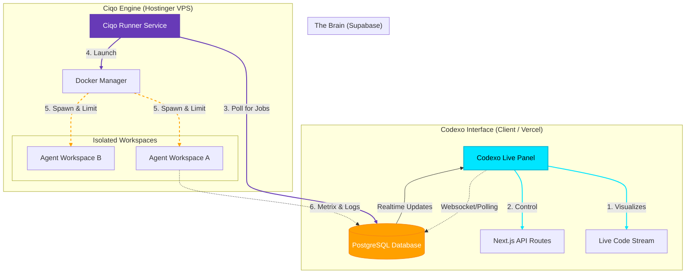

# Ciqo & Codexo: The AI Engine & Interface

**Ciqo** is the isolated execution engine running on Hostinger.
**Codexo** is the futuristic, live-code interface running on Vercel (Client).

## System Architecture

## Codexo Features (The Interface)
*   **Visual Style**: Glassmorphism, Neon Glows (Cyan/Pink/Purple), 3D Code Cubes.
*   **Live Data**: Real-time CPU usage, Memory pressure, Console logs.
*   **Interactivity**: "Jack in" to a running container to see the terminal.
