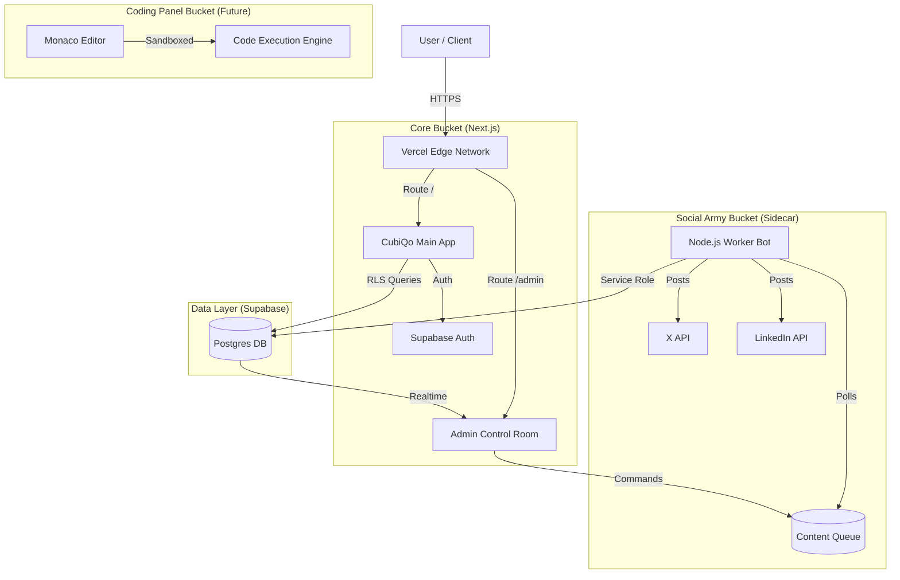

# CubiQo System Architecture V1.0 - "The Fortress"

## 1. Executive Summary
This document defines the technical architecture for the CubiQo Ecosystem as of Feb 2026. It establishes the "Buckets" strategy for independent scaling, the strict deployment pipelines for stability, and the security protocols for enterprise-grade safety.

---

## 2. System Topology (End-to-End)

---

## 3. The "Buckets" Strategy
To ensure long-term scalability, we segregate functionality into designated "Buckets". This prevents the "Monolith from Hell" scenario.

| Bucket Name | Location | Type | Responsibility |
| :--- | :--- | :--- | :--- |
| **Core Brain** | `src/app` | Next.js Service | Main UI, Chat Logic, Router, Auth. |
| **Control Room** | `src/app/admin` | Protected Route | Admin Dashboard, feature toggles, monitoring. |
| **Social Army** | `social-army/` | Node.js Worker | Headless browser automation, content posting. |
| **Agents** | `agents/` | Python/Node | Standalone AI agents for complex offline tasks. |
| **Extension** | `chrome-extension/` | Browser Ext | Client-side capture and "Ghost Mode" helper. |

### Architecture Decision: Monorepo vs Sidecars
*   **Current State**: Loose Monorepo.
*   **Target State**: **Integrated Monorepo**.
    *   We keep code in one repo for ease of versioning.
    *   We deploy "Buckets" independently where needed (e.g., Social Army deployed to a Docker container or Vercel Serverless Function, distinct from the Main Web App).

---

## 4. Deployment Pipeline & Safety

We enforce a strict 3-Tier Flow with a "Safety Valve".

### The Pipeline
1.  **🚧 Staging (`staging0217`)**:
    *   **Purpose**: Integration testing.
    *   **Data**: Dummy Data / Seed Data.
    *   **Access**: Internal Team only.
    *   **Trigger**: Push to branch.
    
2.  **🟢 Production (`main`)**:
    *   **Purpose**: Live Traffic.
    *   **Data**: Real User Data (Sanitized).
    *   **Access**: Public.
    *   **Trigger**: Pull Request from Staging.

3.  **🛡️ Safety Valve (`production-fallback`)**:
    *   **Purpose**: Doomsday Recovery.
    *   **Content**: Last Known Good Configuration (frozen).
    *   **Trigger**: Manual Revert only.

### Environment Isolation
*   **Prod DB**: `cubiqo-production` (Strict RLS, No Delete/Drop).
*   **Stage DB**: `cubiqo-staging` (Reset allowed).
*   **Local**: `local` (Mock).

---

## 5. Security & Infrastructure

### "Zero Trust" Database Access
*   **Client (Browser)**: API Keys are `anon` (restricted). Can ONLY read/write own data via **Row Level Security (RLS)**.
*   **Admin Console**: Access via Role `service_role` or elevated User Claims.
*   **Workers**: Access via `SUPABASE_SERVICE_ROLE_KEY` (never exposed to client).

### Encryption Standards
*   **At Rest**: Postgres TDE (Transparent Data Encryption).
*   **In Transit**: TLS 1.3 for all connections.
*   **Secrets**: All API Keys (Twitter, OpenAI) stored in Supabase Vault or Vercel Encrypted Env Vars.

---

## 6. Next Steps (Immediate)
1.  **Freeze Production**: Lock `main` branch.
2.  **Hydrate Staging**: Run `MASTER_STAGING_SETUP.sql`.
3.  **Activate Worker**: Deploy `social-army` bucket to a persistent runner (e.g. Railway/Render or Vercel Cron).

*Architecture confirmed by Antigravity.*
