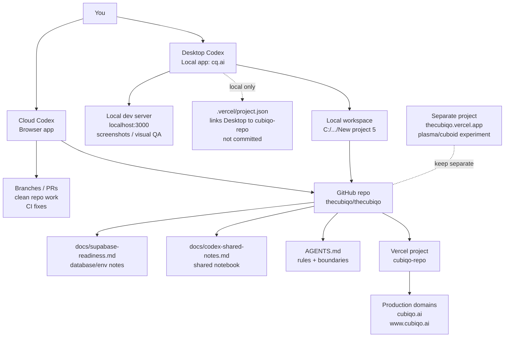
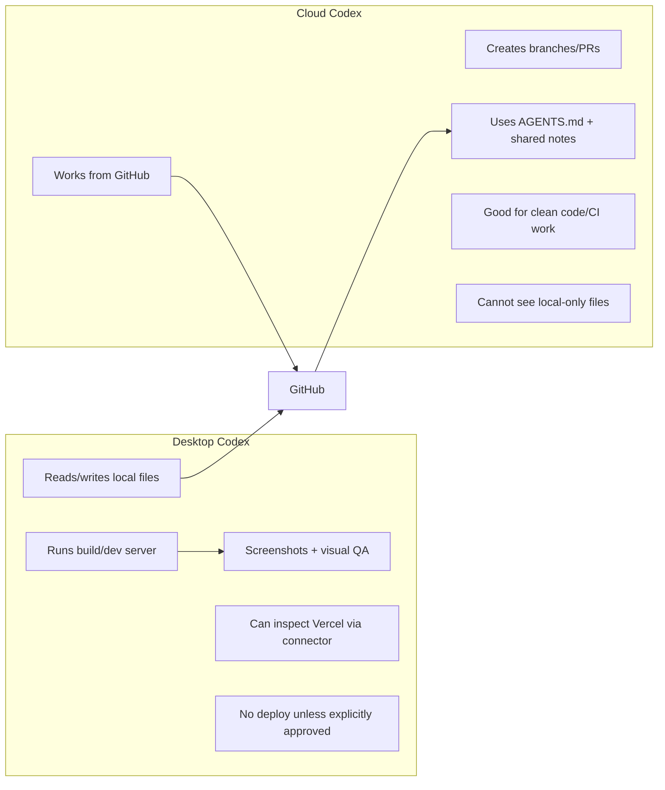
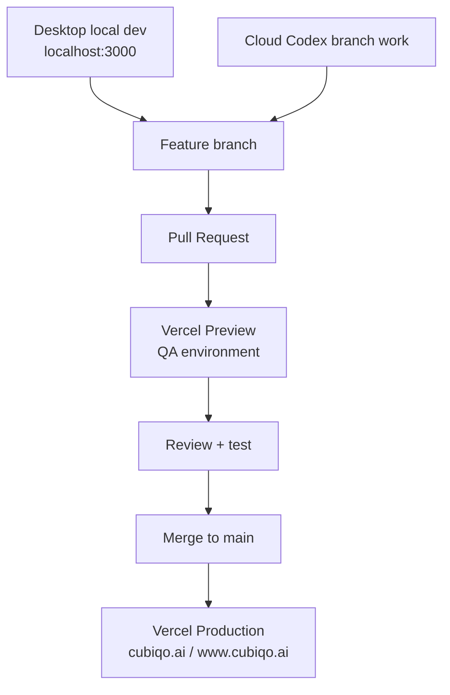

# Codex Shared Notes

This document is the shared working notebook for Desktop Codex and Cloud Codex on the primary CubiQo app.

Use it for durable project context that should survive across chats, machines, and agents. Keep it factual, concise, and updated through normal Git branches and pull requests.

## Scope

- Primary project: `cubiqo-repo`
- Production domains: `cubiqo.ai`, `www.cubiqo.ai`
- GitHub repo: `thecubiqo/thecubiqo`
- Separate experiment: `thecubiqo.vercel.app` plasma/cuboid project

Do not mix the separate plasma/cuboid experiment into the primary `cubiqo.ai` app unless the user explicitly asks.

## Current Operating Model

- Desktop Codex is best for local browser checks, screenshots, and visual QA.
- Cloud Codex is best for clean repo branches, PRs, CI fixes, and reviewable code changes.
- GitHub is the source of truth between Desktop and Cloud.
- Desktop-only changes must be committed and pushed before Cloud Codex can see them.
- Cloud Codex changes must be fetched or pulled before Desktop Codex can see them locally.

## Architecture Overview

## Operating Rules Summary

- `cubiqo-repo` / `cubiqo.ai` / `www.cubiqo.ai` is the main project.
- `thecubiqo.vercel.app` is the separate plasma/cuboid experiment.
- GitHub is the sync layer between Desktop Codex and Cloud Codex.
- Desktop changes: commit, push, then Cloud Codex can see them.
- Cloud changes: push, then Desktop Codex must fetch or pull.
- Do not edit `main` directly.
- Do not deploy production unless explicitly approved.
- Use Vercel PR previews as QA.

## Pipeline Summary

- Dev: local Desktop Codex and feature branches.
- QA: Vercel pull request preview deployments.
- Prod: `main` deploys to `cubiqo.ai` / `www.cubiqo.ai`.
- Rollback: redeploy previous Vercel deployment or revert the merged PR.

## Environment Model

- Production: `main` deploys to `cubiqo.ai` / `www.cubiqo.ai`.
- QA: Vercel pull request preview deployments.
- Development: local Desktop Codex and feature branches.
- Optional future staging: add only if PR previews are not enough.

## Readiness Notes

- Local Desktop workspace has `.vercel/project.json` linked to `cubiqo-repo`, but `.vercel/` is ignored and local-only.
- `AGENTS.md` is the primary instruction file for agents.
- Supabase readiness notes live in `docs/supabase-readiness.md`.
- Avoid Terraform/Jenkins unless project complexity grows enough to justify formal infrastructure automation.

## Change Log

- 2026-05-02: Added agent guardrails, Supabase readiness notes, and this shared notebook on branch `codex/cubiqo-ai-readiness`.
