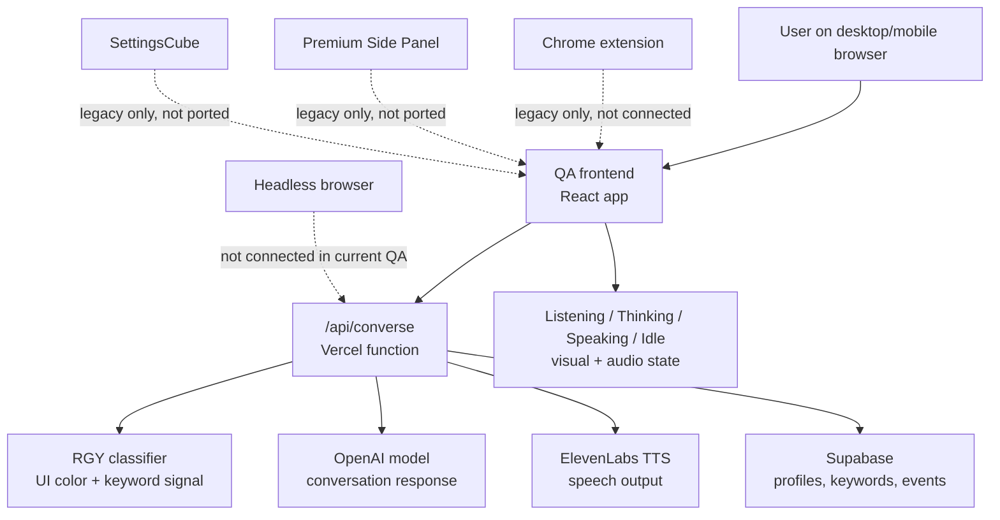
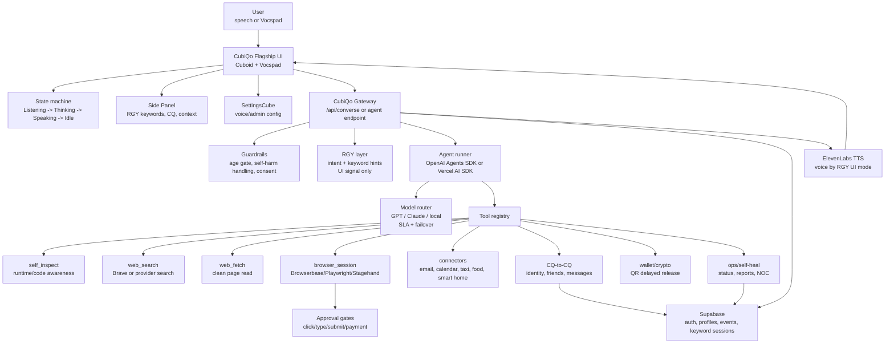

# CubiQo QA Architecture

Date: 2026-05-04

## Current QA State

Current meaning:
- QA can converse through the Vercel API.
- QA can use OpenAI and ElevenLabs.
- QA can classify RGY and track keywords.
- QA has Supabase auth/database provisioning work.
- QA does not yet have production browser control, CQ-to-CQ, the legacy Side Panel, SettingsCube, or the full agentic tool loop.

## Future Flagship State

Future meaning:
- CubiQo becomes agentic when the LLM can use tools in a controlled loop.
- RGY stays a product/UI/voice signal, not a model selector.
- Browser search and browser control are separate capabilities.
- CQ identity, Side Panel, SettingsCube, RGY, voice, consent, and governance remain CubiQo-owned product logic.

## Browser vs Search

Brave API or another search API:
- Finds web results.
- Returns links/snippets or fetched text.
- Does not click buttons, fill forms, log into sites, or complete workflows by itself.

Headless/browser automation:
- Opens a real browser session.
- Navigates pages.
- Clicks, types, screenshots, extracts, downloads, and observes page state.
- Can execute tasks like booking tickets only with explicit approval gates.

The right future design uses both:
- `web_search` for information lookup.
- `browser_session` for actions on websites.

## Is Browser Control Part Of Agentic?

Yes, but it is one tool inside agentic behavior, not the whole definition.

Agentic CubiQo means:
- It understands a goal.
- It decides whether tools are needed.
- It calls tools safely.
- It observes results.
- It continues or stops based on progress.
- It reports what it did.

Browser control is one powerful tool in that loop.

## Can CubiQo Code Like Codex?

Possible, but only as a gated mode.

Requirements:
- dedicated sandbox/workspace execution
- file read/write permissions
- test runner
- patch review
- Git branch/PR flow
- owner/founder approval
- clear separation from normal public chat

Legacy had self-coding concepts and terminal/workspace APIs, but the current QA app should not expose Codex-like code execution until sandboxing and governance are built.

## Recommended Near-Term Build

1. Add `self_inspect` and `runtime_status` tools.
2. Add an agent runner around `/api/converse`.
3. Add read-only `web_search` and `web_fetch`.
4. Add Side Panel shell and RGY keyword bands.
5. Add hosted browser sessions with explicit consent.
6. Port CQ-to-CQ identity and messaging.
7. Add SettingsCube.
8. Add self-reporting/NOC.
9. Add high-risk tools only after approval gates are mature.

