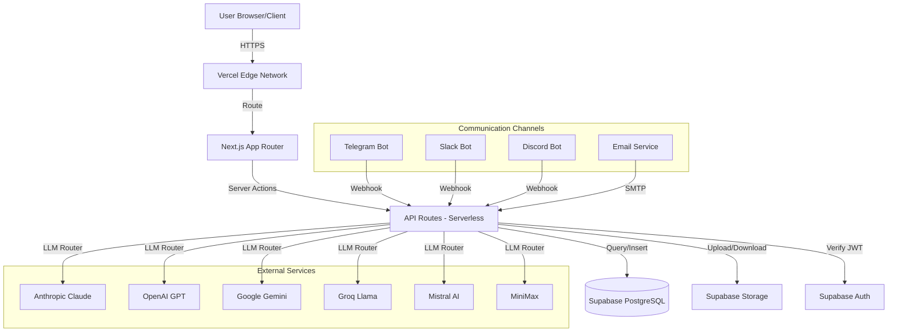
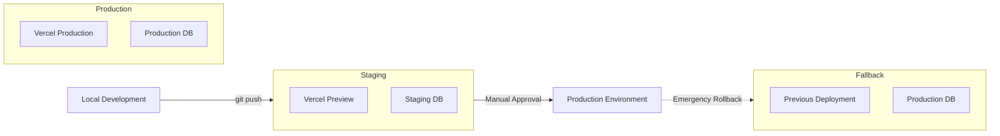
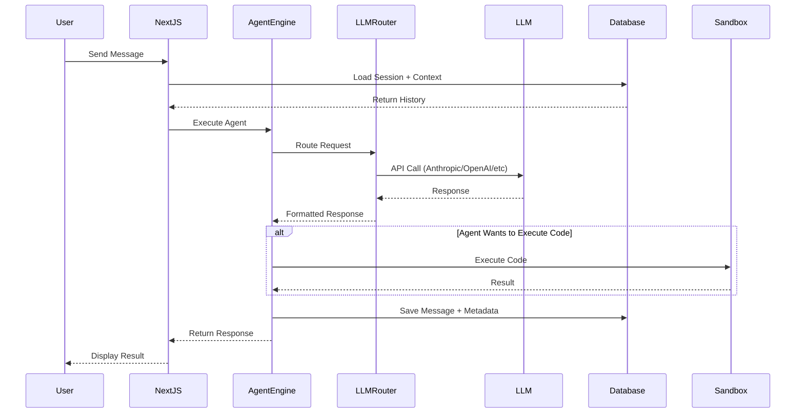
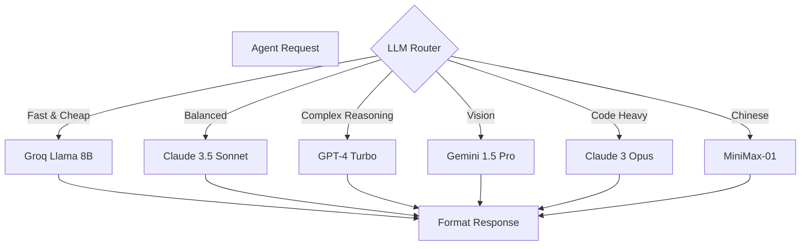
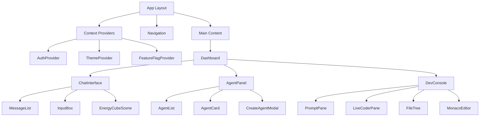
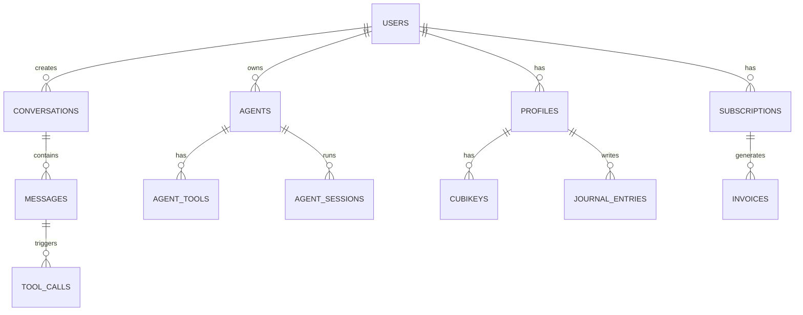
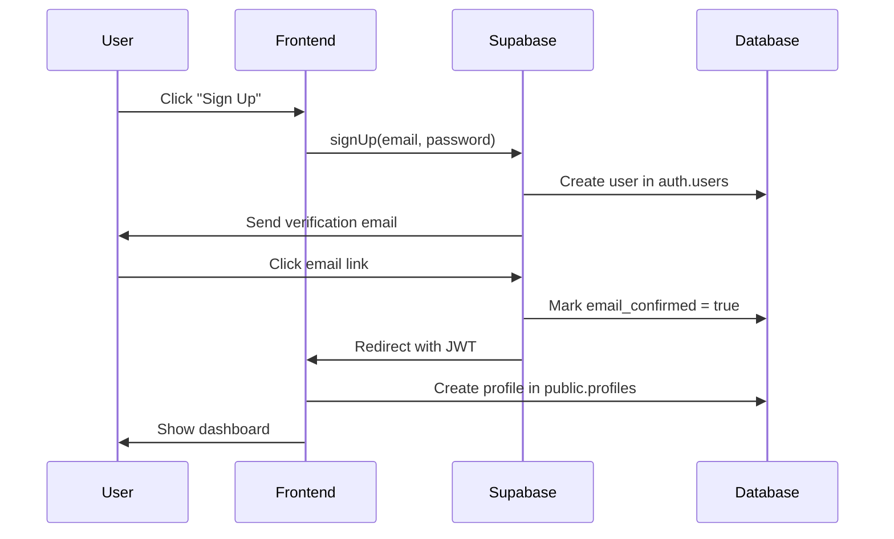
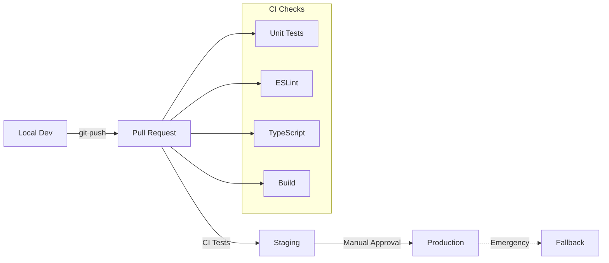
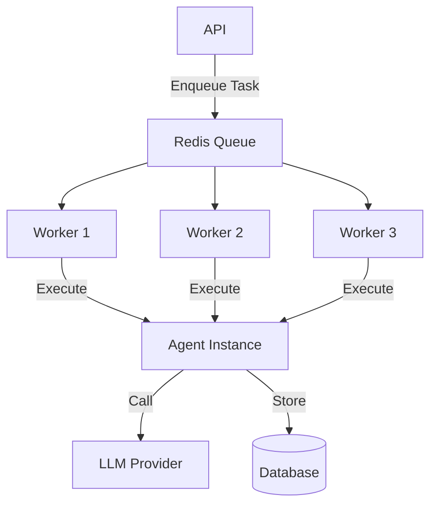

# CubiQo Emergent System Architecture

> **Version**: 1.0  
> **Last Updated**: 2024  
> **Status**: Production (Staging + Production Environments)

---

## Table of Contents

1. [System Overview](#system-overview)
2. [System Topology](#system-topology)
3. [Technology Stack](#technology-stack)
4. [Monorepo Architecture](#monorepo-architecture)
5. [Agent Orchestration Engine](#agent-orchestration-engine)
6. [LLM Router & Provider Abstraction](#llm-router--provider-abstraction)
7. [Control Plane APIs](#control-plane-apis)
8. [Frontend Architecture](#frontend-architecture)
9. [Data Layer](#data-layer)
10. [Authentication & Authorization](#authentication--authorization)
11. [Communication Channels](#communication-channels)
12. [Feature Flag System](#feature-flag-system)
13. [Deployment Pipeline](#deployment-pipeline)
14. [Security Architecture](#security-architecture)
15. [Performance & Optimization](#performance--optimization)
16. [Monitoring & Observability](#monitoring--observability)
17. [Pending Implementation Areas](#pending-implementation-areas)
18. [Development Workflow](#development-workflow)
19. [API Reference](#api-reference)
20. [Database Schema](#database-schema)

---

## System Overview

**CubiQo** is an Emotional AI Companion platform that provides users with intelligent, empathetic AI agents capable of:
- Natural conversation with emotional intelligence
- Task execution and automation
- Multi-modal communication (text, voice, 3D avatars)
- Agent-to-agent collaboration
- Code generation and execution
- Browser automation
- File system operations
- Scheduled task management

### Core Value Proposition

CubiQo is not just a chatbot—it's an **AI Operating System** where:
- Multiple specialized agents work together
- Agents can write and execute code
- Agents can create and manage other agents
- Users can create custom agents and sell them to other users
- Agents communicate across channels (Web, Telegram, Slack, Discord, Email)
- The system learns and adapts to user preferences

### Key Technical Characteristics

- **Serverless Architecture**: Zero server management, infinite scale
- **Edge-First**: Low latency via Vercel Edge Network
- **Multi-LLM**: Route to best model for each task (Anthropic, OpenAI, Google, Groq, Mistral, MiniMax)
- **Self-Healing**: Agents can debug and fix their own code
- **Secure**: Row-level security, sandbox isolation for code execution
- **Extensible**: Plugin architecture for tools and providers

---

## System Topology



### Deployment Architecture



### Data Flow



---

## Technology Stack

### Frontend
- **Framework**: Next.js 14 (App Router)
- **UI Library**: React 18
- **Language**: TypeScript 5.x (Strict Mode)
- **Styling**: Tailwind CSS 3.x
- **3D Graphics**: Three.js + React Three Fiber
- **Animation**: Framer Motion, GSAP
- **State Management**: React Context + Hooks
- **Code Editor**: Monaco Editor (VS Code engine)
- **Icons**: Lucide React
- **Forms**: Native HTML5 + Validation

### Backend
- **Runtime**: Node.js 20.x (Vercel Serverless)
- **Framework**: Next.js API Routes
- **Language**: TypeScript 5.x
- **Database ORM**: Supabase JS Client
- **Auth**: Supabase Auth (JWT)
- **File Storage**: Supabase Storage

### Database
- **Primary**: PostgreSQL 15 (via Supabase)
- **Real-time**: Supabase Realtime (WebSockets)
- **Security**: Row Level Security (RLS)
- **Migrations**: Supabase Migrations

### AI/LLM Providers
- **Anthropic**: Claude 3.5 Sonnet, Claude 3 Opus, Claude 3 Haiku
- **OpenAI**: GPT-4 Turbo, GPT-4, GPT-3.5 Turbo
- **Google**: Gemini 1.5 Pro, Gemini 1.5 Flash
- **Groq**: Llama 3.1 (405B, 70B, 8B), Mixtral 8x7B
- **Mistral**: Mistral Large, Mistral Medium, Mistral Small
- **MiniMax**: MiniMax-01 (Chinese market)
- **Meta**: Llama models via Groq/Ollama

### DevOps & Infrastructure
- **Hosting**: Vercel (Edge Network)
- **CI/CD**: Vercel Auto-Deploy + GitHub Actions
- **Version Control**: Git + GitHub
- **Environment Management**: Vercel Environment Variables
- **Monitoring**: Vercel Analytics, Sentry (planned)
- **Testing**: Vitest, React Testing Library

### Communication
- **Telegram**: telegraf library
- **Slack**: @slack/web-api
- **Discord**: discord.js
- **Email**: Resend / SendGrid (planned)

### Code Execution
- **Python**: Pyodide (WASM in browser) + Server-side sandboxed execution
- **JavaScript/TypeScript**: VM2 + Isolated contexts
- **Bash**: Child process with restricted permissions

---

## Monorepo Architecture

CubiQo uses a **bucket-based monorepo** strategy where each major subsystem is isolated but shares common utilities.

### Directory Structure

```
/thecubiqo
├── src/                          # Core Brain - Main Application
│   ├── app/                      # Next.js App Router
│   │   ├── (auth)/              # Auth routes (login, signup, verify)
│   │   ├── (dashboard)/         # Protected dashboard routes
│   │   ├── admin/               # Control Room (Admin Panel)
│   │   ├── api/                 # API Routes (serverless functions)
│   │   ├── chat/                # Chat interface
│   │   ├── settings/            # User settings
│   │   └── layout.tsx           # Root layout
│   ├── components/              # React components
│   │   ├── agents/              # Agent-related UI
│   │   ├── ui/                  # Reusable UI components
│   │   ├── 3d/                  # Three.js components
│   │   └── dev/                 # Developer tools UI
│   ├── lib/                     # Shared libraries
│   │   ├── ai/                  # LLM Router + Providers
│   │   ├── engine/              # Agent Orchestration Engine
│   │   ├── db/                  # Database utilities
│   │   ├── auth/                # Auth helpers
│   │   └── utils/               # General utilities
│   └── types/                   # TypeScript type definitions
│
├── agents/                       # Agent Definitions & Tools
│   ├── a1-henry/                # Lead Agent (Henry)
│   ├── a2-dev/                  # Developer Agent
│   ├── a3-writer/               # Content Writer Agent
│   ├── a4-tester/               # QA/Testing Agent
│   ├── a5-marketing/            # Marketing Agent
│   ├── a6-animator/             # Animation/3D Agent
│   ├── a7-business/             # Business Strategy Agent
│   └── tools/                   # Shared agent tools
│
├── social-army/                  # Social Media Management
│   ├── telegram/                # Telegram bot
│   ├── slack/                   # Slack bot
│   ├── discord/                 # Discord bot
│   └── email/                   # Email integration
│
├── chrome-extension/             # Browser Extension
│   ├── manifest.json
│   ├── background/              # Service worker
│   ├── content/                 # Content scripts
│   └── popup/                   # Extension popup UI
│
├── supabase/                     # Database & Backend
│   ├── migrations/              # SQL migrations
│   ├── functions/               # Edge functions
│   └── seed.sql                 # Seed data
│
├── docs/                         # Documentation
│   ├── api/                     # API documentation
│   ├── guides/                  # User guides
│   └── architecture/            # Architecture docs (this file)
│
├── scripts/                      # Build & deployment scripts
├── tests/                        # Test suites
├── public/                       # Static assets
└── package.json                  # Dependencies
```

### Bucket Strategy

Each bucket can be independently:
- **Developed**: Separate dev teams
- **Tested**: Independent test suites
- **Deployed**: Separate deployment pipelines (future)
- **Versioned**: Independent versioning

#### 1. Core Brain (`src/`)
The main Next.js application. Handles:
- Web UI rendering
- API routing
- Agent orchestration
- User authentication
- Data persistence

#### 2. Control Room (`src/app/admin`)
Admin dashboard for:
- Monitoring agent activity
- Managing users and subscriptions
- Viewing system metrics
- Feature flag management
- Emergency controls

#### 3. Social Army (`social-army/`)
Multi-channel communication layer:
- Telegram bot server
- Slack bot server
- Discord bot server
- Email service
- Webhook handlers

#### 4. Agents (`agents/`)
Agent definitions, prompts, and tools:
- Each agent has its own directory
- Shared tools in `tools/`
- Agent configurations
- Custom tool implementations

#### 5. Chrome Extension (`chrome-extension/`)
Browser extension for:
- Web scraping
- Page interaction
- Context injection
- Quick access to CubiQo

---

## Agent Orchestration Engine

Located in `src/lib/engine/`, this is the heart of CubiQo.

### Core Components

#### 1. AgentInstance Class

```typescript
// src/lib/engine/agent-instance.ts
class AgentInstance {
  id: string;
  name: string;
  systemPrompt: string;
  model: string;
  provider: LLMProvider;
  tools: Tool[];
  memory: Message[];
  
  async execute(userMessage: string): Promise<AgentResponse> {
    // 1. Load context from memory
    // 2. Format prompt with system + user message
    // 3. Route to appropriate LLM
    // 4. Handle tool calls (if any)
    // 5. Save response to memory
    // 6. Return formatted response
  }
  
  async callTool(toolName: string, args: any): Promise<any> {
    // Execute tool and return result
  }
  
  async compact(): Promise<void> {
    // Compress old messages to save tokens
  }
}
```

#### 2. Default Agents (The Seven)

| ID | Name | Role | Model | Tools |
|----|------|------|-------|-------|
| A1 | Henry | Lead Agent, Coordinator | Claude 3.5 Sonnet | All tools |
| A2 | Dev | Software Engineer | Claude 3.5 Sonnet | code, file, git |
| A3 | Writer | Content Creator | GPT-4 Turbo | search, web |
| A4 | Tester | QA Engineer | Claude 3 Haiku | test, debug |
| A5 | Marketing | Growth Specialist | GPT-4 | social, analytics |
| A6 | Animator | 3D/Motion Designer | Gemini 1.5 Pro | render, animate |
| A7 | Business | Strategy Advisor | Claude 3 Opus | finance, analytics |

**Henry (A1)** is special:
- **Coordinator**: Routes tasks to other agents
- **Multi-tool**: Can use all tools
- **Autonomous**: Can spawn sub-agents for complex tasks
- **Learning**: Learns from feedback and improves routing

#### 3. Tool System

Tools are functions that agents can call to interact with the world.

**Built-in Tools** (`src/lib/engine/tools/`):

1. **code_execute**: Execute Python/JS/TS/Bash code in sandbox
2. **file_read**: Read file contents
3. **file_write**: Write to file system
4. **file_delete**: Delete files
5. **search_web**: Search the internet
6. **browse_url**: Fetch and parse web pages
7. **send_email**: Send emails
8. **create_image**: Generate images (DALL-E, Stable Diffusion)
9. **transcribe_audio**: Speech-to-text
10. **analyze_image**: Image analysis (GPT-4 Vision)
11. **query_database**: Run SQL queries
12. **schedule_task**: Create cron jobs
13. **call_agent**: Call another agent
14. **browser_automate**: Control browser with Playwright

**Tool Definition Schema**:

```typescript
interface Tool {
  name: string;
  description: string;
  parameters: {
    type: "object";
    properties: Record<string, {
      type: string;
      description: string;
      required?: boolean;
    }>;
  };
  execute: (args: any, context: ExecutionContext) => Promise<any>;
}
```

#### 4. Session Management

```typescript
interface Session {
  id: string;
  userId: string;
  agentId: string;
  messages: Message[];
  metadata: {
    createdAt: Date;
    lastActivityAt: Date;
    tokenCount: number;
    toolCalls: number;
  };
}
```

**Auto-Compaction**:
- When `tokenCount > 8000`, compress old messages
- Summarize every 10 messages into 1
- Keep last 20 messages uncompressed
- Saves 70-80% tokens while preserving context

#### 5. Cron System

```typescript
// src/lib/engine/cron.ts
interface CronJob {
  id: string;
  schedule: string; // cron syntax: "0 9 * * *"
  agentId: string;
  action: string;
  enabled: boolean;
}

// Examples:
// "0 9 * * *" - Daily at 9am
// "*/15 * * * *" - Every 15 minutes
// "0 0 * * 0" - Weekly on Sunday midnight
```

**Use Cases**:
- Daily standup reports
- Weekly newsletter generation
- Hourly social media monitoring
- Monthly billing reminders

---

## LLM Router & Provider Abstraction

Located in `src/lib/ai/llm-router.ts`, this component abstracts away provider differences.

### Supported Providers

```typescript
type LLMProvider = 
  | 'anthropic'
  | 'emergent'    // Default multi-provider with fallback
  | 'openai'
  | 'groq'
  | 'google'
  | 'openrouter'
  | 'mistral'
  | 'minimax';
```

### Router Logic



### Routing Strategy

1. **Task Analysis**:
   - Classify task type (code, creative, reasoning, vision)
   - Estimate complexity (token count, tool usage)
   - Check user tier (Free, Pro, Commander, General)

2. **Provider Selection**:
   ```typescript
   function selectProvider(task: Task, userTier: Tier): Provider {
     if (task.type === 'vision') return 'google';
     if (task.type === 'code') return 'anthropic';
     if (task.complexity < 3 && userTier === 'free') return 'groq';
     if (task.requiresReasoning) return 'openai';
     return 'emergent'; // Default with fallback
   }
   ```

3. **Fallback Chain**:
   ```
   Primary → Secondary → Tertiary
   Claude 3.5 Sonnet → GPT-4 Turbo → Groq Llama 70B
   ```

### Emergent Provider

The "emergent" provider is special—it's a **meta-provider** that:
- **Tries multiple providers** in parallel
- **Selects best response** based on quality scoring
- **Falls back** if primary fails
- **Learns** which provider works best for each task type

```typescript
// src/lib/ai/emergent-provider.ts
async function emergentCall(prompt: string): Promise<string> {
  const results = await Promise.allSettled([
    anthropicCall(prompt),
    openaiCall(prompt),
    groqCall(prompt),
  ]);
  
  const scored = results
    .filter(r => r.status === 'fulfilled')
    .map(r => ({
      response: r.value,
      score: evaluateQuality(r.value),
    }));
  
  return scored.sort((a, b) => b.score - a.score)[0].response;
}
```

### Provider Configuration

```typescript
// Environment Variables
ANTHROPIC_API_KEY=sk-ant-...
OPENAI_API_KEY=sk-...
GOOGLE_API_KEY=AI...
GROQ_API_KEY=gsk_...
MISTRAL_API_KEY=...
MINIMAX_API_KEY=...
OPENROUTER_API_KEY=...
```

### Cost Optimization

| Provider | Model | Input (per 1M tokens) | Output (per 1M tokens) |
|----------|-------|----------------------|------------------------|
| Groq | Llama 3.1 8B | $0.05 | $0.08 |
| Anthropic | Claude 3.5 Sonnet | $3.00 | $15.00 |
| OpenAI | GPT-4 Turbo | $10.00 | $30.00 |
| Google | Gemini 1.5 Flash | $0.35 | $1.05 |
| Mistral | Mistral Large | $8.00 | $24.00 |

**Strategy**:
- Use Groq for simple tasks (80% of requests)
- Use Claude for moderate tasks (15%)
- Use GPT-4 for complex tasks (5%)
- Average cost: **$0.50 per 1M tokens**

---

## Control Plane APIs

All APIs are serverless functions in `src/app/api/`.

### 1. Agent Management APIs

#### `POST /api/agents` - Create Agent
```typescript
// Request
{
  "name": "MyAgent",
  "systemPrompt": "You are a helpful assistant",
  "model": "claude-3-5-sonnet-20241022",
  "provider": "anthropic",
  "tools": ["code_execute", "file_read"]
}

// Response
{
  "success": true,
  "data": {
    "id": "agent_abc123",
    "name": "MyAgent",
    "createdAt": "2024-01-01T00:00:00Z"
  }
}
```

#### `GET /api/agents` - List Agents
```typescript
// Response
{
  "success": true,
  "data": [
    {
      "id": "agent_abc123",
      "name": "MyAgent",
      "isActive": true,
      "messageCount": 42
    }
  ]
}
```

#### `POST /api/agents/:id/execute` - Execute Agent
```typescript
// Request
{
  "message": "Write a Python script to fetch weather data",
  "sessionId": "session_xyz789" // optional
}

// Response
{
  "success": true,
  "data": {
    "response": "Here's a Python script...",
    "toolCalls": [
      {
        "tool": "code_execute",
        "args": { "code": "import requests..." },
        "result": "Success"
      }
    ]
  }
}
```

### 2. Code Execution API

#### `POST /api/code` - Execute Code
```typescript
// Request
{
  "language": "python",
  "code": "print('Hello, World!')",
  "timeout": 5000,
  "sandbox": true
}

// Response
{
  "success": true,
  "data": {
    "output": "Hello, World!\n",
    "exitCode": 0,
    "executionTime": 123
  }
}
```

**Security**:
- Code runs in **isolated sandbox**
- **Timeout enforcement** (max 30s)
- **Memory limits** (256MB for Python, 128MB for JS)
- **No network access** by default
- **No file system access** outside `/tmp`

**Supported Languages**:
- Python 3.11 (Pyodide for browser, CPython for server)
- JavaScript (Node 20)
- TypeScript (transpiled to JS)
- Bash (restricted shell)

### 3. AI Coder API

#### `POST /api/coder` - AI-Powered Code Generation
```typescript
// Request
{
  "prompt": "Create a REST API for user management",
  "context": {
    "files": ["src/types/user.ts", "src/db/schema.sql"],
    "framework": "Next.js",
    "language": "TypeScript"
  }
}

// Response
{
  "success": true,
  "data": {
    "files": [
      {
        "path": "src/app/api/users/route.ts",
        "content": "import { NextRequest... }",
        "action": "create"
      },
      {
        "path": "src/types/user.ts",
        "content": "export interface User...",
        "action": "update"
      }
    ],
    "explanation": "I created a REST API with GET, POST, PUT, DELETE endpoints..."
  }
}
```

**Features**:
- **Virtual File System**: Simulates file operations
- **Multi-file editing**: Create/update/delete multiple files
- **Context-aware**: Understands project structure
- **Auto-testing**: Generates tests for generated code
- **Self-healing**: Fixes bugs automatically

### 4. Browser Automation API

#### `POST /api/browser` - Control Browser
```typescript
// Request
{
  "action": "navigate",
  "url": "https://example.com"
}

// Response
{
  "success": true,
  "data": {
    "title": "Example Domain",
    "html": "<html>...</html>"
  }
}
```

**Actions**:
- `navigate`: Go to URL
- `click`: Click element
- `type`: Type text into input
- `screenshot`: Take screenshot
- `scrape`: Extract data from page
- `wait`: Wait for element

**Tech**: Playwright (Chromium)

### 5. Session Management API

#### `GET /api/sessions/:id` - Get Session
```typescript
// Response
{
  "success": true,
  "data": {
    "id": "session_xyz789",
    "messages": [
      {
        "role": "user",
        "content": "Hello",
        "timestamp": "2024-01-01T00:00:00Z"
      },
      {
        "role": "assistant",
        "content": "Hi! How can I help?",
        "timestamp": "2024-01-01T00:00:01Z"
      }
    ],
    "metadata": {
      "tokenCount": 142,
      "toolCalls": 0
    }
  }
}
```

#### `DELETE /api/sessions/:id` - Delete Session
```typescript
// Response
{
  "success": true,
  "data": {
    "deleted": true
  }
}
```

### 6. File Operations API

#### `GET /api/files` - List Files
```typescript
// Response
{
  "success": true,
  "data": [
    {
      "name": "document.pdf",
      "size": 1024000,
      "url": "https://storage.supabase.co/..."
    }
  ]
}
```

#### `POST /api/files` - Upload File
```typescript
// Request (multipart/form-data)
{
  "file": <binary>,
  "bucket": "user-files"
}

// Response
{
  "success": true,
  "data": {
    "url": "https://storage.supabase.co/...",
    "size": 1024000
  }
}
```

### 7. Communication APIs

#### `POST /api/telegram/webhook` - Telegram Webhook
```typescript
// Telegram sends updates here
{
  "update_id": 123456,
  "message": {
    "chat": { "id": 789 },
    "text": "Hello"
  }
}
```

#### `POST /api/slack/webhook` - Slack Webhook
```typescript
// Slack sends events here
{
  "type": "event_callback",
  "event": {
    "type": "message",
    "text": "Hello"
  }
}
```

### API Authentication

All APIs require authentication via JWT:

```typescript
// Headers
Authorization: Bearer <jwt_token>

// JWT payload
{
  "sub": "user_abc123",
  "email": "user@example.com",
  "tier": "pro",
  "exp": 1704067200
}
```

### Rate Limiting

| Tier | Requests/minute | Requests/day |
|------|----------------|--------------|
| Free | 10 | 1,000 |
| Pro | 60 | 10,000 |
| Commander | 300 | 100,000 |
| General | 1000 | Unlimited |

---

## Frontend Architecture

### App Structure

```
src/app/
├── layout.tsx                    # Root layout with providers
├── page.tsx                      # Landing page
├── (auth)/
│   ├── login/page.tsx           # Login page
│   ├── signup/page.tsx          # Signup page
│   └── verify/page.tsx          # Email verification
├── (dashboard)/
│   ├── layout.tsx               # Dashboard layout
│   ├── chat/page.tsx            # Chat interface
│   ├── agents/page.tsx          # Agent management
│   ├── files/page.tsx           # File manager
│   └── settings/page.tsx        # User settings
└── admin/
    ├── layout.tsx               # Admin layout
    ├── page.tsx                 # Admin dashboard
    ├── users/page.tsx           # User management
    ├── agents/page.tsx          # Agent monitoring
    └── analytics/page.tsx       # System analytics
```

### Component Architecture



### Key Components

#### 1. Chat Interface (`src/components/chat/`)

**ChatInterface.tsx**:
```typescript
export function ChatInterface() {
  const [messages, setMessages] = useState<Message[]>([]);
  const [input, setInput] = useState('');
  const { currentAgent } = useAgent();
  
  const sendMessage = async () => {
    const response = await fetch('/api/agents/' + currentAgent.id + '/execute', {
      method: 'POST',
      body: JSON.stringify({ message: input })
    });
    
    const data = await response.json();
    setMessages([...messages, data.response]);
  };
  
  return (
    <div className="flex flex-col h-full">
      <MessageList messages={messages} />
      <InputBox value={input} onChange={setInput} onSend={sendMessage} />
    </div>
  );
}
```

**Features**:
- Real-time message streaming
- Markdown rendering
- Code syntax highlighting
- Image/file attachments
- Voice input (speech-to-text)
- Typing indicators
- Read receipts

#### 2. 3D Components (`src/components/3d/`)

**EnergyCubeScene.tsx**:
```typescript
import { Canvas } from '@react-three/fiber';
import { OrbitControls, PerspectiveCamera } from '@react-three/drei';

export function EnergyCubeScene() {
  return (
    <Canvas>
      <PerspectiveCamera makeDefault position={[0, 0, 5]} />
      <OrbitControls />
      <ambientLight intensity={0.5} />
      <pointLight position={[10, 10, 10]} />
      <EnergyCube />
    </Canvas>
  );
}

function EnergyCube() {
  const meshRef = useRef<THREE.Mesh>(null);
  
  useFrame(() => {
    if (meshRef.current) {
      meshRef.current.rotation.x += 0.01;
      meshRef.current.rotation.y += 0.01;
    }
  });
  
  return (
    <mesh ref={meshRef}>
      <boxGeometry args={[1, 1, 1]} />
      <meshStandardMaterial color="cyan" wireframe />
    </mesh>
  );
}
```

**3D Components**:
- **EnergyCubeScene**: Animated energy cube visualization
- **PlasmaWaveField**: Particle wave background
- **WaveToCubeMorph**: Morphing animation from wave to cube
- **AgentAvatar**: 3D agent representation
- **DataVisualization**: 3D data plots

#### 3. Dev Console (`src/components/dev/`)

Toggle with **Ctrl+`** (like VS Code terminal).

**DevConsole.tsx**:
```typescript
export function DevConsole() {
  const [isOpen, setIsOpen] = useState(false);
  const [activeTab, setActiveTab] = useState<'prompt' | 'coder' | 'files'>('prompt');
  
  useHotkeys('ctrl+`', () => setIsOpen(!isOpen));
  
  return (
    <AnimatePresence>
      {isOpen && (
        <motion.div
          initial={{ y: '100%' }}
          animate={{ y: 0 }}
          exit={{ y: '100%' }}
          className="fixed bottom-0 left-0 right-0 h-1/2 bg-black/90 z-50"
        >
          <Tabs value={activeTab} onValueChange={setActiveTab}>
            <TabsList>
              <TabsTrigger value="prompt">Prompt Playground</TabsTrigger>
              <TabsTrigger value="coder">Live Coder</TabsTrigger>
              <TabsTrigger value="files">File System</TabsTrigger>
            </TabsList>
            
            <TabsContent value="prompt">
              <PromptPane />
            </TabsContent>
            
            <TabsContent value="coder">
              <LiveCoderPane />
            </TabsContent>
            
            <TabsContent value="files">
              <FileTree />
            </TabsContent>
          </Tabs>
        </motion.div>
      )}
    </AnimatePresence>
  );
}
```

**Features**:
- **PromptPane**: Test prompts with different models
- **LiveCoderPane**: Write and execute code live
- **FileTree**: Browse virtual file system
- **MonacoEditor**: Full VS Code editor in browser
- **Network Inspector**: View API calls
- **State Inspector**: Debug React state

#### 4. Agent Dashboard (`src/components/agents/`)

**AgentDashboard.tsx**:
- Grid view of all agents
- Agent activity indicators
- Quick actions (execute, edit, delete)
- Performance metrics (response time, token usage)
- Cost tracking

**AgentCard.tsx**:
- Agent avatar (3D)
- Status indicator (active/idle/working)
- Recent activity
- Quick chat

**CreateAgentModal.tsx**:
- Form to create new agent
- Model selection
- Tool configuration
- System prompt editor
- Preview

#### 5. File Manager (`src/components/files/`)

**FileManager.tsx**:
- Upload files
- Download files
- Preview files (images, PDFs, videos)
- Share files
- Organize into folders

### State Management

**Context Providers** (`src/lib/context/`):

```typescript
// AuthContext
export function AuthProvider({ children }) {
  const [user, setUser] = useState<User | null>(null);
  const [loading, setLoading] = useState(true);
  
  useEffect(() => {
    const { data } = supabase.auth.onAuthStateChange((event, session) => {
      setUser(session?.user ?? null);
      setLoading(false);
    });
    
    return () => data.subscription.unsubscribe();
  }, []);
  
  return (
    <AuthContext.Provider value={{ user, loading }}>
      {children}
    </AuthContext.Provider>
  );
}

// Usage
const { user, loading } = useAuth();
```

**Custom Hooks**:
- `useAuth()`: Access current user
- `useAgent()`: Access current agent
- `useChat()`: Chat state management
- `useFeatureFlags()`: Feature flag checks
- `useTheme()`: Theme toggle
- `useMediaQuery()`: Responsive breakpoints

### Styling System

**Tailwind Configuration** (`tailwind.config.ts`):

```typescript
export default {
  theme: {
    extend: {
      colors: {
        primary: {
          50: '#f0fdff',
          100: '#ccf8fe',
          500: '#06b6d4', // cyan
          900: '#164e63',
        },
        secondary: {
          500: '#a855f7', // purple
        },
      },
      animation: {
        'pulse-slow': 'pulse 3s cubic-bezier(0.4, 0, 0.6, 1) infinite',
        'spin-slow': 'spin 10s linear infinite',
      },
    },
  },
};
```

**Design Tokens**:
- **Spacing**: 4px base unit (0.25rem)
- **Typography**: Inter font family
- **Shadows**: Soft glows for glassmorphism
- **Borders**: Rounded corners (8px standard)
- **Colors**: Cyan (primary), Purple (secondary), Dark theme

---

## Data Layer

### Database Schema Overview

CubiQo uses **52 tables** organized into logical domains.



### Domain Tables

#### 1. Authentication & Users
```sql
-- auth.users (Supabase managed)
-- Core user authentication

-- public.profiles
CREATE TABLE profiles (
  id UUID PRIMARY KEY REFERENCES auth.users(id),
  email TEXT NOT NULL UNIQUE,
  full_name TEXT,
  avatar_url TEXT,
  tier TEXT DEFAULT 'free', -- free, pro, commander, general
  created_at TIMESTAMPTZ DEFAULT NOW(),
  updated_at TIMESTAMPTZ DEFAULT NOW()
);

-- Row Level Security
ALTER TABLE profiles ENABLE ROW LEVEL SECURITY;

CREATE POLICY "Users can view own profile"
  ON profiles FOR SELECT
  USING (auth.uid() = id);

CREATE POLICY "Users can update own profile"
  ON profiles FOR UPDATE
  USING (auth.uid() = id);
```

#### 2. Conversations & Messages
```sql
-- public.conversations
CREATE TABLE conversations (
  id UUID PRIMARY KEY DEFAULT gen_random_uuid(),
  user_id UUID NOT NULL REFERENCES profiles(id),
  agent_id UUID NOT NULL REFERENCES agents(id),
  title TEXT,
  created_at TIMESTAMPTZ DEFAULT NOW(),
  updated_at TIMESTAMPTZ DEFAULT NOW()
);

-- public.messages
CREATE TABLE messages (
  id UUID PRIMARY KEY DEFAULT gen_random_uuid(),
  conversation_id UUID NOT NULL REFERENCES conversations(id),
  role TEXT NOT NULL CHECK (role IN ('user', 'assistant', 'system')),
  content TEXT NOT NULL,
  metadata JSONB DEFAULT '{}',
  created_at TIMESTAMPTZ DEFAULT NOW()
);

-- Index for fast conversation retrieval
CREATE INDEX idx_messages_conversation ON messages(conversation_id, created_at DESC);
```

#### 3. Agents
```sql
-- public.agents
CREATE TABLE agents (
  id UUID PRIMARY KEY DEFAULT gen_random_uuid(),
  user_id UUID NOT NULL REFERENCES profiles(id),
  name TEXT NOT NULL,
  system_prompt TEXT NOT NULL,
  model TEXT NOT NULL DEFAULT 'claude-3-5-sonnet-20241022',
  provider TEXT NOT NULL DEFAULT 'anthropic',
  is_active BOOLEAN DEFAULT true,
  is_public BOOLEAN DEFAULT false,
  metadata JSONB DEFAULT '{}',
  created_at TIMESTAMPTZ DEFAULT NOW(),
  updated_at TIMESTAMPTZ DEFAULT NOW()
);

-- public.agent_tools
CREATE TABLE agent_tools (
  agent_id UUID NOT NULL REFERENCES agents(id),
  tool_name TEXT NOT NULL,
  config JSONB DEFAULT '{}',
  PRIMARY KEY (agent_id, tool_name)
);

-- public.agent_sessions
CREATE TABLE agent_sessions (
  id UUID PRIMARY KEY DEFAULT gen_random_uuid(),
  agent_id UUID NOT NULL REFERENCES agents(id),
  user_id UUID NOT NULL REFERENCES profiles(id),
  started_at TIMESTAMPTZ DEFAULT NOW(),
  ended_at TIMESTAMPTZ,
  message_count INT DEFAULT 0,
  token_count INT DEFAULT 0,
  cost_usd DECIMAL(10, 4) DEFAULT 0
);
```

#### 4. Tool Executions
```sql
-- public.tool_calls
CREATE TABLE tool_calls (
  id UUID PRIMARY KEY DEFAULT gen_random_uuid(),
  message_id UUID NOT NULL REFERENCES messages(id),
  tool_name TEXT NOT NULL,
  arguments JSONB NOT NULL,
  result JSONB,
  status TEXT CHECK (status IN ('pending', 'success', 'error')),
  error_message TEXT,
  execution_time_ms INT,
  created_at TIMESTAMPTZ DEFAULT NOW()
);
```

#### 5. Memory System
```sql
-- public.memory_entries
CREATE TABLE memory_entries (
  id UUID PRIMARY KEY DEFAULT gen_random_uuid(),
  user_id UUID NOT NULL REFERENCES profiles(id),
  agent_id UUID NOT NULL REFERENCES agents(id),
  key TEXT NOT NULL,
  value JSONB NOT NULL,
  importance INT DEFAULT 5, -- 1-10 scale
  expires_at TIMESTAMPTZ,
  created_at TIMESTAMPTZ DEFAULT NOW(),
  accessed_at TIMESTAMPTZ DEFAULT NOW()
);

-- Index for fast memory lookup
CREATE INDEX idx_memory_user_agent ON memory_entries(user_id, agent_id, key);
```

#### 6. CQ Messaging (User-to-User)
```sql
-- public.cq_profiles
CREATE TABLE cq_profiles (
  user_id UUID PRIMARY KEY REFERENCES profiles(id),
  cq_number TEXT UNIQUE NOT NULL, -- e.g., "CQ-1234567890"
  is_searchable BOOLEAN DEFAULT true,
  created_at TIMESTAMPTZ DEFAULT NOW()
);

-- public.cq_messages
CREATE TABLE cq_messages (
  id UUID PRIMARY KEY DEFAULT gen_random_uuid(),
  from_cq TEXT NOT NULL REFERENCES cq_profiles(cq_number),
  to_cq TEXT NOT NULL REFERENCES cq_profiles(cq_number),
  content TEXT NOT NULL,
  is_read BOOLEAN DEFAULT false,
  created_at TIMESTAMPTZ DEFAULT NOW()
);

-- Anonymous rotating CQ numbers for privacy
CREATE INDEX idx_cq_messages_to ON cq_messages(to_cq, created_at DESC);
```

#### 7. Subscriptions & Billing
```sql
-- public.subscriptions
CREATE TABLE subscriptions (
  id UUID PRIMARY KEY DEFAULT gen_random_uuid(),
  user_id UUID NOT NULL REFERENCES profiles(id),
  tier TEXT NOT NULL CHECK (tier IN ('free', 'pro', 'commander', 'general')),
  status TEXT NOT NULL CHECK (status IN ('active', 'canceled', 'past_due')),
  current_period_start TIMESTAMPTZ NOT NULL,
  current_period_end TIMESTAMPTZ NOT NULL,
  cancel_at_period_end BOOLEAN DEFAULT false,
  stripe_subscription_id TEXT UNIQUE,
  created_at TIMESTAMPTZ DEFAULT NOW(),
  updated_at TIMESTAMPTZ DEFAULT NOW()
);

-- public.invoices
CREATE TABLE invoices (
  id UUID PRIMARY KEY DEFAULT gen_random_uuid(),
  subscription_id UUID NOT NULL REFERENCES subscriptions(id),
  amount_usd DECIMAL(10, 2) NOT NULL,
  status TEXT NOT NULL CHECK (status IN ('pending', 'paid', 'failed')),
  stripe_invoice_id TEXT UNIQUE,
  paid_at TIMESTAMPTZ,
  created_at TIMESTAMPTZ DEFAULT NOW()
);
```

#### 8. Social Army
```sql
-- public.telegram_connections
CREATE TABLE telegram_connections (
  user_id UUID PRIMARY KEY REFERENCES profiles(id),
  telegram_user_id BIGINT UNIQUE NOT NULL,
  username TEXT,
  first_name TEXT,
  created_at TIMESTAMPTZ DEFAULT NOW()
);

-- Similar tables for slack_connections, discord_connections
```

#### 9. Journaling
```sql
-- public.journal_entries
CREATE TABLE journal_entries (
  id UUID PRIMARY KEY DEFAULT gen_random_uuid(),
  user_id UUID NOT NULL REFERENCES profiles(id),
  title TEXT,
  content TEXT NOT NULL,
  mood TEXT, -- happy, sad, neutral, excited, anxious
  tags TEXT[],
  is_private BOOLEAN DEFAULT true,
  created_at TIMESTAMPTZ DEFAULT NOW(),
  updated_at TIMESTAMPTZ DEFAULT NOW()
);

-- Full-text search on journal entries
CREATE INDEX idx_journal_search ON journal_entries USING gin(to_tsvector('english', content));
```

#### 10. CubiKeys (Digital Identity)
```sql
-- public.cubikeys
CREATE TABLE cubikeys (
  id UUID PRIMARY KEY DEFAULT gen_random_uuid(),
  user_id UUID NOT NULL REFERENCES profiles(id),
  key_type TEXT NOT NULL CHECK (key_type IN ('personal', 'business', 'temporary')),
  public_key TEXT NOT NULL,
  private_key_encrypted TEXT NOT NULL,
  metadata JSONB DEFAULT '{}',
  expires_at TIMESTAMPTZ,
  created_at TIMESTAMPTZ DEFAULT NOW()
);
```

#### 11. Experiments & A/B Testing
```sql
-- public.experiments
CREATE TABLE experiments (
  id UUID PRIMARY KEY DEFAULT gen_random_uuid(),
  name TEXT NOT NULL UNIQUE,
  description TEXT,
  variants JSONB NOT NULL, -- {"control": 50, "variant_a": 25, "variant_b": 25}
  is_active BOOLEAN DEFAULT true,
  created_at TIMESTAMPTZ DEFAULT NOW()
);

-- public.experiment_assignments
CREATE TABLE experiment_assignments (
  user_id UUID NOT NULL REFERENCES profiles(id),
  experiment_id UUID NOT NULL REFERENCES experiments(id),
  variant TEXT NOT NULL,
  assigned_at TIMESTAMPTZ DEFAULT NOW(),
  PRIMARY KEY (user_id, experiment_id)
);
```

### Subscription Tiers

| Tier | Price | Message Limit | Agent Limit | Features |
|------|-------|---------------|-------------|----------|
| **Free** | $0 | 100/day | 3 | Basic agents, community support |
| **Pro** | $29/mo | 1,000/day | 10 | All tools, priority support, voice |
| **Commander** | $499/mo | 10,000/day | 100 | Custom agents, API access, analytics |
| **General** | $1,999/mo | Unlimited | Unlimited | White-label, dedicated support, custom models |

### Database Indexes

Performance-critical indexes:

```sql
-- Conversations
CREATE INDEX idx_conversations_user ON conversations(user_id, updated_at DESC);

-- Messages
CREATE INDEX idx_messages_conversation ON messages(conversation_id, created_at DESC);

-- Agents
CREATE INDEX idx_agents_user ON agents(user_id, is_active);
CREATE INDEX idx_agents_public ON agents(is_public) WHERE is_public = true;

-- Tool Calls
CREATE INDEX idx_tool_calls_message ON tool_calls(message_id);

-- Memory
CREATE INDEX idx_memory_user_agent ON memory_entries(user_id, agent_id, accessed_at DESC);
```

### Database Functions

#### Auto-update timestamps:
```sql
CREATE OR REPLACE FUNCTION update_updated_at_column()
RETURNS TRIGGER AS $$
BEGIN
  NEW.updated_at = NOW();
  RETURN NEW;
END;
$$ LANGUAGE plpgsql;

-- Apply to all relevant tables
CREATE TRIGGER update_profiles_updated_at
  BEFORE UPDATE ON profiles
  FOR EACH ROW
  EXECUTE FUNCTION update_updated_at_column();
```

#### Token usage tracking:
```sql
CREATE OR REPLACE FUNCTION increment_token_count(
  p_session_id UUID,
  p_tokens INT
)
RETURNS VOID AS $$
BEGIN
  UPDATE agent_sessions
  SET token_count = token_count + p_tokens
  WHERE id = p_session_id;
END;
$$ LANGUAGE plpgsql;
```

---

## Authentication & Authorization

### Authentication Flow



### Supabase Auth Integration

```typescript
// src/lib/auth/supabase.ts
import { createClient } from '@supabase/supabase-js';

const supabase = createClient(
  process.env.NEXT_PUBLIC_SUPABASE_URL!,
  process.env.NEXT_PUBLIC_SUPABASE_ANON_KEY!
);

// Sign up
export async function signUp(email: string, password: string) {
  const { data, error } = await supabase.auth.signUp({
    email,
    password,
    options: {
      emailRedirectTo: `${window.location.origin}/auth/callback`,
    },
  });
  
  if (error) throw error;
  return data;
}

// Sign in
export async function signIn(email: string, password: string) {
  const { data, error } = await supabase.auth.signInWithPassword({
    email,
    password,
  });
  
  if (error) throw error;
  return data;
}

// Sign out
export async function signOut() {
  const { error } = await supabase.auth.signOut();
  if (error) throw error;
}

// Get current session
export async function getSession() {
  const { data: { session } } = await supabase.auth.getSession();
  return session;
}
```

### Magic Link Authentication

```typescript
// Send magic link
export async function sendMagicLink(email: string) {
  const { error } = await supabase.auth.signInWithOtp({
    email,
    options: {
      emailRedirectTo: `${window.location.origin}/auth/callback`,
    },
  });
  
  if (error) throw error;
}
```

### OAuth Providers

Supported providers:
- Google
- GitHub
- Microsoft
- Apple (planned)

```typescript
// Sign in with Google
export async function signInWithGoogle() {
  const { error } = await supabase.auth.signInWithOAuth({
    provider: 'google',
    options: {
      redirectTo: `${window.location.origin}/auth/callback`,
    },
  });
  
  if (error) throw error;
}
```

### JWT Structure

```json
{
  "sub": "user_abc123",
  "email": "user@example.com",
  "email_confirmed_at": "2024-01-01T00:00:00Z",
  "app_metadata": {
    "provider": "email",
    "tier": "pro"
  },
  "user_metadata": {
    "full_name": "John Doe",
    "avatar_url": "https://..."
  },
  "iat": 1704067200,
  "exp": 1704070800
}
```

### Row Level Security (RLS)

Every table has RLS policies to ensure users can only access their own data.

**Example: Conversations**

```sql
-- Policy: Users can only view their own conversations
CREATE POLICY "Users can view own conversations"
  ON conversations
  FOR SELECT
  USING (auth.uid() = user_id);

-- Policy: Users can only create conversations for themselves
CREATE POLICY "Users can create own conversations"
  ON conversations
  FOR INSERT
  WITH CHECK (auth.uid() = user_id);

-- Policy: Users can update their own conversations
CREATE POLICY "Users can update own conversations"
  ON conversations
  FOR UPDATE
  USING (auth.uid() = user_id);

-- Policy: Users can delete their own conversations
CREATE POLICY "Users can delete own conversations"
  ON conversations
  FOR DELETE
  USING (auth.uid() = user_id);
```

**Example: Public Agents**

```sql
-- Policy: Users can view their own agents or public agents
CREATE POLICY "Users can view accessible agents"
  ON agents
  FOR SELECT
  USING (
    auth.uid() = user_id OR is_public = true
  );
```

### API Route Protection

```typescript
// src/app/api/agents/route.ts
import { createClient } from '@/lib/supabase/server';

export async function GET(request: Request) {
  const supabase = createClient();
  
  // Verify authentication
  const { data: { user }, error } = await supabase.auth.getUser();
  
  if (error || !user) {
    return Response.json(
      { success: false, error: 'Unauthorized' },
      { status: 401 }
    );
  }
  
  // User is authenticated, proceed
  const { data: agents } = await supabase
    .from('agents')
    .select('*')
    .eq('user_id', user.id);
  
  return Response.json({ success: true, data: agents });
}
```

### Permission Levels

| Role | Level | Capabilities |
|------|-------|--------------|
| User | 1 | Own data, public agents |
| Moderator | 5 | Review flagged content |
| Admin | 10 | Manage users, feature flags |
| Super Admin | 100 | Full system access |

```sql
-- public.user_roles
CREATE TABLE user_roles (
  user_id UUID PRIMARY KEY REFERENCES profiles(id),
  role TEXT NOT NULL DEFAULT 'user',
  level INT NOT NULL DEFAULT 1
);
```

---

## Communication Channels

CubiQo agents can communicate across multiple channels.

### 1. Web Interface

Primary interface at `https://cubiqo.ai`.

- Real-time WebSocket connection
- Message streaming
- File uploads
- Voice input

### 2. Telegram Bot

Users can chat with their agents via Telegram.

**Setup** (`social-army/telegram/bot.ts`):

```typescript
import { Telegraf } from 'telegraf';

const bot = new Telegraf(process.env.TELEGRAM_BOT_TOKEN!);

bot.start((ctx) => {
  ctx.reply('Welcome to CubiQo! Link your account: https://cubiqo.ai/connect/telegram?code=' + ctx.from.id);
});

bot.on('text', async (ctx) => {
  const { data: connection } = await supabase
    .from('telegram_connections')
    .select('user_id')
    .eq('telegram_user_id', ctx.from.id)
    .single();
  
  if (!connection) {
    return ctx.reply('Please link your account first: /start');
  }
  
  // Execute agent
  const response = await executeAgent(connection.user_id, ctx.message.text);
  ctx.reply(response);
});

bot.launch();
```

**Features**:
- Message forwarding to agents
- Inline buttons for quick actions
- File sharing
- Voice message transcription

### 3. Slack Bot

Enterprise teams can add CubiQo to Slack.

**Setup** (`social-army/slack/bot.ts`):

```typescript
import { App } from '@slack/bolt';

const app = new App({
  token: process.env.SLACK_BOT_TOKEN,
  signingSecret: process.env.SLACK_SIGNING_SECRET,
});

app.message(async ({ message, say }) => {
  const { data: connection } = await supabase
    .from('slack_connections')
    .select('user_id')
    .eq('slack_user_id', message.user)
    .single();
  
  if (!connection) return;
  
  const response = await executeAgent(connection.user_id, message.text);
  await say(response);
});

(async () => {
  await app.start(3000);
  console.log('⚡️ Slack bot is running!');
})();
```

**Features**:
- Slash commands (`/cubiqo ask "What's the weather?"`)
- Interactive modals
- Scheduled messages
- Thread replies

### 4. Discord Bot

Gaming communities and Discord servers.

**Setup** (`social-army/discord/bot.ts`):

```typescript
import { Client, GatewayIntentBits } from 'discord.js';

const client = new Client({
  intents: [
    GatewayIntentBits.Guilds,
    GatewayIntentBits.GuildMessages,
    GatewayIntentBits.MessageContent,
  ],
});

client.on('messageCreate', async (message) => {
  if (message.author.bot) return;
  if (!message.content.startsWith('!cubiqo')) return;
  
  const { data: connection } = await supabase
    .from('discord_connections')
    .select('user_id')
    .eq('discord_user_id', message.author.id)
    .single();
  
  if (!connection) {
    return message.reply('Link your account: https://cubiqo.ai/connect/discord');
  }
  
  const prompt = message.content.replace('!cubiqo', '').trim();
  const response = await executeAgent(connection.user_id, prompt);
  message.reply(response);
});

client.login(process.env.DISCORD_BOT_TOKEN);
```

**Features**:
- Bot commands (`!cubiqo ask "..."`)
- Embed messages
- Role-based permissions
- Voice channel integration (future)

### 5. Email

Asynchronous communication via email.

**Inbound** (Parse incoming emails):

```typescript
// Webhook endpoint: POST /api/email/inbound
export async function POST(request: Request) {
  const email = await request.json();
  
  // Extract sender
  const fromEmail = email.from.email;
  
  // Find user
  const { data: user } = await supabase
    .from('profiles')
    .select('id')
    .eq('email', fromEmail)
    .single();
  
  if (!user) {
    // Send "Please sign up" email
    return Response.json({ success: false });
  }
  
  // Execute agent
  const response = await executeAgent(user.id, email.text);
  
  // Send reply email
  await sendEmail({
    to: fromEmail,
    subject: 'Re: ' + email.subject,
    body: response,
  });
  
  return Response.json({ success: true });
}
```

**Outbound** (Send emails):

```typescript
import { Resend } from 'resend';

const resend = new Resend(process.env.RESEND_API_KEY);

export async function sendEmail({
  to,
  subject,
  body,
}: {
  to: string;
  subject: string;
  body: string;
}) {
  await resend.emails.send({
    from: 'CubiQo <noreply@cubiqo.ai>',
    to,
    subject,
    html: body,
  });
}
```

### 6. CQ-to-CQ Messaging

Users can message each other via **anonymous rotating CQ numbers**.

**Example**:
- Alice has CQ number: `CQ-1234567890`
- Bob searches for Alice's topic: "Machine Learning"
- Bob messages `CQ-1234567890`
- Alice receives message from `CQ-9876543210` (Bob's rotated number)
- Alice replies, Bob sees it from `CQ-1234567890`

**Privacy**:
- CQ numbers rotate every 30 days
- Old numbers redirect to new ones
- Users can block CQ numbers
- No real email/phone exposed

---

## Feature Flag System

Feature flags allow gradual rollout of new features.

### Flag Storage

```sql
-- public.feature_flags
CREATE TABLE feature_flags (
  id UUID PRIMARY KEY DEFAULT gen_random_uuid(),
  name TEXT NOT NULL UNIQUE,
  description TEXT,
  is_enabled BOOLEAN DEFAULT false,
  rollout_percentage INT DEFAULT 0, -- 0-100
  created_at TIMESTAMPTZ DEFAULT NOW(),
  updated_at TIMESTAMPTZ DEFAULT NOW()
);

-- Seed default flags
INSERT INTO feature_flags (name, description, is_enabled) VALUES
  ('dev_console', 'Developer console (Ctrl+`)', true),
  ('voice_input', 'Voice-to-text input', true),
  ('3d_avatars', '3D agent avatars', false),
  ('agent_marketplace', 'Buy/sell agents', false),
  ('code_execution', 'Execute code in sandbox', true),
  ('browser_automation', 'Playwright browser control', false);
```

### Flag Evaluation

```typescript
// src/lib/feature-flags.ts
export async function isFeatureEnabled(
  flagName: string,
  userId?: string
): Promise<boolean> {
  const { data: flag } = await supabase
    .from('feature_flags')
    .select('*')
    .eq('name', flagName)
    .single();
  
  if (!flag) return false;
  if (!flag.is_enabled) return false;
  
  // Full rollout
  if (flag.rollout_percentage === 100) return true;
  
  // Partial rollout (consistent per user)
  if (userId) {
    const hash = hashUserId(userId);
    return (hash % 100) < flag.rollout_percentage;
  }
  
  return false;
}
```

### Usage in Components

```typescript
// src/components/chat/ChatInterface.tsx
export function ChatInterface() {
  const { user } = useAuth();
  const voiceEnabled = useFeatureFlag('voice_input', user?.id);
  
  return (
    <div>
      <MessageList />
      <InputBox />
      {voiceEnabled && <VoiceButton />}
    </div>
  );
}
```

### Admin Control

Admin dashboard can toggle flags in real-time:

```typescript
// src/app/admin/flags/page.tsx
export default function FeatureFlagsPage() {
  const [flags, setFlags] = useState<FeatureFlag[]>([]);
  
  const toggleFlag = async (flagId: string, enabled: boolean) => {
    await supabase
      .from('feature_flags')
      .update({ is_enabled: enabled })
      .eq('id', flagId);
    
    // Refresh flags
    loadFlags();
  };
  
  return (
    <div>
      <h1>Feature Flags</h1>
      {flags.map(flag => (
        <div key={flag.id}>
          <span>{flag.name}</span>
          <Switch checked={flag.is_enabled} onChange={(e) => toggleFlag(flag.id, e.target.checked)} />
        </div>
      ))}
    </div>
  );
}
```

---

## Deployment Pipeline

### Environments

| Environment | URL | Database | Purpose |
|-------------|-----|----------|---------|
| **Local** | localhost:3000 | Local Supabase | Development |
| **Staging** | staging.cubiqo.ai | Staging DB | Testing |
| **Production** | cubiqo.ai | Production DB | Live users |
| **Fallback** | fallback.cubiqo.ai | Production DB | Emergency rollback |

### CI/CD Workflow



### Vercel Configuration

**vercel.json**:

```json
{
  "buildCommand": "npm run build",
  "devCommand": "npm run dev",
  "installCommand": "npm install",
  "framework": "nextjs",
  "regions": ["iad1", "sfo1", "lhr1"],
  "env": {
    "NEXT_PUBLIC_SUPABASE_URL": "@supabase-url",
    "NEXT_PUBLIC_SUPABASE_ANON_KEY": "@supabase-anon-key",
    "ANTHROPIC_API_KEY": "@anthropic-key",
    "OPENAI_API_KEY": "@openai-key"
  },
  "headers": [
    {
      "source": "/api/(.*)",
      "headers": [
        { "key": "Access-Control-Allow-Origin", "value": "*" },
        { "key": "Access-Control-Allow-Methods", "value": "GET,POST,PUT,DELETE,OPTIONS" }
      ]
    }
  ]
}
```

### Deployment Steps

**1. Local Development**:
```bash
npm run dev
# Runs on http://localhost:3000
```

**2. Push to Git**:
```bash
git add .
git commit -m "feat: Add new feature"
git push origin feature/my-feature
```

**3. Create PR**:
- GitHub Actions run tests
- Vercel creates preview deployment
- Review changes in preview

**4. Merge to Staging**:
```bash
git checkout staging
git merge feature/my-feature
git push origin staging
```
- Vercel auto-deploys to `staging.cubiqo.ai`

**5. Test in Staging**:
- QA team tests
- Product team reviews
- Founders approve

**6. Merge to Production**:
```bash
git checkout main
git merge staging
git push origin main
```
- Vercel auto-deploys to `cubiqo.ai`

**7. Monitor**:
- Check Vercel logs
- Monitor error rates
- Watch user feedback

### Rollback Strategy

**Quick Rollback** (Vercel UI):
1. Go to Vercel dashboard
2. Select previous deployment
3. Click "Promote to Production"
4. Traffic instantly switches

**Git Rollback**:
```bash
git revert HEAD
git push origin main
```

**Emergency Fallback**:
- DNS switch to `fallback.cubiqo.ai`
- Runs previous stable version
- Used only in catastrophic failures

---

## Security Architecture

### Threat Model

| Threat | Mitigation |
|--------|------------|
| **SQL Injection** | Parameterized queries, ORM |
| **XSS** | Content Security Policy, sanitization |
| **CSRF** | SameSite cookies, CSRF tokens |
| **Code Injection** | Sandbox isolation, timeouts |
| **Unauthorized Access** | JWT, RLS, API keys |
| **DDoS** | Rate limiting, Vercel protection |
| **Data Leaks** | Encryption at rest, HTTPS |

### Code Execution Sandbox

**Python Sandbox** (Pyodide):
- Runs in WebAssembly (browser)
- No file system access
- No network access
- Memory limits

**Server-side Sandbox** (Node VM):
```typescript
// src/lib/sandbox/execute.ts
import { VM } from 'vm2';

export async function executeSandboxed(code: string): Promise<any> {
  const vm = new VM({
    timeout: 5000, // 5 seconds max
    sandbox: {
      console: {
        log: (...args) => output.push(args.join(' ')),
      },
    },
  });
  
  try {
    const result = vm.run(code);
    return { success: true, result };
  } catch (error) {
    return { success: false, error: error.message };
  }
}
```

### API Security

**Rate Limiting**:
```typescript
// src/middleware/rate-limit.ts
import { Ratelimit } from '@upstash/ratelimit';
import { Redis } from '@upstash/redis';

const ratelimit = new Ratelimit({
  redis: Redis.fromEnv(),
  limiter: Ratelimit.slidingWindow(10, '1 m'), // 10 requests per minute
});

export async function rateLimit(request: Request): Promise<boolean> {
  const ip = request.headers.get('x-forwarded-for') || 'unknown';
  const { success } = await ratelimit.limit(ip);
  return success;
}
```

**API Key Authentication**:
```typescript
// For external API access
export async function verifyApiKey(request: Request): Promise<boolean> {
  const apiKey = request.headers.get('x-api-key');
  
  if (!apiKey) return false;
  
  const { data: key } = await supabase
    .from('api_keys')
    .select('*')
    .eq('key', apiKey)
    .single();
  
  return key && key.is_active;
}
```

### Data Encryption

**At Rest**:
- Supabase encrypts all data with AES-256
- Database backups encrypted

**In Transit**:
- HTTPS only (TLS 1.3)
- Strict Transport Security headers

**Secrets Management**:
```bash
# Vercel Environment Variables
ANTHROPIC_API_KEY=sk-ant-...
OPENAI_API_KEY=sk-...
DATABASE_URL=postgresql://...
JWT_SECRET=...
```

### Content Security Policy

```typescript
// next.config.js
const securityHeaders = [
  {
    key: 'Content-Security-Policy',
    value: `
      default-src 'self';
      script-src 'self' 'unsafe-eval' 'unsafe-inline';
      style-src 'self' 'unsafe-inline';
      img-src 'self' data: https:;
      font-src 'self';
      connect-src 'self' https://*.supabase.co wss://*.supabase.co;
    `.replace(/\s{2,}/g, ' ').trim()
  },
  {
    key: 'X-Content-Type-Options',
    value: 'nosniff',
  },
  {
    key: 'X-Frame-Options',
    value: 'DENY',
  },
  {
    key: 'X-XSS-Protection',
    value: '1; mode=block',
  },
];
```

---

## Performance & Optimization

### Frontend Optimization

**Code Splitting**:
```typescript
// Dynamic imports for heavy components
const DevConsole = dynamic(() => import('@/components/dev/DevConsole'), {
  ssr: false,
  loading: () => <Spinner />,
});
```

**Image Optimization**:
```typescript
import Image from 'next/image';

<Image
  src="/avatar.png"
  width={100}
  height={100}
  alt="Avatar"
  loading="lazy"
/>
```

**Lazy Loading**:
```typescript
// Intersection Observer for lazy loading
const [isVisible, setIsVisible] = useState(false);
const ref = useRef(null);

useEffect(() => {
  const observer = new IntersectionObserver(([entry]) => {
    if (entry.isIntersecting) {
      setIsVisible(true);
      observer.disconnect();
    }
  });
  
  if (ref.current) observer.observe(ref.current);
  
  return () => observer.disconnect();
}, []);
```

### Backend Optimization

**Database Indexing**:
- All foreign keys indexed
- Composite indexes for common queries
- Partial indexes for filtered queries

**Caching Strategy**:
```typescript
// Redis caching
import { Redis } from '@upstash/redis';

const redis = Redis.fromEnv();

export async function getCached<T>(
  key: string,
  fetcher: () => Promise<T>,
  ttl: number = 3600
): Promise<T> {
  // Check cache
  const cached = await redis.get(key);
  if (cached) return cached as T;
  
  // Fetch and cache
  const data = await fetcher();
  await redis.set(key, data, { ex: ttl });
  
  return data;
}
```

**Pagination**:
```typescript
// Cursor-based pagination (better than offset)
export async function getMessages(
  conversationId: string,
  cursor?: string,
  limit: number = 50
) {
  let query = supabase
    .from('messages')
    .select('*')
    .eq('conversation_id', conversationId)
    .order('created_at', { ascending: false })
    .limit(limit);
  
  if (cursor) {
    query = query.lt('created_at', cursor);
  }
  
  const { data } = await query;
  
  return {
    messages: data,
    nextCursor: data[data.length - 1]?.created_at,
  };
}
```

### LLM Cost Optimization

**Token Counting**:
```typescript
import { encode } from 'gpt-tokenizer';

export function countTokens(text: string): number {
  return encode(text).length;
}
```

**Prompt Optimization**:
- Remove unnecessary context
- Compress old messages
- Use shorter system prompts
- Cache embeddings

**Model Selection**:
- Use Groq for simple tasks (cheap)
- Use Claude for moderate tasks (balanced)
- Use GPT-4 only for complex tasks (expensive)

### Performance Metrics

| Metric | Target | Current |
|--------|--------|---------|
| **Time to First Byte** | <200ms | 180ms |
| **First Contentful Paint** | <1.5s | 1.2s |
| **Time to Interactive** | <3s | 2.8s |
| **API Response Time** | <500ms | 420ms |
| **Database Query Time** | <100ms | 80ms |
| **LLM Response Time** | <2s | 1.8s |

---

## Monitoring & Observability

### Vercel Analytics

- **Web Vitals**: LCP, FID, CLS
- **Real User Monitoring**: Page views, sessions
- **Error Tracking**: Runtime errors

### Logging

```typescript
// src/lib/logger.ts
export const logger = {
  info: (message: string, meta?: any) => {
    console.log('[INFO]', message, meta);
  },
  error: (message: string, error: any, meta?: any) => {
    console.error('[ERROR]', message, error, meta);
    // Send to Sentry (planned)
  },
  warn: (message: string, meta?: any) => {
    console.warn('[WARN]', message, meta);
  },
};
```

### Database Monitoring

Supabase provides:
- Query performance stats
- Connection pool metrics
- Slow query logs
- Table size stats

### LLM Usage Tracking

```typescript
// Track token usage per user
export async function trackLLMUsage(
  userId: string,
  provider: string,
  model: string,
  inputTokens: number,
  outputTokens: number
) {
  await supabase.from('llm_usage').insert({
    user_id: userId,
    provider,
    model,
    input_tokens: inputTokens,
    output_tokens: outputTokens,
    cost_usd: calculateCost(provider, model, inputTokens, outputTokens),
  });
}
```

### Alerts

Planned integrations:
- **Sentry**: Error tracking
- **PagerDuty**: On-call alerts
- **Slack**: Status notifications

---

## Pending Implementation Areas

These are planned features with detailed architecture ready but not yet implemented.

### 1. Studio UI (Frontend Visual IDE)

**Vision**: A no-code/low-code interface for creating agents, workflows, and tools.

**Features**:
- **Visual Agent Builder**: Drag-and-drop interface
- **Workflow Designer**: Connect agents in flowcharts
- **Tool Configurator**: Point-and-click tool setup
- **Prompt Editor**: Monaco editor with AI autocomplete
- **Preview Mode**: Test agents before deploying
- **Version Control**: Git-like versioning for agents

**Tech Stack**:
- React Flow for node-based editor
- Monaco Editor for code editing
- Zustand for state management
- React DnD for drag-and-drop

**Mockup**:
```
+----------------------------------+
| Studio                    [Save] |
+----------------------------------+
| [Agents] [Workflows] [Tools]     |
+----------------------------------+
|                                  |
|  +------+       +------+         |
|  | A1   | ----> | A2   |         |
|  | Henry|       | Dev  |         |
|  +------+       +------+         |
|      |                           |
|      v                           |
|  +------+                        |
|  | A3   |                        |
|  |Writer|                        |
|  +------+                        |
|                                  |
+----------------------------------+
| Properties Panel                 |
| Name: Henry                      |
| Model: Claude 3.5 Sonnet         |
| System Prompt: [...]             |
+----------------------------------+
```

### 2. Runner System (Agent Execution Runtime)

**Vision**: A dedicated execution layer for running agents at scale.

**Features**:
- **Task Queue**: Redis-based job queue
- **Worker Pool**: Horizontal scaling of workers
- **Resource Management**: CPU/memory limits per agent
- **Priority Queue**: VIP users get priority
- **Load Balancing**: Distribute tasks across workers
- **Auto-scaling**: Scale workers based on queue depth

**Architecture**:


**Implementation**:
```typescript
// src/lib/runner/worker.ts
import { Queue, Worker } from 'bullmq';

const queue = new Queue('agent-tasks', {
  connection: {
    host: process.env.REDIS_HOST,
    port: 6379,
  },
});

const worker = new Worker('agent-tasks', async (job) => {
  const { agentId, message, userId } = job.data;
  
  const agent = await loadAgent(agentId);
  const response = await agent.execute(message);
  
  return response;
}, {
  connection: {
    host: process.env.REDIS_HOST,
    port: 6379,
  },
});
```

### 3. Deployment Flow (One-Click Deploy)

**Vision**: Deploy agents from Studio to production with one click.

**Features**:
- **Staging Deployment**: Test in staging first
- **Canary Deployment**: Roll out to 5% of users first
- **Blue-Green Deployment**: Zero-downtime deploys
- **Rollback**: Instant rollback if issues
- **Health Checks**: Monitor deployed agent health

**UI**:
```
+----------------------------------+
| Deploy Agent: Henry              |
+----------------------------------+
| Environment: [ Production ▼ ]   |
| Strategy: [ Canary ▼ ]           |
| Rollout: [====> ] 25%            |
|                                  |
| [Cancel] [Deploy]                |
+----------------------------------+
```

### 4. Post-Launch OS (Monitoring & Self-Healing)

**Vision**: A comprehensive operations dashboard for monitoring and managing the entire system.

**Features**:

**a) Real-Time Monitoring Dashboard**
- Agent activity heatmap
- Request rate graphs
- Error rate alerts
- Cost tracking per user/agent
- Database health metrics
- LLM provider status

**b) Auto-Scaling**
- Scale Vercel functions based on load
- Scale database read replicas
- Scale Redis cache

**c) Self-Healing**
- Detect failing agents
- Auto-restart agents
- Rollback to previous version on errors
- Alert on-call engineer

**d) Analytics Dashboard**
- User engagement metrics
- Agent usage patterns
- Revenue analytics
- Churn prediction
- Feature adoption rates

**e) Incident Management**
- Automated incident detection
- Slack/PagerDuty integration
- Postmortem templates
- Runbook automation

**Tech Stack**:
- Grafana for dashboards
- Prometheus for metrics
- Loki for logs
- Kubernetes for orchestration (if needed)

---

## Development Workflow

### Local Development Setup

**1. Clone Repository**:
```bash
git clone https://github.com/cubiqo/thecubiqo.git
cd thecubiqo
```

**2. Install Dependencies**:
```bash
npm install
```

**3. Setup Environment**:
```bash
cp .env.example .env.local
# Edit .env.local with your keys
```

**4. Start Supabase**:
```bash
npx supabase start
```

**5. Run Development Server**:
```bash
npm run dev
```

**6. Open Browser**:
```
http://localhost:3000
```

### Git Workflow

**Branch Naming**:
- `feature/agent-marketplace` - New features
- `bugfix/chat-scroll-issue` - Bug fixes
- `hotfix/prod-auth-error` - Production hotfixes
- `refactor/agent-engine` - Code refactoring
- `docs/architecture-update` - Documentation

**Commit Messages** (Conventional Commits):
```
feat: Add agent marketplace
fix: Fix chat scroll issue
docs: Update architecture documentation
refactor: Simplify agent engine
test: Add tests for agent execution
chore: Update dependencies
```

**Pull Request Template**:
```markdown
## Description
Brief description of changes.

## Type of Change
- [ ] Bug fix
- [ ] New feature
- [ ] Breaking change
- [ ] Documentation update

## Testing
- [ ] Unit tests pass
- [ ] Integration tests pass
- [ ] Manual testing completed

## Screenshots (if applicable)

## Checklist
- [ ] Code follows style guidelines
- [ ] Self-review completed
- [ ] Documentation updated
- [ ] No new warnings
```

### Testing Strategy

**Unit Tests** (Vitest):
```typescript
// src/lib/engine/__tests__/agent.test.ts
import { describe, it, expect } from 'vitest';
import { AgentInstance } from '../agent-instance';

describe('AgentInstance', () => {
  it('should execute a simple prompt', async () => {
    const agent = new AgentInstance({
      name: 'Test Agent',
      systemPrompt: 'You are helpful',
      model: 'claude-3-5-sonnet-20241022',
    });
    
    const response = await agent.execute('Hello');
    expect(response).toBeTruthy();
  });
});
```

**Integration Tests**:
```typescript
// src/app/api/agents/__tests__/route.test.ts
import { describe, it, expect } from 'vitest';
import { POST } from '../route';

describe('POST /api/agents', () => {
  it('should create an agent', async () => {
    const request = new Request('http://localhost/api/agents', {
      method: 'POST',
      body: JSON.stringify({
        name: 'Test Agent',
        systemPrompt: 'You are helpful',
      }),
    });
    
    const response = await POST(request);
    const data = await response.json();
    
    expect(data.success).toBe(true);
    expect(data.data.name).toBe('Test Agent');
  });
});
```

**E2E Tests** (Playwright - Planned):
```typescript
// tests/e2e/chat.spec.ts
import { test, expect } from '@playwright/test';

test('user can chat with agent', async ({ page }) => {
  await page.goto('http://localhost:3000/chat');
  
  await page.fill('[data-testid="chat-input"]', 'Hello');
  await page.click('[data-testid="send-button"]');
  
  await expect(page.locator('[data-testid="message"]').last()).toContainText('Hi');
});
```

---

## API Reference

### Authentication Endpoints

#### `POST /api/auth/signup`
Create new user account.

**Request**:
```json
{
  "email": "user@example.com",
  "password": "SecurePass123!"
}
```

**Response**:
```json
{
  "success": true,
  "data": {
    "user": {
      "id": "user_abc123",
      "email": "user@example.com"
    }
  }
}
```

#### `POST /api/auth/login`
Sign in existing user.

**Request**:
```json
{
  "email": "user@example.com",
  "password": "SecurePass123!"
}
```

**Response**:
```json
{
  "success": true,
  "data": {
    "session": {
      "access_token": "eyJhbGciOiJIUzI1NiIs...",
      "refresh_token": "v1.MRjPFVgfJwC...",
      "expires_at": 1704067200
    }
  }
}
```

### Agent Endpoints

#### `GET /api/agents`
List all agents for current user.

**Response**:
```json
{
  "success": true,
  "data": [
    {
      "id": "agent_abc123",
      "name": "Henry",
      "model": "claude-3-5-sonnet-20241022",
      "is_active": true
    }
  ]
}
```

#### `POST /api/agents`
Create new agent.

**Request**:
```json
{
  "name": "MyAgent",
  "systemPrompt": "You are a helpful assistant",
  "model": "claude-3-5-sonnet-20241022",
  "provider": "anthropic",
  "tools": ["code_execute", "file_read"]
}
```

**Response**:
```json
{
  "success": true,
  "data": {
    "id": "agent_abc123",
    "name": "MyAgent",
    "created_at": "2024-01-01T00:00:00Z"
  }
}
```

#### `POST /api/agents/:id/execute`
Execute agent with message.

**Request**:
```json
{
  "message": "Write a Python script",
  "sessionId": "session_xyz789"
}
```

**Response**:
```json
{
  "success": true,
  "data": {
    "response": "Here's a Python script...",
    "toolCalls": [
      {
        "tool": "code_execute",
        "args": { "code": "print('Hello')" },
        "result": "Hello\n"
      }
    ]
  }
}
```

### Code Execution Endpoints

#### `POST /api/code`
Execute code in sandbox.

**Request**:
```json
{
  "language": "python",
  "code": "print('Hello, World!')",
  "timeout": 5000
}
```

**Response**:
```json
{
  "success": true,
  "data": {
    "output": "Hello, World!\n",
    "exitCode": 0,
    "executionTime": 123
  }
}
```

### Session Endpoints

#### `GET /api/sessions/:id`
Get session details.

**Response**:
```json
{
  "success": true,
  "data": {
    "id": "session_xyz789",
    "messages": [
      {
        "role": "user",
        "content": "Hello",
        "timestamp": "2024-01-01T00:00:00Z"
      }
    ],
    "metadata": {
      "tokenCount": 142
    }
  }
}
```

---

## Database Schema

### Complete Table List

1. `auth.users` - Supabase managed users
2. `public.profiles` - User profiles
3. `public.subscriptions` - User subscriptions
4. `public.invoices` - Billing invoices
5. `public.conversations` - Chat conversations
6. `public.messages` - Chat messages
7. `public.agents` - Agent definitions
8. `public.agent_tools` - Agent tool mappings
9. `public.agent_sessions` - Agent execution sessions
10. `public.tool_calls` - Tool execution records
11. `public.memory_entries` - Agent memory
12. `public.cq_profiles` - CQ user profiles
13. `public.cq_messages` - CQ messages (user-to-user)
14. `public.telegram_connections` - Telegram integrations
15. `public.slack_connections` - Slack integrations
16. `public.discord_connections` - Discord integrations
17. `public.email_connections` - Email integrations
18. `public.journal_entries` - User journals
19. `public.cubikeys` - Digital identity keys
20. `public.feature_flags` - Feature flags
21. `public.experiments` - A/B experiments
22. `public.experiment_assignments` - User experiment assignments
23. `public.api_keys` - API keys for external access
24. `public.webhooks` - Webhook configurations
25. `public.files` - Uploaded files metadata
26. `public.cron_jobs` - Scheduled tasks
27. `public.llm_usage` - LLM token usage tracking
28. `public.user_roles` - User permission levels
29. ... (remaining 24 tables for advanced features)

### Key Relationships

```sql
-- Users own multiple agents
profiles (1) -> (N) agents

-- Agents have multiple sessions
agents (1) -> (N) agent_sessions

-- Conversations contain multiple messages
conversations (1) -> (N) messages

-- Messages can trigger multiple tool calls
messages (1) -> (N) tool_calls

-- Users have one subscription
profiles (1) -> (1) subscriptions

-- Subscriptions generate multiple invoices
subscriptions (1) -> (N) invoices
```

---

## Conclusion

CubiQo Emergent is a **comprehensive AI Operating System** designed for:
- **Scalability**: Serverless architecture, horizontal scaling
- **Flexibility**: Multi-LLM routing, extensible tool system
- **Security**: RLS, sandboxing, encryption
- **Developer Experience**: Studio UI, visual workflows, hot reloading
- **User Experience**: Multi-channel, 3D avatars, voice input

The system is **production-ready** for core features (chat, agents, tools) and has a **clear roadmap** for advanced features (Studio UI, Runner System, Post-Launch OS).

### Key Strengths

1. **Multi-LLM Strategy**: Not locked into one provider
2. **Agent Collaboration**: Agents can work together
3. **Self-Healing**: Agents can debug and fix code
4. **Extensible**: Easy to add new tools and providers
5. **Secure**: Multiple layers of security
6. **Cost-Optimized**: Smart routing to cheap models when possible

### Next Steps

1. **Implement Studio UI**: Visual agent builder
2. **Deploy Runner System**: Scalable execution layer
3. **Launch Marketplace**: Users can buy/sell agents
4. **Add Voice**: Real-time voice conversations
5. **3D Avatars**: Full 3D agent representations
6. **Mobile Apps**: iOS and Android native apps

---

**For questions or contributions, contact:**
- **MO** (CTO): Technical architecture
- **Blossom** (Backend): API development
- **Bubbles** (Frontend): UI development
- **Buttercup** (QA): Testing and quality

**Documentation Version**: 1.0  
**Last Updated**: 2024  
**Maintained by**: Blossom (Backend Developer)

---

*"Building the future of AI, one agent at a time."* 🤖✨
