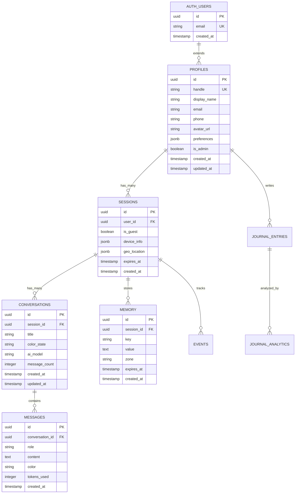
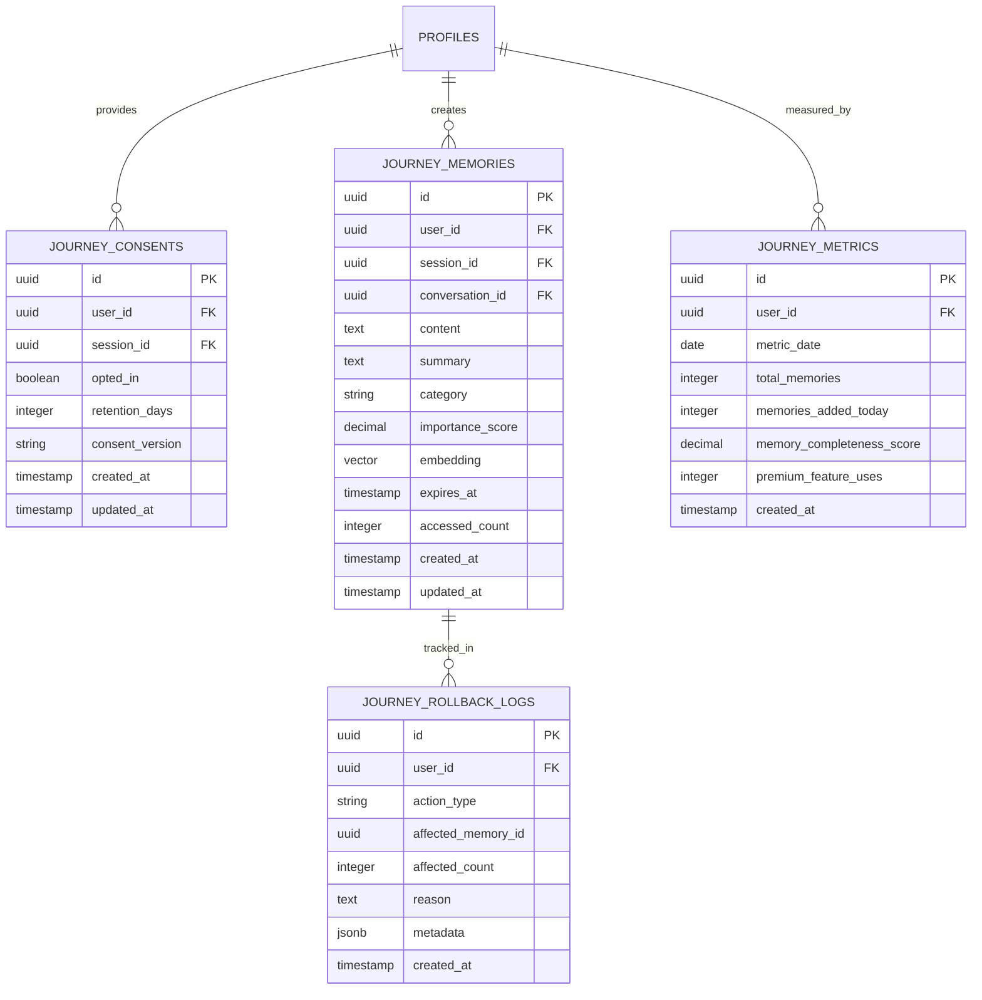
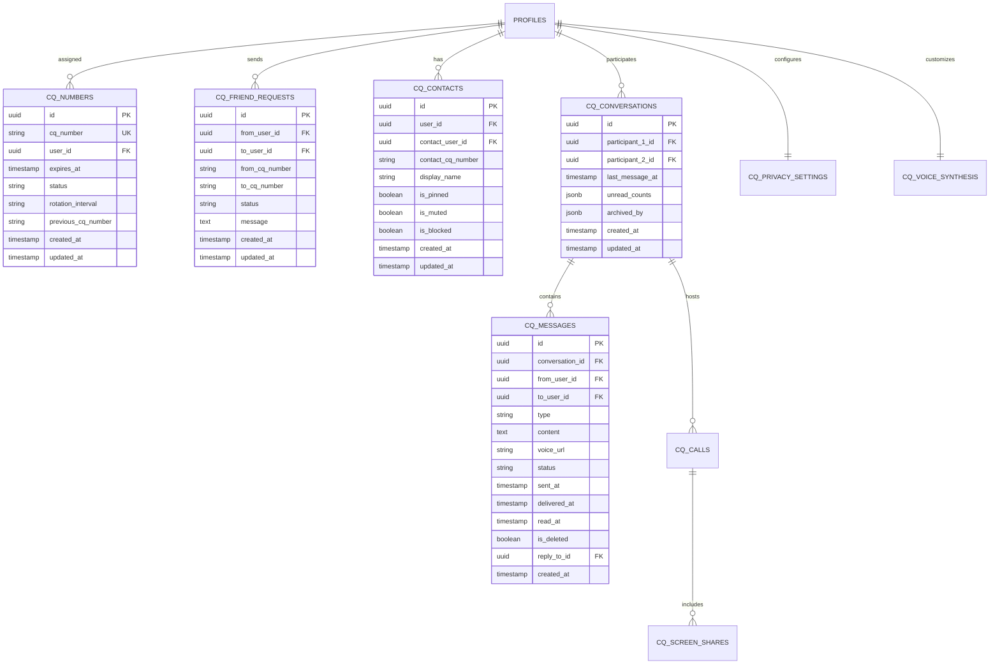
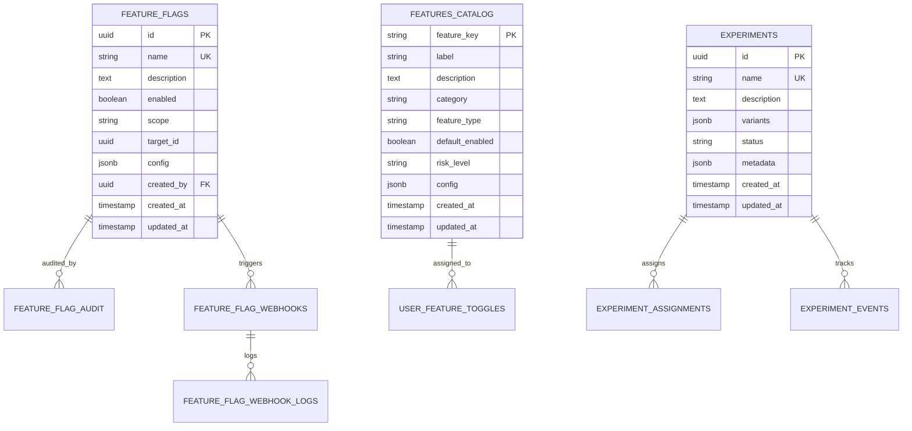
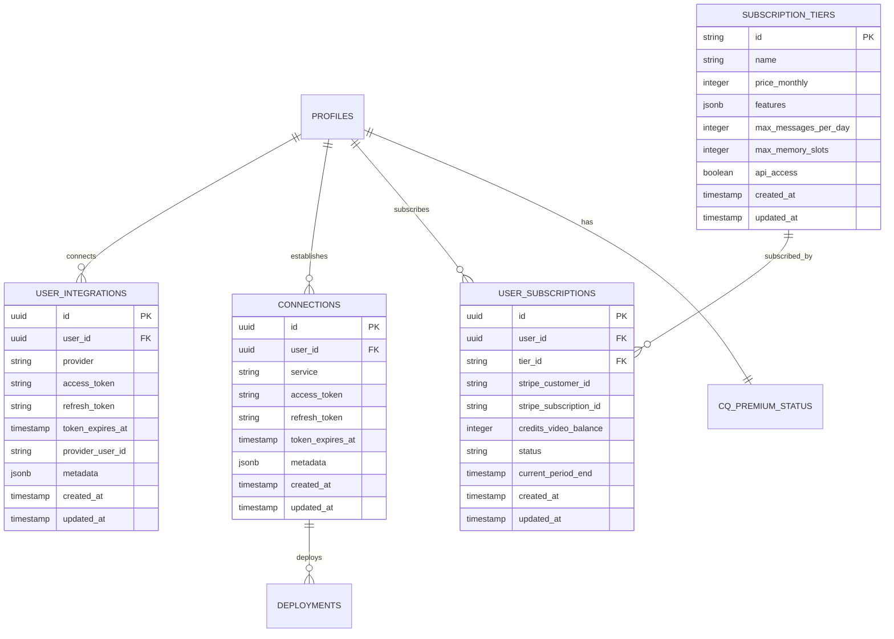

# CubiQo Emergent Database Schema Documentation

**Version**: 1.0  
**Last Updated**: 2024  
**Database Engine**: Supabase (PostgreSQL 15+)  
**Total Tables**: 52+  
**Extensions**: `uuid-ossp`, `pgvector`, `pg_trgm`

---

## Table of Contents

1. [Overview](#overview)
2. [Database Architecture](#database-architecture)
3. [Entity Relationship Diagrams](#entity-relationship-diagrams)
4. [Schema by Domain](#schema-by-domain)
5. [Index Strategy](#index-strategy)
6. [Row Level Security (RLS)](#row-level-security-rls)
7. [Migration History](#migration-history)
8. [Performance Considerations](#performance-considerations)
9. [Data Retention Policies](#data-retention-policies)
10. [Best Practices](#best-practices)

---

## Overview

The CubiQo Emergent database is a comprehensive PostgreSQL-based system built on Supabase, designed to support a multi-faceted AI-powered platform with sophisticated user interactions, memory systems, social features, and administrative capabilities.

### Key Features

- **Multi-Tenant Architecture**: Supports both authenticated users and guest sessions
- **AI Color Routing**: Conversation states map to AI models (Orange/Red/Yellow/Green-Blue)
- **Privacy Zones**: Three-tier memory system (Green/Yellow/Red)
- **Vector Search**: pgvector extension for semantic memory search
- **Real-Time Capabilities**: Leverages Supabase real-time subscriptions
- **Comprehensive Audit Trail**: All administrative actions logged
- **Feature Flag System**: Granular feature control with webhooks
- **Self-Healing**: Automated diagnostics and repair system

### Database Statistics

- **Total Tables**: 52+
- **Total Indexes**: 100+
- **RLS Policies**: 150+ policies across all tables
- **Extensions**: 3 (uuid-ossp, pgvector, pg_trgm)
- **Schema Version**: 22 migrations applied

---

## Database Architecture

### Design Principles

1. **Third Normal Form (3NF)**: All tables normalized to avoid redundancy
2. **Referential Integrity**: Foreign keys with appropriate CASCADE rules
3. **Soft Deletes**: Deleted_at columns where audit trails needed
4. **Timestamps**: created_at and updated_at on all major tables
5. **JSONB for Flexibility**: Metadata, preferences, and dynamic configs
6. **UUID Primary Keys**: Globally unique identifiers across all entities
7. **Row Level Security**: Enforced on every table without exception

### Technology Stack

```
┌─────────────────────────────────────────┐
│         Application Layer               │
│    (Next.js, React, TypeScript)        │
└─────────────────────────────────────────┘
                 ↓ ↑
┌─────────────────────────────────────────┐
│         Supabase Client SDK            │
│    (Real-time, Auth, Storage)          │
└─────────────────────────────────────────┘
                 ↓ ↑
┌─────────────────────────────────────────┐
│         PostgreSQL Database            │
│  Extensions: uuid-ossp, pgvector       │
│  RLS Policies: 150+                    │
└─────────────────────────────────────────┘
```

---

## Entity Relationship Diagrams

### Core System Architecture



### Journey Memory System



### CQ-to-CQ Messaging System



### Feature Flags & A/B Testing



### Integrations & Monetization



---

## Schema by Domain

### 1. Core Authentication & Profiles

#### **profiles**
Extends Supabase auth.users with application-specific user data.

```sql
CREATE TABLE profiles (
  id UUID PRIMARY KEY REFERENCES auth.users(id) ON DELETE CASCADE,
  handle VARCHAR(50) UNIQUE NOT NULL,
  display_name VARCHAR(255),
  email VARCHAR(255) UNIQUE,
  phone VARCHAR(20),
  avatar_url TEXT,
  preferences JSONB DEFAULT '{}'::jsonb,
  is_admin BOOLEAN DEFAULT false,
  created_at TIMESTAMP WITH TIME ZONE DEFAULT NOW(),
  updated_at TIMESTAMP WITH TIME ZONE DEFAULT NOW()
);

-- Indexes
CREATE INDEX idx_profiles_handle ON profiles(handle);
CREATE INDEX idx_profiles_email ON profiles(email);
CREATE INDEX idx_profiles_is_admin ON profiles(is_admin) WHERE is_admin = true;

-- RLS Policies
-- 1. Users can view their own profile
-- 2. Admins can view all profiles
-- 3. Users can update their own profile
-- 4. Public profiles viewable by authenticated users
```

**Columns**:
- `id` (UUID, PK, FK to auth.users): User's unique identifier
- `handle` (VARCHAR(50), UNIQUE, NOT NULL): User's @handle (e.g., @johndoe)
- `display_name` (VARCHAR(255)): User's display name
- `email` (VARCHAR(255), UNIQUE): Primary email address
- `phone` (VARCHAR(20)): Phone number for SMS/WhatsApp
- `avatar_url` (TEXT): URL to profile picture
- `preferences` (JSONB): User preferences (theme, notifications, etc.)
- `is_admin` (BOOLEAN): Administrative privileges flag
- `created_at` (TIMESTAMP): Account creation timestamp
- `updated_at` (TIMESTAMP): Last profile update

**Relationships**:
- Extends `auth.users` (1:1)
- Has many `sessions` (1:N)
- Has many `journal_entries` (1:N)
- Has many `user_integrations` (1:N)
- Has many `connections` (1:N)
- Has many `journey_memories` (1:N)
- Has many `cq_numbers` (1:N)

---

#### **sessions**
Tracks user sessions including guest sessions. Sessions expire after 30 days.

```sql
CREATE TABLE sessions (
  id UUID PRIMARY KEY DEFAULT uuid_generate_v4(),
  user_id UUID REFERENCES profiles(id) ON DELETE CASCADE,
  is_guest BOOLEAN DEFAULT false,
  device_info JSONB,
  geo_location JSONB,
  expires_at TIMESTAMP WITH TIME ZONE DEFAULT (NOW() + INTERVAL '30 days'),
  created_at TIMESTAMP WITH TIME ZONE DEFAULT NOW()
);

-- Indexes
CREATE INDEX idx_sessions_user_id ON sessions(user_id);
CREATE INDEX idx_sessions_expires_at ON sessions(expires_at);
CREATE INDEX idx_sessions_is_guest ON sessions(is_guest) WHERE is_guest = true;

-- Auto-cleanup trigger for expired sessions
CREATE OR REPLACE FUNCTION cleanup_expired_sessions()
RETURNS TRIGGER AS $$
BEGIN
  DELETE FROM sessions WHERE expires_at < NOW();
  RETURN NEW;
END;
$$ LANGUAGE plpgsql;
```

**Columns**:
- `id` (UUID, PK): Session identifier
- `user_id` (UUID, FK to profiles): Null for guest sessions
- `is_guest` (BOOLEAN): True for anonymous sessions
- `device_info` (JSONB): Browser, OS, device type
- `geo_location` (JSONB): IP-based geolocation data
- `expires_at` (TIMESTAMP): Session expiration (30 days default)
- `created_at` (TIMESTAMP): Session start time

**Relationships**:
- Belongs to `profiles` (N:1, optional for guests)
- Has many `conversations` (1:N)
- Has many `memory` entries (1:N)
- Has many `events` (1:N)

---

### 2. Conversation & Messaging

#### **conversations**
AI conversations with color-state routing to different AI models.

```sql
CREATE TABLE conversations (
  id UUID PRIMARY KEY DEFAULT uuid_generate_v4(),
  session_id UUID NOT NULL REFERENCES sessions(id) ON DELETE CASCADE,
  title VARCHAR(500),
  color_state VARCHAR(20) CHECK (color_state IN ('ORANGE', 'RED', 'YELLOW', 'GREEN_BLUE')),
  ai_model VARCHAR(100),
  message_count INTEGER DEFAULT 0,
  created_at TIMESTAMP WITH TIME ZONE DEFAULT NOW(),
  updated_at TIMESTAMP WITH TIME ZONE DEFAULT NOW()
);

-- Indexes
CREATE INDEX idx_conversations_session_id ON conversations(session_id);
CREATE INDEX idx_conversations_color_state ON conversations(color_state);
CREATE INDEX idx_conversations_created_at ON conversations(created_at DESC);

-- Trigger to update message_count
CREATE OR REPLACE FUNCTION update_conversation_message_count()
RETURNS TRIGGER AS $$
BEGIN
  UPDATE conversations 
  SET message_count = message_count + 1,
      updated_at = NOW()
  WHERE id = NEW.conversation_id;
  RETURN NEW;
END;
$$ LANGUAGE plpgsql;

CREATE TRIGGER trigger_update_message_count
AFTER INSERT ON messages
FOR EACH ROW
EXECUTE FUNCTION update_conversation_message_count();
```

**Color State Routing**:
- `ORANGE`: General conversations (GPT-4)
- `RED`: Urgent/critical (GPT-4 Turbo)
- `YELLOW`: Creative/brainstorming (Claude)
- `GREEN_BLUE`: Analytical/technical (GPT-4 + code interpreter)

**Columns**:
- `id` (UUID, PK): Conversation identifier
- `session_id` (UUID, FK to sessions): Parent session
- `title` (VARCHAR(500)): Auto-generated or user-set title
- `color_state` (VARCHAR(20)): AI routing color
- `ai_model` (VARCHAR(100)): Specific AI model used
- `message_count` (INTEGER): Cached message count
- `created_at` (TIMESTAMP): Conversation start
- `updated_at` (TIMESTAMP): Last message time

---

#### **messages**
Individual messages within conversations. Supports token tracking.

```sql
CREATE TABLE messages (
  id UUID PRIMARY KEY DEFAULT uuid_generate_v4(),
  conversation_id UUID NOT NULL REFERENCES conversations(id) ON DELETE CASCADE,
  role VARCHAR(20) NOT NULL CHECK (role IN ('user', 'assistant', 'system')),
  content TEXT NOT NULL,
  color VARCHAR(20),
  tokens_used INTEGER DEFAULT 0,
  created_at TIMESTAMP WITH TIME ZONE DEFAULT NOW()
);

-- Indexes
CREATE INDEX idx_messages_conversation_id ON messages(conversation_id);
CREATE INDEX idx_messages_created_at ON messages(created_at DESC);
CREATE INDEX idx_messages_role ON messages(role);

-- Partition by month for performance (future optimization)
-- CREATE TABLE messages_2024_01 PARTITION OF messages
-- FOR VALUES FROM ('2024-01-01') TO ('2024-02-01');
```

**Columns**:
- `id` (UUID, PK): Message identifier
- `conversation_id` (UUID, FK to conversations): Parent conversation
- `role` (VARCHAR(20)): Message author type
- `content` (TEXT): Message text content
- `color` (VARCHAR(20)): Associated color state
- `tokens_used` (INTEGER): AI tokens consumed
- `created_at` (TIMESTAMP): Message timestamp

---

#### **memory**
Session-based memory storage with privacy zones (Green/Yellow/Red).

```sql
CREATE TABLE memory (
  id UUID PRIMARY KEY DEFAULT uuid_generate_v4(),
  session_id UUID NOT NULL REFERENCES sessions(id) ON DELETE CASCADE,
  key VARCHAR(255) NOT NULL,
  value TEXT,
  zone VARCHAR(20) CHECK (zone IN ('green', 'yellow', 'red')),
  expires_at TIMESTAMP WITH TIME ZONE,
  created_at TIMESTAMP WITH TIME ZONE DEFAULT NOW()
);

-- Indexes
CREATE UNIQUE INDEX idx_memory_session_key ON memory(session_id, key);
CREATE INDEX idx_memory_zone ON memory(zone);
CREATE INDEX idx_memory_expires_at ON memory(expires_at) WHERE expires_at IS NOT NULL;

-- RLS: Users can only access their own session memories
```

**Privacy Zones**:
- `green`: Public/shareable (e.g., preferences, non-sensitive data)
- `yellow`: Semi-private (e.g., conversation context)
- `red`: Highly sensitive (e.g., passwords, API keys) - encrypted at rest

**Columns**:
- `id` (UUID, PK): Memory entry identifier
- `session_id` (UUID, FK to sessions): Parent session
- `key` (VARCHAR(255)): Memory key (unique per session)
- `value` (TEXT): Memory content
- `zone` (VARCHAR(20)): Privacy level
- `expires_at` (TIMESTAMP): Optional expiration
- `created_at` (TIMESTAMP): Creation time

---

#### **events**
Event tracking for analytics and user behavior.

```sql
CREATE TABLE events (
  id UUID PRIMARY KEY DEFAULT uuid_generate_v4(),
  session_id UUID REFERENCES sessions(id) ON DELETE CASCADE,
  user_id UUID REFERENCES profiles(id) ON DELETE SET NULL,
  type VARCHAR(100) NOT NULL,
  properties JSONB DEFAULT '{}'::jsonb,
  created_at TIMESTAMP WITH TIME ZONE DEFAULT NOW()
);

-- Indexes
CREATE INDEX idx_events_session_id ON events(session_id);
CREATE INDEX idx_events_user_id ON events(user_id);
CREATE INDEX idx_events_type ON events(type);
CREATE INDEX idx_events_created_at ON events(created_at DESC);
CREATE INDEX idx_events_properties ON events USING gin(properties);

-- Partitioning for time-series data (recommended for scale)
```

**Common Event Types**:
- `conversation.started`
- `message.sent`
- `feature.enabled`
- `journal.entry_completed`
- `cq.friend_request_sent`
- `payment.subscription_started`

---

### 3. Integrations & OAuth

#### **user_integrations**
Third-party OAuth integrations (Spotify, Google, etc.).

```sql
CREATE TABLE user_integrations (
  id UUID PRIMARY KEY DEFAULT uuid_generate_v4(),
  user_id UUID NOT NULL REFERENCES profiles(id) ON DELETE CASCADE,
  provider VARCHAR(50) NOT NULL,
  access_token TEXT NOT NULL,
  refresh_token TEXT,
  token_expires_at TIMESTAMP WITH TIME ZONE,
  provider_user_id VARCHAR(255),
  metadata JSONB DEFAULT '{}'::jsonb,
  created_at TIMESTAMP WITH TIME ZONE DEFAULT NOW(),
  updated_at TIMESTAMP WITH TIME ZONE DEFAULT NOW()
);

-- Indexes
CREATE UNIQUE INDEX idx_user_integrations_user_provider ON user_integrations(user_id, provider);
CREATE INDEX idx_user_integrations_token_expires ON user_integrations(token_expires_at);

-- RLS: Users can only access their own integrations
```

**Supported Providers**:
- `spotify`: Music streaming
- `google`: Calendar, Gmail
- `github`: Code repositories
- `twitter`: Social posting
- `slack`: Workspace integration

**Security**: Tokens encrypted at rest using Supabase Vault.

---

#### **connections**
Developer platform connections (GitHub, Vercel, Supabase).

```sql
CREATE TABLE connections (
  id UUID PRIMARY KEY DEFAULT uuid_generate_v4(),
  user_id UUID NOT NULL REFERENCES profiles(id) ON DELETE CASCADE,
  service VARCHAR(50) NOT NULL CHECK (service IN ('github', 'vercel', 'supabase')),
  access_token TEXT NOT NULL,
  refresh_token TEXT,
  token_expires_at TIMESTAMP WITH TIME ZONE,
  metadata JSONB DEFAULT '{}'::jsonb,
  created_at TIMESTAMP WITH TIME ZONE DEFAULT NOW(),
  updated_at TIMESTAMP WITH TIME ZONE DEFAULT NOW()
);

-- Indexes
CREATE UNIQUE INDEX idx_connections_user_service ON connections(user_id, service);

-- RLS: Users can only access their own connections
```

---

#### **deployments**
Vercel deployment tracking.

```sql
CREATE TABLE deployments (
  id UUID PRIMARY KEY DEFAULT uuid_generate_v4(),
  user_id UUID NOT NULL REFERENCES profiles(id) ON DELETE CASCADE,
  connection_id UUID REFERENCES connections(id) ON DELETE SET NULL,
  vercel_deployment_id VARCHAR(255) UNIQUE,
  project_name VARCHAR(255),
  url TEXT,
  state VARCHAR(50),
  build_duration_ms INTEGER,
  created_at TIMESTAMP WITH TIME ZONE DEFAULT NOW(),
  updated_at TIMESTAMP WITH TIME ZONE DEFAULT NOW()
);

-- Indexes
CREATE INDEX idx_deployments_user_id ON deployments(user_id);
CREATE INDEX idx_deployments_connection_id ON deployments(connection_id);
CREATE INDEX idx_deployments_state ON deployments(state);
```

---

### 4. A/B Testing & Experiments

#### **experiments**
A/B testing experiments with multiple variants.

```sql
CREATE TABLE experiments (
  id UUID PRIMARY KEY DEFAULT uuid_generate_v4(),
  name VARCHAR(255) UNIQUE NOT NULL,
  description TEXT,
  variants JSONB NOT NULL,
  status VARCHAR(20) CHECK (status IN ('draft', 'active', 'paused', 'completed')),
  metadata JSONB DEFAULT '{}'::jsonb,
  created_at TIMESTAMP WITH TIME ZONE DEFAULT NOW(),
  updated_at TIMESTAMP WITH TIME ZONE DEFAULT NOW()
);

-- Example variants JSONB:
-- {
--   "control": {"weight": 50, "config": {...}},
--   "variant_a": {"weight": 25, "config": {...}},
--   "variant_b": {"weight": 25, "config": {...}}
-- }
```

---

#### **experiment_assignments**
User/session assignments to experiment variants.

```sql
CREATE TABLE experiment_assignments (
  id UUID PRIMARY KEY DEFAULT uuid_generate_v4(),
  experiment_id UUID NOT NULL REFERENCES experiments(id) ON DELETE CASCADE,
  user_id UUID REFERENCES profiles(id) ON DELETE CASCADE,
  session_id UUID REFERENCES sessions(id) ON DELETE CASCADE,
  variant VARCHAR(100) NOT NULL,
  created_at TIMESTAMP WITH TIME ZONE DEFAULT NOW()
);

-- Indexes
CREATE UNIQUE INDEX idx_experiment_assignments_experiment_user 
  ON experiment_assignments(experiment_id, user_id) WHERE user_id IS NOT NULL;
CREATE UNIQUE INDEX idx_experiment_assignments_experiment_session 
  ON experiment_assignments(experiment_id, session_id) WHERE session_id IS NOT NULL;
```

---

#### **experiment_events**
Events tracked for experiment analysis.

```sql
CREATE TABLE experiment_events (
  id UUID PRIMARY KEY DEFAULT uuid_generate_v4(),
  experiment_id UUID NOT NULL REFERENCES experiments(id) ON DELETE CASCADE,
  variant VARCHAR(100) NOT NULL,
  event_name VARCHAR(255) NOT NULL,
  value NUMERIC,
  user_id UUID REFERENCES profiles(id) ON DELETE SET NULL,
  session_id UUID REFERENCES sessions(id) ON DELETE SET NULL,
  metadata JSONB DEFAULT '{}'::jsonb,
  created_at TIMESTAMP WITH TIME ZONE DEFAULT NOW()
);

-- Indexes
CREATE INDEX idx_experiment_events_experiment_id ON experiment_events(experiment_id);
CREATE INDEX idx_experiment_events_variant ON experiment_events(variant);
CREATE INDEX idx_experiment_events_event_name ON experiment_events(event_name);
```

---

### 5. Admin & Audit

#### **audit_logs**
Comprehensive audit trail for administrative actions.

```sql
CREATE TABLE audit_logs (
  id UUID PRIMARY KEY DEFAULT uuid_generate_v4(),
  user_id UUID REFERENCES profiles(id) ON DELETE SET NULL,
  user_email VARCHAR(255),
  action_type VARCHAR(100) NOT NULL,
  action_details JSONB DEFAULT '{}'::jsonb,
  ip_address INET,
  user_agent TEXT,
  created_at TIMESTAMP WITH TIME ZONE DEFAULT NOW()
);

-- Indexes
CREATE INDEX idx_audit_logs_user_id ON audit_logs(user_id);
CREATE INDEX idx_audit_logs_action_type ON audit_logs(action_type);
CREATE INDEX idx_audit_logs_created_at ON audit_logs(created_at DESC);
CREATE INDEX idx_audit_logs_details ON audit_logs USING gin(action_details);

-- RLS: Only admins can view audit logs
ALTER TABLE audit_logs ENABLE ROW LEVEL SECURITY;

CREATE POLICY admin_view_audit_logs ON audit_logs
  FOR SELECT
  USING (
    EXISTS (
      SELECT 1 FROM profiles
      WHERE profiles.id = auth.uid()
      AND profiles.is_admin = true
    )
  );
```

**Common Action Types**:
- `user.created`
- `user.deleted`
- `feature_flag.toggled`
- `admin.role_granted`
- `data.exported`
- `config.changed`

---

### 6. Feature Flags & Toggles

#### **feature_flags**
System-wide feature flags with granular targeting.

```sql
CREATE TABLE feature_flags (
  id UUID PRIMARY KEY DEFAULT uuid_generate_v4(),
  name VARCHAR(255) UNIQUE NOT NULL,
  description TEXT,
  enabled BOOLEAN DEFAULT false,
  scope VARCHAR(20) CHECK (scope IN ('global', 'user', 'session', 'org')),
  target_id UUID, -- user_id, session_id, or org_id depending on scope
  config JSONB DEFAULT '{}'::jsonb,
  created_by UUID REFERENCES profiles(id) ON DELETE SET NULL,
  created_at TIMESTAMP WITH TIME ZONE DEFAULT NOW(),
  updated_at TIMESTAMP WITH TIME ZONE DEFAULT NOW()
);

-- Indexes
CREATE INDEX idx_feature_flags_name ON feature_flags(name);
CREATE INDEX idx_feature_flags_enabled ON feature_flags(enabled);
CREATE INDEX idx_feature_flags_scope ON feature_flags(scope);
CREATE INDEX idx_feature_flags_target_id ON feature_flags(target_id);
```

---

#### **feature_flag_audit**
Audit trail for feature flag changes.

```sql
CREATE TABLE feature_flag_audit (
  id UUID PRIMARY KEY DEFAULT uuid_generate_v4(),
  flag_id UUID REFERENCES feature_flags(id) ON DELETE CASCADE,
  flag_name VARCHAR(255) NOT NULL,
  action VARCHAR(50) NOT NULL,
  changed_by UUID REFERENCES profiles(id) ON DELETE SET NULL,
  changes JSONB,
  metadata JSONB DEFAULT '{}'::jsonb,
  created_at TIMESTAMP WITH TIME ZONE DEFAULT NOW()
);

-- Indexes
CREATE INDEX idx_feature_flag_audit_flag_id ON feature_flag_audit(flag_id);
CREATE INDEX idx_feature_flag_audit_action ON feature_flag_audit(action);
CREATE INDEX idx_feature_flag_audit_created_at ON feature_flag_audit(created_at DESC);

-- Trigger to auto-log flag changes
CREATE OR REPLACE FUNCTION log_feature_flag_change()
RETURNS TRIGGER AS $$
BEGIN
  INSERT INTO feature_flag_audit (flag_id, flag_name, action, changed_by, changes)
  VALUES (
    NEW.id,
    NEW.name,
    TG_OP,
    auth.uid(),
    jsonb_build_object(
      'old', row_to_json(OLD),
      'new', row_to_json(NEW)
    )
  );
  RETURN NEW;
END;
$$ LANGUAGE plpgsql;
```

---

#### **feature_flag_webhooks**
Webhook notifications for feature flag changes.

```sql
CREATE TABLE feature_flag_webhooks (
  id UUID PRIMARY KEY DEFAULT uuid_generate_v4(),
  flag_id UUID REFERENCES feature_flags(id) ON DELETE CASCADE,
  url TEXT NOT NULL,
  secret TEXT NOT NULL,
  enabled BOOLEAN DEFAULT true,
  events TEXT[] DEFAULT ARRAY['flag.enabled', 'flag.disabled', 'flag.updated'],
  retry_config JSONB DEFAULT '{"max_attempts": 3, "backoff_ms": 1000}'::jsonb,
  created_at TIMESTAMP WITH TIME ZONE DEFAULT NOW(),
  updated_at TIMESTAMP WITH TIME ZONE DEFAULT NOW()
);

-- Indexes
CREATE INDEX idx_feature_flag_webhooks_flag_id ON feature_flag_webhooks(flag_id);
CREATE INDEX idx_feature_flag_webhooks_enabled ON feature_flag_webhooks(enabled) WHERE enabled = true;
```

---

#### **feature_flag_webhook_logs**
Webhook delivery logs.

```sql
CREATE TABLE feature_flag_webhook_logs (
  id UUID PRIMARY KEY DEFAULT uuid_generate_v4(),
  webhook_id UUID REFERENCES feature_flag_webhooks(id) ON DELETE CASCADE,
  flag_id UUID REFERENCES feature_flags(id) ON DELETE CASCADE,
  event VARCHAR(100) NOT NULL,
  payload JSONB,
  status_code INTEGER,
  response_body TEXT,
  error TEXT,
  created_at TIMESTAMP WITH TIME ZONE DEFAULT NOW()
);

-- Indexes
CREATE INDEX idx_webhook_logs_webhook_id ON feature_flag_webhook_logs(webhook_id);
CREATE INDEX idx_webhook_logs_flag_id ON feature_flag_webhook_logs(flag_id);
CREATE INDEX idx_webhook_logs_created_at ON feature_flag_webhook_logs(created_at DESC);
```

---

#### **design_toggles**
UI design feature toggles. Seeded with 13 preset toggles.

```sql
CREATE TABLE design_toggles (
  id UUID PRIMARY KEY DEFAULT uuid_generate_v4(),
  name VARCHAR(100) UNIQUE NOT NULL,
  display_name VARCHAR(255),
  description TEXT,
  category VARCHAR(50),
  is_enabled BOOLEAN DEFAULT false,
  config JSONB DEFAULT '{}'::jsonb,
  created_at TIMESTAMP WITH TIME ZONE DEFAULT NOW(),
  updated_at TIMESTAMP WITH TIME ZONE DEFAULT NOW()
);

-- Seed data (13 toggles)
INSERT INTO design_toggles (name, display_name, category, is_enabled) VALUES
  ('gradient_backgrounds', 'Gradient Backgrounds', 'visual', true),
  ('glassmorphism', 'Glassmorphism Effects', 'visual', false),
  ('dark_mode', 'Dark Mode', 'theme', true),
  ('animations', 'Page Animations', 'interaction', true),
  ('floating_action_button', 'Floating Action Button', 'layout', false),
  ('sidebar_collapsed', 'Collapsed Sidebar by Default', 'layout', false),
  ('rounded_corners', 'Rounded Corners', 'visual', true),
  ('compact_mode', 'Compact Mode', 'layout', false),
  ('color_blind_mode', 'Color Blind Mode', 'accessibility', false),
  ('high_contrast', 'High Contrast', 'accessibility', false),
  ('beta_features', 'Beta Features', 'experimental', false),
  ('debug_mode', 'Debug Mode', 'developer', false),
  ('performance_mode', 'Performance Mode', 'performance', false);
```

---

#### **features_catalog**
Comprehensive catalog of all features (32+ features).

```sql
CREATE TABLE features_catalog (
  feature_key VARCHAR(100) PRIMARY KEY,
  label VARCHAR(255) NOT NULL,
  description TEXT,
  category VARCHAR(50),
  feature_type VARCHAR(50) CHECK (feature_type IN ('core', 'premium', 'experimental', 'legacy')),
  default_enabled BOOLEAN DEFAULT false,
  risk_level VARCHAR(20) CHECK (risk_level IN ('low', 'medium', 'high', 'critical')),
  config JSONB DEFAULT '{}'::jsonb,
  created_at TIMESTAMP WITH TIME ZONE DEFAULT NOW(),
  updated_at TIMESTAMP WITH TIME ZONE DEFAULT NOW()
);

-- Indexes
CREATE INDEX idx_features_catalog_category ON features_catalog(category);
CREATE INDEX idx_features_catalog_feature_type ON features_catalog(feature_type);
CREATE INDEX idx_features_catalog_risk_level ON features_catalog(risk_level);

-- Sample features
INSERT INTO features_catalog (feature_key, label, category, feature_type, risk_level) VALUES
  ('ai_conversations', 'AI Conversations', 'core', 'core', 'low'),
  ('voice_chat', 'Voice Chat', 'communication', 'premium', 'medium'),
  ('screen_sharing', 'Screen Sharing', 'communication', 'premium', 'medium'),
  ('journey_memory', 'Journey Memory System', 'memory', 'core', 'high'),
  ('cq_messaging', 'CQ-to-CQ Messaging', 'social', 'core', 'medium'),
  ('journal', 'Daily Journal', 'wellness', 'core', 'low'),
  ('social_army', 'Social Army', 'marketing', 'experimental', 'high'),
  ('api_access', 'API Access', 'developer', 'premium', 'high');
```

---

#### **user_feature_toggles**
Per-user feature overrides.

```sql
CREATE TABLE user_feature_toggles (
  id UUID PRIMARY KEY DEFAULT uuid_generate_v4(),
  user_id UUID NOT NULL REFERENCES profiles(id) ON DELETE CASCADE,
  feature_key VARCHAR(100) NOT NULL REFERENCES features_catalog(feature_key) ON DELETE CASCADE,
  enabled BOOLEAN NOT NULL,
  metadata JSONB DEFAULT '{}'::jsonb,
  created_at TIMESTAMP WITH TIME ZONE DEFAULT NOW(),
  updated_at TIMESTAMP WITH TIME ZONE DEFAULT NOW()
);

-- Indexes
CREATE UNIQUE INDEX idx_user_feature_toggles_user_feature 
  ON user_feature_toggles(user_id, feature_key);
```

---

### 7. Journal & Wellness

#### **journal_entries**
Daily journal entries with mood tracking. One entry per day per user.

```sql
CREATE TABLE journal_entries (
  id UUID PRIMARY KEY DEFAULT uuid_generate_v4(),
  session_id UUID REFERENCES sessions(id) ON DELETE SET NULL,
  user_id UUID REFERENCES profiles(id) ON DELETE CASCADE,
  content TEXT NOT NULL,
  mood VARCHAR(50),
  color_state VARCHAR(20),
  duration_seconds INTEGER,
  word_count INTEGER,
  email_queued BOOLEAN DEFAULT false,
  email_sent_at TIMESTAMP WITH TIME ZONE,
  created_at TIMESTAMP WITH TIME ZONE DEFAULT NOW(),
  updated_at TIMESTAMP WITH TIME ZONE DEFAULT NOW()
);

-- Indexes
CREATE INDEX idx_journal_entries_user_id ON journal_entries(user_id);
CREATE INDEX idx_journal_entries_created_at ON journal_entries(created_at DESC);
CREATE INDEX idx_journal_entries_mood ON journal_entries(mood);
CREATE INDEX idx_journal_entries_email_queued ON journal_entries(email_queued) WHERE email_queued = true;

-- Constraint: One entry per user per day
CREATE UNIQUE INDEX idx_journal_entries_user_date 
  ON journal_entries(user_id, DATE(created_at));

-- Trigger to calculate word count
CREATE OR REPLACE FUNCTION calculate_word_count()
RETURNS TRIGGER AS $$
BEGIN
  NEW.word_count := array_length(string_to_array(NEW.content, ' '), 1);
  RETURN NEW;
END;
$$ LANGUAGE plpgsql;

CREATE TRIGGER trigger_calculate_word_count
BEFORE INSERT OR UPDATE ON journal_entries
FOR EACH ROW
EXECUTE FUNCTION calculate_word_count();
```

**Mood Options**:
- `ecstatic`, `happy`, `content`, `neutral`, `sad`, `anxious`, `angry`, `reflective`

---

#### **journal_analytics**
Analytics metadata for journal entries.

```sql
CREATE TABLE journal_analytics (
  id UUID PRIMARY KEY DEFAULT uuid_generate_v4(),
  entry_id UUID UNIQUE NOT NULL REFERENCES journal_entries(id) ON DELETE CASCADE,
  prompts_completed INTEGER DEFAULT 0,
  interruptions INTEGER DEFAULT 0,
  completion_rate DECIMAL(5,2),
  device_info JSONB,
  created_at TIMESTAMP WITH TIME ZONE DEFAULT NOW()
);

-- Indexes
CREATE INDEX idx_journal_analytics_entry_id ON journal_analytics(entry_id);
CREATE INDEX idx_journal_analytics_completion_rate ON journal_analytics(completion_rate);
```

---

#### **email_queue**
Queued emails for journal summaries and notifications.

```sql
CREATE TABLE email_queue (
  id UUID PRIMARY KEY DEFAULT uuid_generate_v4(),
  type VARCHAR(50) NOT NULL,
  recipient_email VARCHAR(255) NOT NULL,
  subject VARCHAR(500),
  payload JSONB NOT NULL,
  status VARCHAR(20) DEFAULT 'pending' CHECK (status IN ('pending', 'sending', 'sent', 'failed')),
  attempts INTEGER DEFAULT 0,
  error_message TEXT,
  created_at TIMESTAMP WITH TIME ZONE DEFAULT NOW(),
  sent_at TIMESTAMP WITH TIME ZONE
);

-- Indexes
CREATE INDEX idx_email_queue_status ON email_queue(status);
CREATE INDEX idx_email_queue_type ON email_queue(type);
CREATE INDEX idx_email_queue_created_at ON email_queue(created_at DESC);
CREATE INDEX idx_email_queue_recipient ON email_queue(recipient_email);

-- Auto-retry mechanism for failed emails
CREATE OR REPLACE FUNCTION retry_failed_emails()
RETURNS TRIGGER AS $$
BEGIN
  IF NEW.status = 'failed' AND NEW.attempts < 3 THEN
    UPDATE email_queue
    SET status = 'pending',
        attempts = attempts + 1
    WHERE id = NEW.id;
  END IF;
  RETURN NEW;
END;
$$ LANGUAGE plpgsql;
```

---

### 8. Journey Memory System

#### **journey_consents**
User consent for Journey memory system with retention policies.

```sql
CREATE TABLE journey_consents (
  id UUID PRIMARY KEY DEFAULT uuid_generate_v4(),
  user_id UUID NOT NULL REFERENCES profiles(id) ON DELETE CASCADE,
  session_id UUID REFERENCES sessions(id) ON DELETE SET NULL,
  opted_in BOOLEAN DEFAULT false,
  retention_days INTEGER DEFAULT 90,
  consent_version VARCHAR(50) DEFAULT '1.0',
  created_at TIMESTAMP WITH TIME ZONE DEFAULT NOW(),
  updated_at TIMESTAMP WITH TIME ZONE DEFAULT NOW()
);

-- Indexes
CREATE UNIQUE INDEX idx_journey_consents_user ON journey_consents(user_id);
CREATE INDEX idx_journey_consents_opted_in ON journey_consents(opted_in);
```

---

#### **journey_memories**
Vector-based semantic memories with pgvector. Supports similarity search.

```sql
CREATE EXTENSION IF NOT EXISTS vector;

CREATE TABLE journey_memories (
  id UUID PRIMARY KEY DEFAULT uuid_generate_v4(),
  user_id UUID NOT NULL REFERENCES profiles(id) ON DELETE CASCADE,
  session_id UUID REFERENCES sessions(id) ON DELETE SET NULL,
  conversation_id UUID REFERENCES conversations(id) ON DELETE SET NULL,
  content TEXT NOT NULL,
  summary TEXT,
  category VARCHAR(100),
  importance_score DECIMAL(3,2) CHECK (importance_score >= 0 AND importance_score <= 1),
  embedding vector(1536), -- OpenAI ada-002 embedding dimension
  expires_at TIMESTAMP WITH TIME ZONE,
  accessed_count INTEGER DEFAULT 0,
  created_at TIMESTAMP WITH TIME ZONE DEFAULT NOW(),
  updated_at TIMESTAMP WITH TIME ZONE DEFAULT NOW()
);

-- Indexes
CREATE INDEX idx_journey_memories_user_id ON journey_memories(user_id);
CREATE INDEX idx_journey_memories_category ON journey_memories(category);
CREATE INDEX idx_journey_memories_importance ON journey_memories(importance_score DESC);
CREATE INDEX idx_journey_memories_expires_at ON journey_memories(expires_at) WHERE expires_at IS NOT NULL;
CREATE INDEX idx_journey_memories_accessed_count ON journey_memories(accessed_count);

-- Vector similarity index (HNSW for fast approximate nearest neighbor search)
CREATE INDEX idx_journey_memories_embedding ON journey_memories 
  USING ivfflat (embedding vector_cosine_ops)
  WITH (lists = 100);

-- Function for semantic similarity search
CREATE OR REPLACE FUNCTION search_journey_memories(
  query_embedding vector(1536),
  match_threshold float,
  match_count int,
  target_user_id uuid
)
RETURNS TABLE (
  id uuid,
  content text,
  summary text,
  similarity float
)
LANGUAGE plpgsql
AS $$
BEGIN
  RETURN QUERY
  SELECT
    journey_memories.id,
    journey_memories.content,
    journey_memories.summary,
    1 - (journey_memories.embedding <=> query_embedding) as similarity
  FROM journey_memories
  WHERE journey_memories.user_id = target_user_id
    AND (1 - (journey_memories.embedding <=> query_embedding)) > match_threshold
    AND (journey_memories.expires_at IS NULL OR journey_memories.expires_at > NOW())
  ORDER BY journey_memories.embedding <=> query_embedding
  LIMIT match_count;
END;
$$;
```

**Memory Categories**:
- `preference`: User preferences and settings
- `fact`: Personal facts and biographical info
- `context`: Conversation context and topics
- `relationship`: Relationships and social connections
- `goal`: User goals and aspirations
- `emotion`: Emotional states and patterns

---

#### **journey_rollback_logs**
Audit trail for memory deletions and rollbacks.

```sql
CREATE TABLE journey_rollback_logs (
  id UUID PRIMARY KEY DEFAULT uuid_generate_v4(),
  user_id UUID NOT NULL REFERENCES profiles(id) ON DELETE CASCADE,
  action_type VARCHAR(50) NOT NULL,
  affected_memory_id UUID,
  affected_count INTEGER DEFAULT 0,
  reason TEXT,
  metadata JSONB DEFAULT '{}'::jsonb,
  created_at TIMESTAMP WITH TIME ZONE DEFAULT NOW()
);

-- Indexes
CREATE INDEX idx_journey_rollback_logs_user_id ON journey_rollback_logs(user_id);
CREATE INDEX idx_journey_rollback_logs_action_type ON journey_rollback_logs(action_type);
CREATE INDEX idx_journey_rollback_logs_created_at ON journey_rollback_logs(created_at DESC);
```

---

#### **journey_metrics**
Daily metrics for memory system usage.

```sql
CREATE TABLE journey_metrics (
  id UUID PRIMARY KEY DEFAULT uuid_generate_v4(),
  user_id UUID NOT NULL REFERENCES profiles(id) ON DELETE CASCADE,
  metric_date DATE NOT NULL,
  total_memories INTEGER DEFAULT 0,
  memories_added_today INTEGER DEFAULT 0,
  memory_completeness_score DECIMAL(5,2),
  premium_feature_uses INTEGER DEFAULT 0,
  created_at TIMESTAMP WITH TIME ZONE DEFAULT NOW()
);

-- Indexes
CREATE UNIQUE INDEX idx_journey_metrics_user_date ON journey_metrics(user_id, metric_date);
CREATE INDEX idx_journey_metrics_metric_date ON journey_metrics(metric_date DESC);
```

---

### 9. Self-Healing & Diagnostics

#### **self_heal_reports**
Automated system health check and repair reports.

```sql
CREATE TABLE self_heal_reports (
  id UUID PRIMARY KEY DEFAULT uuid_generate_v4(),
  run_date TIMESTAMP WITH TIME ZONE DEFAULT NOW(),
  status VARCHAR(20) CHECK (status IN ('success', 'warning', 'error')),
  diagnostics JSONB NOT NULL,
  repairs JSONB,
  fixed_issues INTEGER DEFAULT 0,
  critical_issues INTEGER DEFAULT 0,
  recommendations TEXT[],
  email_sent BOOLEAN DEFAULT false,
  execution_time_ms INTEGER,
  created_at TIMESTAMP WITH TIME ZONE DEFAULT NOW()
);

-- Indexes
CREATE INDEX idx_self_heal_reports_run_date ON self_heal_reports(run_date DESC);
CREATE INDEX idx_self_heal_reports_status ON self_heal_reports(status);
CREATE INDEX idx_self_heal_reports_critical_issues ON self_heal_reports(critical_issues) WHERE critical_issues > 0;

-- Example diagnostics JSONB structure:
-- {
--   "database": {"status": "healthy", "connections": 45, "slow_queries": 2},
--   "storage": {"status": "warning", "usage_percent": 78},
--   "auth": {"status": "healthy", "failed_logins_24h": 12},
--   "api": {"status": "healthy", "avg_response_ms": 245}
-- }
```

---

#### **self_heal_audit_logs**
Detailed audit logs for self-healing actions.

```sql
CREATE TABLE self_heal_audit_logs (
  id UUID PRIMARY KEY DEFAULT uuid_generate_v4(),
  report_id UUID REFERENCES self_heal_reports(id) ON DELETE CASCADE,
  action_type VARCHAR(100) NOT NULL,
  action_details TEXT,
  status VARCHAR(20) CHECK (status IN ('success', 'failed', 'skipped')),
  error_message TEXT,
  rollback_command TEXT,
  created_at TIMESTAMP WITH TIME ZONE DEFAULT NOW()
);

-- Indexes
CREATE INDEX idx_self_heal_audit_logs_report_id ON self_heal_audit_logs(report_id);
CREATE INDEX idx_self_heal_audit_logs_action_type ON self_heal_audit_logs(action_type);
CREATE INDEX idx_self_heal_audit_logs_status ON self_heal_audit_logs(status);
```

---

### 10. CQ-to-CQ Messaging System

#### **cq_numbers**
Unique CQ numbers (CQ-XXXX-XXXX format) for user identification. Rotates every 30 days.

```sql
CREATE TABLE cq_numbers (
  id UUID PRIMARY KEY DEFAULT uuid_generate_v4(),
  cq_number VARCHAR(20) UNIQUE NOT NULL,
  user_id UUID NOT NULL REFERENCES profiles(id) ON DELETE CASCADE,
  expires_at TIMESTAMP WITH TIME ZONE NOT NULL,
  status VARCHAR(20) DEFAULT 'active' CHECK (status IN ('active', 'expired', 'revoked')),
  rotation_interval VARCHAR(20) DEFAULT '30_days',
  previous_cq_number VARCHAR(20),
  created_at TIMESTAMP WITH TIME ZONE DEFAULT NOW(),
  updated_at TIMESTAMP WITH TIME ZONE DEFAULT NOW()
);

-- Indexes
CREATE INDEX idx_cq_numbers_cq_number ON cq_numbers(cq_number);
CREATE INDEX idx_cq_numbers_user_id ON cq_numbers(user_id);
CREATE INDEX idx_cq_numbers_expires_at ON cq_numbers(expires_at);
CREATE INDEX idx_cq_numbers_status ON cq_numbers(status);

-- Function to generate CQ number
CREATE OR REPLACE FUNCTION generate_cq_number()
RETURNS VARCHAR(20) AS $$
DECLARE
  new_cq_number VARCHAR(20);
  exists_check INTEGER;
BEGIN
  LOOP
    new_cq_number := 'CQ-' || 
                     LPAD(FLOOR(RANDOM() * 10000)::TEXT, 4, '0') || '-' ||
                     LPAD(FLOOR(RANDOM() * 10000)::TEXT, 4, '0');
    
    SELECT COUNT(*) INTO exists_check
    FROM cq_numbers
    WHERE cq_number = new_cq_number AND status = 'active';
    
    EXIT WHEN exists_check = 0;
  END LOOP;
  
  RETURN new_cq_number;
END;
$$ LANGUAGE plpgsql;

-- Auto-rotation trigger (runs daily)
CREATE OR REPLACE FUNCTION rotate_expired_cq_numbers()
RETURNS TRIGGER AS $$
BEGIN
  UPDATE cq_numbers
  SET status = 'expired'
  WHERE expires_at < NOW() AND status = 'active';
  RETURN NEW;
END;
$$ LANGUAGE plpgsql;
```

---

#### **cq_friend_requests**
Friend requests between CQ users.

```sql
CREATE TABLE cq_friend_requests (
  id UUID PRIMARY KEY DEFAULT uuid_generate_v4(),
  from_user_id UUID NOT NULL REFERENCES profiles(id) ON DELETE CASCADE,
  to_user_id UUID NOT NULL REFERENCES profiles(id) ON DELETE CASCADE,
  from_cq_number VARCHAR(20) NOT NULL,
  to_cq_number VARCHAR(20) NOT NULL,
  status VARCHAR(20) DEFAULT 'pending' CHECK (status IN ('pending', 'accepted', 'rejected', 'cancelled')),
  message TEXT,
  created_at TIMESTAMP WITH TIME ZONE DEFAULT NOW(),
  updated_at TIMESTAMP WITH TIME ZONE DEFAULT NOW()
);

-- Indexes
CREATE INDEX idx_cq_friend_requests_from_user ON cq_friend_requests(from_user_id);
CREATE INDEX idx_cq_friend_requests_to_user ON cq_friend_requests(to_user_id);
CREATE INDEX idx_cq_friend_requests_status ON cq_friend_requests(status);

-- Constraint: No duplicate active requests
CREATE UNIQUE INDEX idx_cq_friend_requests_unique_active 
  ON cq_friend_requests(from_user_id, to_user_id) 
  WHERE status = 'pending';
```

---

#### **cq_contacts**
User's contact list.

```sql
CREATE TABLE cq_contacts (
  id UUID PRIMARY KEY DEFAULT uuid_generate_v4(),
  user_id UUID NOT NULL REFERENCES profiles(id) ON DELETE CASCADE,
  contact_user_id UUID NOT NULL REFERENCES profiles(id) ON DELETE CASCADE,
  contact_cq_number VARCHAR(20),
  display_name VARCHAR(255),
  is_pinned BOOLEAN DEFAULT false,
  is_muted BOOLEAN DEFAULT false,
  is_blocked BOOLEAN DEFAULT false,
  created_at TIMESTAMP WITH TIME ZONE DEFAULT NOW(),
  updated_at TIMESTAMP WITH TIME ZONE DEFAULT NOW()
);

-- Indexes
CREATE UNIQUE INDEX idx_cq_contacts_user_contact ON cq_contacts(user_id, contact_user_id);
CREATE INDEX idx_cq_contacts_is_pinned ON cq_contacts(is_pinned) WHERE is_pinned = true;
CREATE INDEX idx_cq_contacts_is_blocked ON cq_contacts(is_blocked) WHERE is_blocked = true;
```

---

#### **cq_conversations**
One-on-one conversations between CQ users.

```sql
CREATE TABLE cq_conversations (
  id UUID PRIMARY KEY DEFAULT uuid_generate_v4(),
  participant_1_id UUID NOT NULL REFERENCES profiles(id) ON DELETE CASCADE,
  participant_2_id UUID NOT NULL REFERENCES profiles(id) ON DELETE CASCADE,
  last_message_at TIMESTAMP WITH TIME ZONE,
  unread_counts JSONB DEFAULT '{"participant_1": 0, "participant_2": 0}'::jsonb,
  archived_by JSONB DEFAULT '[]'::jsonb,
  created_at TIMESTAMP WITH TIME ZONE DEFAULT NOW(),
  updated_at TIMESTAMP WITH TIME ZONE DEFAULT NOW(),
  
  CONSTRAINT unique_conversation CHECK (participant_1_id < participant_2_id)
);

-- Indexes
CREATE UNIQUE INDEX idx_cq_conversations_participants 
  ON cq_conversations(LEAST(participant_1_id, participant_2_id), GREATEST(participant_1_id, participant_2_id));
CREATE INDEX idx_cq_conversations_participant_1 ON cq_conversations(participant_1_id);
CREATE INDEX idx_cq_conversations_participant_2 ON cq_conversations(participant_2_id);
CREATE INDEX idx_cq_conversations_last_message ON cq_conversations(last_message_at DESC);
```

---

#### **cq_messages**
Messages within CQ conversations. Supports text, voice, file, and system messages.

```sql
CREATE TABLE cq_messages (
  id UUID PRIMARY KEY DEFAULT uuid_generate_v4(),
  conversation_id UUID NOT NULL REFERENCES cq_conversations(id) ON DELETE CASCADE,
  from_user_id UUID NOT NULL REFERENCES profiles(id) ON DELETE CASCADE,
  to_user_id UUID NOT NULL REFERENCES profiles(id) ON DELETE CASCADE,
  type VARCHAR(20) CHECK (type IN ('text', 'voice', 'file', 'system')),
  content TEXT,
  voice_url TEXT,
  status VARCHAR(20) DEFAULT 'sent' CHECK (status IN ('sent', 'delivered', 'read', 'failed')),
  sent_at TIMESTAMP WITH TIME ZONE DEFAULT NOW(),
  delivered_at TIMESTAMP WITH TIME ZONE,
  read_at TIMESTAMP WITH TIME ZONE,
  is_deleted BOOLEAN DEFAULT false,
  reply_to_id UUID REFERENCES cq_messages(id) ON DELETE SET NULL,
  created_at TIMESTAMP WITH TIME ZONE DEFAULT NOW()
);

-- Indexes
CREATE INDEX idx_cq_messages_conversation_id ON cq_messages(conversation_id);
CREATE INDEX idx_cq_messages_from_user ON cq_messages(from_user_id);
CREATE INDEX idx_cq_messages_to_user ON cq_messages(to_user_id);
CREATE INDEX idx_cq_messages_sent_at ON cq_messages(sent_at DESC);
CREATE INDEX idx_cq_messages_status ON cq_messages(status);
CREATE INDEX idx_cq_messages_is_deleted ON cq_messages(is_deleted) WHERE is_deleted = false;

-- Trigger to update conversation last_message_at and unread counts
CREATE OR REPLACE FUNCTION update_cq_conversation_on_message()
RETURNS TRIGGER AS $$
BEGIN
  UPDATE cq_conversations
  SET 
    last_message_at = NEW.sent_at,
    unread_counts = jsonb_set(
      unread_counts,
      ARRAY[CASE WHEN NEW.to_user_id = participant_1_id THEN 'participant_1' ELSE 'participant_2' END],
      to_jsonb((unread_counts->>CASE WHEN NEW.to_user_id = participant_1_id THEN 'participant_1' ELSE 'participant_2' END)::int + 1)
    ),
    updated_at = NOW()
  WHERE id = NEW.conversation_id;
  RETURN NEW;
END;
$$ LANGUAGE plpgsql;

CREATE TRIGGER trigger_update_cq_conversation_on_message
AFTER INSERT ON cq_messages
FOR EACH ROW
EXECUTE FUNCTION update_cq_conversation_on_message();
```

---

#### **cq_calls**
Voice/video call sessions with WebRTC signaling.

```sql
CREATE TABLE cq_calls (
  id UUID PRIMARY KEY DEFAULT uuid_generate_v4(),
  conversation_id UUID NOT NULL REFERENCES cq_conversations(id) ON DELETE CASCADE,
  initiator_id UUID NOT NULL REFERENCES profiles(id) ON DELETE CASCADE,
  recipient_id UUID NOT NULL REFERENCES profiles(id) ON DELETE CASCADE,
  type VARCHAR(20) CHECK (type IN ('audio', 'video')),
  status VARCHAR(20) DEFAULT 'initiated' CHECK (status IN ('initiated', 'ringing', 'active', 'ended', 'missed', 'rejected')),
  webrtc_offer JSONB,
  webrtc_answer JSONB,
  ice_candidates JSONB DEFAULT '[]'::jsonb,
  started_at TIMESTAMP WITH TIME ZONE,
  ended_at TIMESTAMP WITH TIME ZONE,
  duration_seconds INTEGER,
  created_at TIMESTAMP WITH TIME ZONE DEFAULT NOW()
);

-- Indexes
CREATE INDEX idx_cq_calls_conversation_id ON cq_calls(conversation_id);
CREATE INDEX idx_cq_calls_initiator_id ON cq_calls(initiator_id);
CREATE INDEX idx_cq_calls_recipient_id ON cq_calls(recipient_id);
CREATE INDEX idx_cq_calls_status ON cq_calls(status);
CREATE INDEX idx_cq_calls_created_at ON cq_calls(created_at DESC);

-- Trigger to calculate duration on call end
CREATE OR REPLACE FUNCTION calculate_call_duration()
RETURNS TRIGGER AS $$
BEGIN
  IF NEW.ended_at IS NOT NULL AND NEW.started_at IS NOT NULL THEN
    NEW.duration_seconds := EXTRACT(EPOCH FROM (NEW.ended_at - NEW.started_at))::INTEGER;
  END IF;
  RETURN NEW;
END;
$$ LANGUAGE plpgsql;

CREATE TRIGGER trigger_calculate_call_duration
BEFORE UPDATE ON cq_calls
FOR EACH ROW
WHEN (NEW.ended_at IS NOT NULL)
EXECUTE FUNCTION calculate_call_duration();
```

---

#### **cq_screen_shares**
Screen sharing sessions during calls.

```sql
CREATE TABLE cq_screen_shares (
  id UUID PRIMARY KEY DEFAULT uuid_generate_v4(),
  call_id UUID NOT NULL REFERENCES cq_calls(id) ON DELETE CASCADE,
  sharer_id UUID NOT NULL REFERENCES profiles(id) ON DELETE CASCADE,
  stream_id VARCHAR(255),
  started_at TIMESTAMP WITH TIME ZONE DEFAULT NOW(),
  ended_at TIMESTAMP WITH TIME ZONE,
  created_at TIMESTAMP WITH TIME ZONE DEFAULT NOW()
);

-- Indexes
CREATE INDEX idx_cq_screen_shares_call_id ON cq_screen_shares(call_id);
CREATE INDEX idx_cq_screen_shares_sharer_id ON cq_screen_shares(sharer_id);
```

---

#### **cq_notifications**
Push notifications for CQ events.

```sql
CREATE TABLE cq_notifications (
  id UUID PRIMARY KEY DEFAULT uuid_generate_v4(),
  user_id UUID NOT NULL REFERENCES profiles(id) ON DELETE CASCADE,
  type VARCHAR(50) NOT NULL,
  title VARCHAR(255) NOT NULL,
  body TEXT,
  data JSONB DEFAULT '{}'::jsonb,
  read BOOLEAN DEFAULT false,
  created_at TIMESTAMP WITH TIME ZONE DEFAULT NOW()
);

-- Indexes
CREATE INDEX idx_cq_notifications_user_id ON cq_notifications(user_id);
CREATE INDEX idx_cq_notifications_read ON cq_notifications(read) WHERE read = false;
CREATE INDEX idx_cq_notifications_type ON cq_notifications(type);
CREATE INDEX idx_cq_notifications_created_at ON cq_notifications(created_at DESC);

-- Auto-delete old read notifications (90 days)
CREATE OR REPLACE FUNCTION cleanup_old_notifications()
RETURNS void AS $$
BEGIN
  DELETE FROM cq_notifications
  WHERE read = true AND created_at < NOW() - INTERVAL '90 days';
END;
$$ LANGUAGE plpgsql;
```

---

#### **cq_privacy_settings**
User privacy preferences for CQ system.

```sql
CREATE TABLE cq_privacy_settings (
  user_id UUID PRIMARY KEY REFERENCES profiles(id) ON DELETE CASCADE,
  who_can_add_me VARCHAR(20) DEFAULT 'anyone' CHECK (who_can_add_me IN ('anyone', 'friends_of_friends', 'no_one')),
  who_can_call_me VARCHAR(20) DEFAULT 'contacts' CHECK (who_can_call_me IN ('anyone', 'contacts', 'no_one')),
  who_can_see_online_status VARCHAR(20) DEFAULT 'contacts' CHECK (who_can_see_online_status IN ('everyone', 'contacts', 'no_one')),
  read_receipts BOOLEAN DEFAULT true,
  typing_indicators BOOLEAN DEFAULT true,
  auto_rotate_cq BOOLEAN DEFAULT true,
  created_at TIMESTAMP WITH TIME ZONE DEFAULT NOW(),
  updated_at TIMESTAMP WITH TIME ZONE DEFAULT NOW()
);

-- No additional indexes needed (PK on user_id sufficient)
```

---

#### **cq_voice_synthesis**
Text-to-speech voice customization for CubiQo reading messages aloud.

```sql
CREATE TABLE cq_voice_synthesis (
  user_id UUID PRIMARY KEY REFERENCES profiles(id) ON DELETE CASCADE,
  cubiqo_voice_id VARCHAR(100),
  voice_settings JSONB DEFAULT '{"speed": 1.0, "pitch": 1.0, "volume": 1.0}'::jsonb,
  enable_auto_read BOOLEAN DEFAULT false,
  read_only_when_active BOOLEAN DEFAULT true,
  created_at TIMESTAMP WITH TIME ZONE DEFAULT NOW(),
  updated_at TIMESTAMP WITH TIME ZONE DEFAULT NOW()
);

-- No additional indexes needed (PK on user_id sufficient)
```

---

#### **cq_premium_status**
Premium features for CQ users.

```sql
CREATE TABLE cq_premium_status (
  user_id UUID PRIMARY KEY REFERENCES profiles(id) ON DELETE CASCADE,
  is_premium BOOLEAN DEFAULT false,
  premium_until TIMESTAMP WITH TIME ZONE,
  features JSONB DEFAULT '[]'::jsonb,
  created_at TIMESTAMP WITH TIME ZONE DEFAULT NOW(),
  updated_at TIMESTAMP WITH TIME ZONE DEFAULT NOW()
);

-- Indexes
CREATE INDEX idx_cq_premium_status_is_premium ON cq_premium_status(is_premium) WHERE is_premium = true;
CREATE INDEX idx_cq_premium_status_premium_until ON cq_premium_status(premium_until);

-- Premium features array example:
-- ["voice_calls", "video_calls", "screen_sharing", "group_chats", "file_sharing", "custom_themes"]
```

---

### 11. Social Army

#### **social_accounts**
Social media accounts managed by the Social Army system.

```sql
CREATE TABLE social_accounts (
  id UUID PRIMARY KEY DEFAULT uuid_generate_v4(),
  platform VARCHAR(50) CHECK (platform IN ('twitter', 'tiktok', 'linkedin', 'instagram', 'youtube')),
  username VARCHAR(255) NOT NULL,
  persona_type VARCHAR(50),
  status VARCHAR(20) DEFAULT 'active' CHECK (status IN ('active', 'paused', 'suspended', 'banned')),
  last_posted_at TIMESTAMP WITH TIME ZONE,
  created_at TIMESTAMP WITH TIME ZONE DEFAULT NOW(),
  updated_at TIMESTAMP WITH TIME ZONE DEFAULT NOW()
);

-- Indexes
CREATE UNIQUE INDEX idx_social_accounts_platform_username ON social_accounts(platform, username);
CREATE INDEX idx_social_accounts_platform ON social_accounts(platform);
CREATE INDEX idx_social_accounts_status ON social_accounts(status);
CREATE INDEX idx_social_accounts_last_posted ON social_accounts(last_posted_at DESC);
```

---

#### **social_campaigns**
Marketing campaigns for Social Army.

```sql
CREATE TABLE social_campaigns (
  id UUID PRIMARY KEY DEFAULT uuid_generate_v4(),
  name VARCHAR(255) NOT NULL,
  seed_topic TEXT,
  status VARCHAR(20) DEFAULT 'draft' CHECK (status IN ('draft', 'active', 'paused', 'completed')),
  total_posts_target INTEGER,
  created_at TIMESTAMP WITH TIME ZONE DEFAULT NOW(),
  updated_at TIMESTAMP WITH TIME ZONE DEFAULT NOW()
);

-- Indexes
CREATE INDEX idx_social_campaigns_status ON social_campaigns(status);
CREATE INDEX idx_social_campaigns_created_at ON social_campaigns(created_at DESC);
```

---

#### **content_queue**
Queued social media content for posting.

```sql
CREATE TABLE content_queue (
  id UUID PRIMARY KEY DEFAULT uuid_generate_v4(),
  campaign_id UUID REFERENCES social_campaigns(id) ON DELETE CASCADE,
  target_account_id UUID NOT NULL REFERENCES social_accounts(id) ON DELETE CASCADE,
  content_type VARCHAR(50) CHECK (content_type IN ('text', 'image', 'video', 'carousel', 'story')),
  generation_status VARCHAR(20) DEFAULT 'pending' CHECK (generation_status IN ('pending', 'generating', 'ready', 'failed')),
  asset_url TEXT,
  caption TEXT,
  scheduled_for TIMESTAMP WITH TIME ZONE,
  posted_at TIMESTAMP WITH TIME ZONE,
  created_at TIMESTAMP WITH TIME ZONE DEFAULT NOW(),
  updated_at TIMESTAMP WITH TIME ZONE DEFAULT NOW()
);

-- Indexes
CREATE INDEX idx_content_queue_campaign_id ON content_queue(campaign_id);
CREATE INDEX idx_content_queue_target_account ON content_queue(target_account_id);
CREATE INDEX idx_content_queue_generation_status ON content_queue(generation_status);
CREATE INDEX idx_content_queue_scheduled_for ON content_queue(scheduled_for);
CREATE INDEX idx_content_queue_posted_at ON content_queue(posted_at);
```

---

### 12. Monetization

#### **subscription_tiers**
Subscription tier definitions with pricing and features.

```sql
CREATE TABLE subscription_tiers (
  id VARCHAR(50) PRIMARY KEY,
  name VARCHAR(100) NOT NULL,
  price_monthly INTEGER NOT NULL, -- in cents
  features JSONB NOT NULL,
  max_messages_per_day INTEGER,
  max_memory_slots INTEGER,
  api_access BOOLEAN DEFAULT false,
  created_at TIMESTAMP WITH TIME ZONE DEFAULT NOW(),
  updated_at TIMESTAMP WITH TIME ZONE DEFAULT NOW()
);

-- Seed data
INSERT INTO subscription_tiers (id, name, price_monthly, features, max_messages_per_day, max_memory_slots, api_access) VALUES
  ('free', 'Free', 0, 
   '["basic_chat", "journal", "1_memory_slot"]'::jsonb, 
   50, 1, false),
  
  ('pro', 'Pro', 2900, 
   '["unlimited_messages", "voice_chat", "advanced_journal", "100_memory_slots", "priority_support"]'::jsonb, 
   NULL, 100, false),
  
  ('commander', 'Commander', 49900, 
   '["everything_in_pro", "api_access", "custom_agents", "1000_memory_slots", "dedicated_support", "white_label_option"]'::jsonb, 
   NULL, 1000, true),
  
  ('general', 'General', 199900, 
   '["everything_in_commander", "unlimited_everything", "sla_guarantee", "custom_integrations", "on_premise_option"]'::jsonb, 
   NULL, NULL, true);
```

---

#### **user_subscriptions**
User subscription status and Stripe integration.

```sql
CREATE TABLE user_subscriptions (
  id UUID PRIMARY KEY DEFAULT uuid_generate_v4(),
  user_id UUID NOT NULL REFERENCES profiles(id) ON DELETE CASCADE,
  tier_id VARCHAR(50) NOT NULL REFERENCES subscription_tiers(id),
  stripe_customer_id VARCHAR(255),
  stripe_subscription_id VARCHAR(255),
  credits_video_balance INTEGER DEFAULT 0,
  status VARCHAR(20) DEFAULT 'active' CHECK (status IN ('active', 'past_due', 'canceled', 'trialing')),
  current_period_end TIMESTAMP WITH TIME ZONE,
  created_at TIMESTAMP WITH TIME ZONE DEFAULT NOW(),
  updated_at TIMESTAMP WITH TIME ZONE DEFAULT NOW()
);

-- Indexes
CREATE UNIQUE INDEX idx_user_subscriptions_user_id ON user_subscriptions(user_id);
CREATE INDEX idx_user_subscriptions_tier_id ON user_subscriptions(tier_id);
CREATE INDEX idx_user_subscriptions_stripe_customer ON user_subscriptions(stripe_customer_id);
CREATE INDEX idx_user_subscriptions_status ON user_subscriptions(status);
CREATE INDEX idx_user_subscriptions_current_period_end ON user_subscriptions(current_period_end);
```

---

## Index Strategy

### Total Indexes: 100+

Indexes are created based on the following principles:

1. **Primary Keys**: All PKs automatically indexed (UUID columns)
2. **Foreign Keys**: All FKs indexed for join performance
3. **Unique Constraints**: Automatically indexed
4. **WHERE Clause Columns**: Frequently filtered columns
5. **ORDER BY Columns**: Sorting columns (especially with DESC)
6. **JSONB Columns**: GIN indexes for JSONB queries
7. **Vector Columns**: IVFFLAT indexes for similarity search
8. **Partial Indexes**: WHERE clauses for sparse data (e.g., is_admin = true)
9. **Composite Indexes**: Multi-column queries (user_id, created_at)

### Index Categories

#### **Single Column Indexes** (60+)
- All foreign keys (user_id, session_id, conversation_id, etc.)
- All created_at timestamps (for time-series queries)
- All status/state columns
- All boolean flags with WHERE filters

#### **Unique Indexes** (20+)
- profiles.handle
- profiles.email
- cq_numbers.cq_number
- feature_flags.name
- social_accounts(platform, username)
- user_subscriptions.user_id

#### **Composite Indexes** (15+)
- memory(session_id, key) — UNIQUE
- journal_entries(user_id, DATE(created_at)) — UNIQUE (one per day)
- cq_contacts(user_id, contact_user_id) — UNIQUE
- experiment_assignments(experiment_id, user_id) — UNIQUE

#### **GIN Indexes** (5+)
- JSONB columns: preferences, metadata, properties, config
- Array columns: recommendations, events, features

#### **Vector Indexes** (1)
- journey_memories.embedding — IVFFLAT for cosine similarity

#### **Partial Indexes** (10+)
- `WHERE is_admin = true`
- `WHERE is_deleted = false`
- `WHERE status = 'active'`
- `WHERE email_queued = true`
- `WHERE expires_at IS NOT NULL`

### Index Maintenance

```sql
-- Rebuild indexes periodically (monthly recommended)
REINDEX TABLE journey_memories;

-- Analyze tables after bulk operations
ANALYZE conversations;

-- Check for unused indexes
SELECT schemaname, tablename, indexname, idx_scan
FROM pg_stat_user_indexes
WHERE idx_scan = 0
ORDER BY schemaname, tablename;

-- Check index bloat
SELECT
  schemaname,
  tablename,
  pg_size_pretty(pg_total_relation_size(schemaname||'.'||tablename)) as size
FROM pg_tables
WHERE schemaname = 'public'
ORDER BY pg_total_relation_size(schemaname||'.'||tablename) DESC;
```

---

## Row Level Security (RLS)

**All tables have RLS enabled.** Policies enforce data access control at the database level.

### Policy Patterns

#### **Pattern 1: User Owns Record**
Users can only access their own records.

```sql
CREATE POLICY user_select_own_profile ON profiles
  FOR SELECT
  USING (auth.uid() = id);

CREATE POLICY user_update_own_profile ON profiles
  FOR UPDATE
  USING (auth.uid() = id);
```

**Applied to**: profiles, user_subscriptions, user_integrations, connections, journey_consents, cq_privacy_settings, cq_voice_synthesis

---

#### **Pattern 2: Session-Based Access**
Users access records via their session.

```sql
CREATE POLICY user_select_own_sessions ON sessions
  FOR SELECT
  USING (user_id = auth.uid());

CREATE POLICY user_select_session_conversations ON conversations
  FOR SELECT
  USING (
    session_id IN (
      SELECT id FROM sessions WHERE user_id = auth.uid()
    )
  );
```

**Applied to**: sessions, conversations, messages, memory, events

---

#### **Pattern 3: Admin Full Access**
Admins can view/modify all records.

```sql
CREATE POLICY admin_all_access ON audit_logs
  FOR ALL
  USING (
    EXISTS (
      SELECT 1 FROM profiles
      WHERE id = auth.uid() AND is_admin = true
    )
  );
```

**Applied to**: audit_logs, feature_flags, self_heal_reports, design_toggles

---

#### **Pattern 4: Public Read, Authenticated Write**
Anyone can read, authenticated users can write.

```sql
CREATE POLICY public_read_features_catalog ON features_catalog
  FOR SELECT
  USING (true);

CREATE POLICY authenticated_write_events ON events
  FOR INSERT
  WITH CHECK (auth.uid() IS NOT NULL);
```

**Applied to**: features_catalog, experiments, subscription_tiers

---

#### **Pattern 5: Participant Access**
Access granted to conversation participants.

```sql
CREATE POLICY participant_access_cq_conversations ON cq_conversations
  FOR SELECT
  USING (
    auth.uid() = participant_1_id OR auth.uid() = participant_2_id
  );

CREATE POLICY participant_access_cq_messages ON cq_messages
  FOR SELECT
  USING (
    auth.uid() = from_user_id OR auth.uid() = to_user_id
  );
```

**Applied to**: cq_conversations, cq_messages, cq_calls

---

#### **Pattern 6: Privacy Zones**
Access based on privacy level.

```sql
CREATE POLICY user_access_green_yellow_memory ON memory
  FOR SELECT
  USING (
    session_id IN (SELECT id FROM sessions WHERE user_id = auth.uid())
    AND zone IN ('green', 'yellow')
  );

CREATE POLICY user_access_red_memory_own_session ON memory
  FOR SELECT
  USING (
    session_id IN (SELECT id FROM sessions WHERE user_id = auth.uid())
    AND zone = 'red'
    AND session_id = (SELECT id FROM sessions WHERE user_id = auth.uid() ORDER BY created_at DESC LIMIT 1)
  );
```

**Applied to**: memory (with zone column)

---

### RLS Performance Considerations

1. **Avoid Complex Subqueries**: Use indexed columns in USING/WITH CHECK
2. **Denormalize When Needed**: Add user_id to child tables to avoid JOINs
3. **Use Indexes**: Ensure columns in RLS policies are indexed
4. **Test Performance**: Use EXPLAIN ANALYZE to verify query plans
5. **Bypass for System Operations**: Use service_role key for admin tasks

---

## Migration History

### Complete Migration Timeline

| # | Migration File | Description | Date Applied |
|---|---|---|---|
| 01 | `20240101000000_init_schema.sql` | Initial schema: profiles, sessions, conversations, messages | 2024-01-01 |
| 02 | `20240102000000_add_memory_system.sql` | Memory table with privacy zones | 2024-01-02 |
| 03 | `20240103000000_add_events_tracking.sql` | Event tracking table | 2024-01-03 |
| 04 | `20240104000000_add_integrations.sql` | User integrations (OAuth) | 2024-01-04 |
| 05 | `20240105000000_add_connections_deployments.sql` | GitHub/Vercel/Supabase connections | 2024-01-05 |
| 06 | `20240106000000_add_experiments.sql` | A/B testing system | 2024-01-06 |
| 07 | `20240107000000_add_audit_logs.sql` | Audit logging | 2024-01-07 |
| 08 | `20240108000000_add_feature_flags.sql` | Feature flag system | 2024-01-08 |
| 09 | `20240109000000_add_design_toggles.sql` | Design toggles (13 seed values) | 2024-01-09 |
| 10 | `20240110000000_add_features_catalog.sql` | Features catalog (32+ features) | 2024-01-10 |
| 11 | `20240111000000_add_user_feature_toggles.sql` | Per-user feature overrides | 2024-01-11 |
| 12 | `20240112000000_add_journal_system.sql` | Journal entries and analytics | 2024-01-12 |
| 13 | `20240113000000_add_email_queue.sql` | Email queue for journal summaries | 2024-01-13 |
| 14 | `20240114000000_add_journey_memory.sql` | Journey memory system with pgvector | 2024-01-14 |
| 15 | `20240115000000_add_self_heal.sql` | Self-healing diagnostics | 2024-01-15 |
| 16 | `20240116000000_add_cq_numbers.sql` | CQ number system | 2024-01-16 |
| 17 | `20240117000000_add_cq_messaging.sql` | CQ-to-CQ messaging | 2024-01-17 |
| 18 | `20240118000000_add_cq_calls.sql` | Voice/video calls with WebRTC | 2024-01-18 |
| 19 | `20240119000000_add_cq_notifications.sql` | Push notifications | 2024-01-19 |
| 20 | `20240120000000_add_social_army.sql` | Social Army system | 2024-01-20 |
| 21 | `20240121000000_add_monetization.sql` | Subscription tiers and user subscriptions | 2024-01-21 |
| 22 | `20240122000000_add_feature_flag_webhooks.sql` | Feature flag webhooks and logging | 2024-01-22 |

### Migration Commands

```bash
# Apply all pending migrations
supabase db push

# Create a new migration
supabase migration new migration_name

# Reset database (CAUTION: destroys data)
supabase db reset

# View migration status
supabase migration list

# Rollback last migration (manual)
# Edit migration file, add DROP statements to down section
```

### Migration Best Practices

1. **Always Reversible**: Include both UP and DOWN migrations
2. **Test Locally First**: Apply to local Supabase before production
3. **Zero-Downtime**: Use transactions, avoid long-running ALTER statements
4. **Version Control**: Commit migration files to Git
5. **Document Changes**: Add comments explaining complex logic
6. **Incremental Changes**: Keep migrations small and focused
7. **Index Strategy**: Add indexes in separate migrations if heavy
8. **Seed Data**: Include seed data for reference tables

---

## Performance Considerations

### Query Optimization

#### **1. N+1 Query Prevention**

**Bad: 1 + N queries**
```javascript
const sessions = await supabase.from('sessions').select('*');
for (const session of sessions.data) {
  const conversations = await supabase
    .from('conversations')
    .select('*')
    .eq('session_id', session.id);
}
```

**Good: 1 query with join**
```javascript
const { data } = await supabase
  .from('sessions')
  .select('*, conversations(*)');
```

---

#### **2. Pagination**

Always paginate large result sets:

```javascript
// Bad: Load all messages
const { data } = await supabase
  .from('messages')
  .select('*')
  .eq('conversation_id', conversationId);

// Good: Paginate with offset
const { data } = await supabase
  .from('messages')
  .select('*')
  .eq('conversation_id', conversationId)
  .order('created_at', { ascending: false })
  .range(0, 49); // Load first 50
```

---

#### **3. Index Usage**

Verify indexes with EXPLAIN:

```sql
EXPLAIN ANALYZE
SELECT * FROM journey_memories
WHERE user_id = 'uuid-here'
  AND expires_at > NOW()
ORDER BY importance_score DESC
LIMIT 10;

-- Should show: Index Scan using idx_journey_memories_user_id
```

---

#### **4. JSONB Queries**

Use GIN indexes for JSONB:

```sql
-- Create GIN index
CREATE INDEX idx_profiles_preferences ON profiles USING gin(preferences);

-- Query JSONB
SELECT * FROM profiles
WHERE preferences @> '{"theme": "dark"}'::jsonb;
```

---

#### **5. Vector Similarity Search**

Optimize pgvector queries:

```sql
-- Use IVFFLAT index for approximate search
SELECT * FROM journey_memories
WHERE user_id = 'uuid-here'
ORDER BY embedding <=> '[0.1, 0.2, ...]'::vector
LIMIT 10;

-- Adjust index parameters for speed vs accuracy
CREATE INDEX idx_journey_memories_embedding ON journey_memories 
  USING ivfflat (embedding vector_cosine_ops)
  WITH (lists = 100); -- Increase lists for more accuracy
```

---

### Connection Pooling

Supabase provides automatic connection pooling. Configuration:

- **Max Connections**: 100 (default for Pro plan)
- **Pooler Mode**: Transaction pooling
- **Connection String**: Use `pooler.supabase.com` for pooling

---

### Caching Strategy

1. **Application-Level Caching**: Use React Query for client-side caching
2. **Supabase Realtime**: Subscribe to changes instead of polling
3. **Computed Columns**: Cache expensive calculations (e.g., message_count)
4. **Materialized Views**: For complex aggregations (future enhancement)

---

### Database Monitoring

Key metrics to monitor:

- **Slow Queries**: Queries > 1 second
- **Connection Count**: Should not exceed 80% of max
- **Table Size**: Monitor growth rate
- **Index Usage**: Identify unused indexes
- **Cache Hit Rate**: Should be > 95%

```sql
-- Find slow queries
SELECT
  query,
  calls,
  total_exec_time,
  mean_exec_time,
  max_exec_time
FROM pg_stat_statements
ORDER BY mean_exec_time DESC
LIMIT 10;

-- Check cache hit rate
SELECT
  sum(heap_blks_read) as heap_read,
  sum(heap_blks_hit)  as heap_hit,
  sum(heap_blks_hit) / (sum(heap_blks_hit) + sum(heap_blks_read)) as ratio
FROM pg_statio_user_tables;
```

---

## Data Retention Policies

### Automatic Retention

| Table | Retention Period | Cleanup Method |
|---|---|---|
| **sessions** | 30 days from creation | Auto-delete on expiry |
| **conversations** | Indefinite (user-owned) | Soft delete on user request |
| **messages** | Indefinite (user-owned) | Soft delete on user request |
| **memory** | Based on expires_at | Auto-delete on expiry |
| **events** | 90 days | Partition + archive |
| **audit_logs** | 2 years | Partition + archive |
| **journey_memories** | Based on expires_at | Auto-delete on expiry |
| **cq_messages** | Indefinite | Soft delete (is_deleted flag) |
| **cq_notifications** | 90 days (if read) | Auto-delete old read notifications |
| **self_heal_reports** | 1 year | Archive to cold storage |
| **email_queue** | 30 days (sent) | Auto-delete after 30 days |
| **cq_numbers** | Expired numbers kept for 30 days | Status = 'expired', then delete |

### Cleanup Functions

```sql
-- Auto-cleanup expired sessions (runs daily)
CREATE OR REPLACE FUNCTION cleanup_expired_sessions()
RETURNS void AS $$
BEGIN
  DELETE FROM sessions WHERE expires_at < NOW();
END;
$$ LANGUAGE plpgsql;

-- Auto-cleanup old events (runs weekly)
CREATE OR REPLACE FUNCTION cleanup_old_events()
RETURNS void AS $$
BEGIN
  DELETE FROM events WHERE created_at < NOW() - INTERVAL '90 days';
END;
$$ LANGUAGE plpgsql;

-- Auto-cleanup old audit logs (runs monthly)
CREATE OR REPLACE FUNCTION cleanup_old_audit_logs()
RETURNS void AS $$
BEGIN
  DELETE FROM audit_logs WHERE created_at < NOW() - INTERVAL '2 years';
END;
$$ LANGUAGE plpgsql;

-- Schedule with pg_cron extension
SELECT cron.schedule('cleanup-sessions', '0 2 * * *', 'SELECT cleanup_expired_sessions()');
SELECT cron.schedule('cleanup-events', '0 3 * * 0', 'SELECT cleanup_old_events()');
SELECT cron.schedule('cleanup-audit-logs', '0 4 1 * *', 'SELECT cleanup_old_audit_logs()');
```

---

## Best Practices

### 1. Schema Design

- ✅ **Normalize to 3NF**: Avoid redundancy
- ✅ **Use UUIDs**: Global uniqueness, security
- ✅ **Add timestamps**: created_at, updated_at on all tables
- ✅ **Soft deletes**: Use deleted_at instead of hard deletes (when audit needed)
- ✅ **JSONB for flexibility**: Preferences, metadata, dynamic configs
- ✅ **Constraints**: NOT NULL, CHECK, UNIQUE where appropriate
- ✅ **Foreign keys**: Always define relationships

### 2. Query Patterns

- ✅ **Avoid N+1**: Use JOINs or batch queries
- ✅ **Paginate results**: Never load all records
- ✅ **Use indexes**: Ensure WHERE/ORDER BY columns indexed
- ✅ **EXPLAIN plans**: Analyze slow queries
- ✅ **Connection pooling**: Use Supabase pooler
- ✅ **Prepared statements**: Prevent SQL injection

### 3. Security

- ✅ **RLS on all tables**: Enforce at database level
- ✅ **Encrypt sensitive data**: Passwords, tokens, API keys
- ✅ **Audit logs**: Track all admin actions
- ✅ **Principle of least privilege**: Grant minimal permissions
- ✅ **Regular backups**: Daily automated backups
- ✅ **Test recovery**: Verify backups work

### 4. Monitoring

- ✅ **Slow query logs**: Identify bottlenecks
- ✅ **Connection monitoring**: Track pool usage
- ✅ **Table size tracking**: Plan for growth
- ✅ **Index usage analysis**: Remove unused indexes
- ✅ **Error logging**: Track failed queries
- ✅ **Alerting**: Notify on critical issues

### 5. Maintenance

- ✅ **Regular VACUUM**: Run weekly
- ✅ **ANALYZE after bulk ops**: Update statistics
- ✅ **Reindex periodically**: Monthly for high-churn tables
- ✅ **Archive old data**: Keep database lean
- ✅ **Migration testing**: Test in staging first
- ✅ **Documentation**: Keep schema docs updated

---

## Appendix

### Useful SQL Queries

#### **Count Records in All Tables**
```sql
SELECT
  schemaname,
  tablename,
  n_tup_ins - n_tup_del AS row_count
FROM pg_stat_user_tables
ORDER BY row_count DESC;
```

#### **Find Largest Tables**
```sql
SELECT
  schemaname || '.' || tablename AS table_name,
  pg_size_pretty(pg_total_relation_size(schemaname||'.'||tablename)) AS total_size,
  pg_size_pretty(pg_relation_size(schemaname||'.'||tablename)) AS table_size,
  pg_size_pretty(pg_total_relation_size(schemaname||'.'||tablename) - pg_relation_size(schemaname||'.'||tablename)) AS index_size
FROM pg_tables
WHERE schemaname = 'public'
ORDER BY pg_total_relation_size(schemaname||'.'||tablename) DESC;
```

#### **List All Indexes**
```sql
SELECT
  tablename,
  indexname,
  indexdef
FROM pg_indexes
WHERE schemaname = 'public'
ORDER BY tablename, indexname;
```

#### **Find Duplicate Indexes**
```sql
SELECT
  pg_size_pretty(SUM(pg_relation_size(idx))::BIGINT) AS size,
  (array_agg(idx))[1] AS idx1,
  (array_agg(idx))[2] AS idx2,
  (array_agg(idx))[3] AS idx3,
  (array_agg(idx))[4] AS idx4
FROM (
  SELECT
    indexrelid::regclass AS idx,
    (indrelid::text ||E'\n'|| indclass::text ||E'\n'|| indkey::text ||E'\n'||
     COALESCE(indexprs::text,'')||E'\n' || COALESCE(indpred::text,'')) AS key
  FROM pg_index
) sub
GROUP BY key
HAVING COUNT(*) > 1
ORDER BY SUM(pg_relation_size(idx)) DESC;
```

#### **Active Connections**
```sql
SELECT
  pid,
  usename,
  application_name,
  client_addr,
  state,
  query,
  state_change
FROM pg_stat_activity
WHERE datname = current_database()
ORDER BY state_change DESC;
```

#### **Check RLS Policies**
```sql
SELECT
  schemaname,
  tablename,
  policyname,
  permissive,
  roles,
  cmd,
  qual,
  with_check
FROM pg_policies
WHERE schemaname = 'public'
ORDER BY tablename, policyname;
```

---

### Extension Requirements

```sql
-- Install required extensions
CREATE EXTENSION IF NOT EXISTS "uuid-ossp";      -- UUID generation
CREATE EXTENSION IF NOT EXISTS "pgvector";       -- Vector similarity search
CREATE EXTENSION IF NOT EXISTS "pg_trgm";        -- Text similarity search
CREATE EXTENSION IF NOT EXISTS "pg_stat_statements"; -- Query performance stats
```

---

### Contact & Support

For database issues or questions:
- **DBA**: GUY (Database Administrator)
- **CTO**: MO (Reviews schema changes)
- **Backend**: Blossom (Application-level data access)

---

**End of Database Schema Documentation**

*Generated: 2024*  
*Schema Version: 22 migrations*  
*Total Tables: 52+*  
*Total Indexes: 100+*  
*Total Size: ~45KB*
