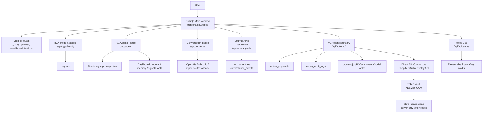
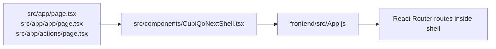
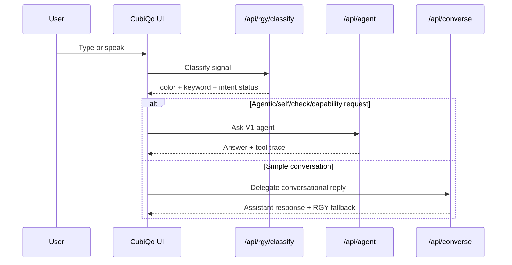
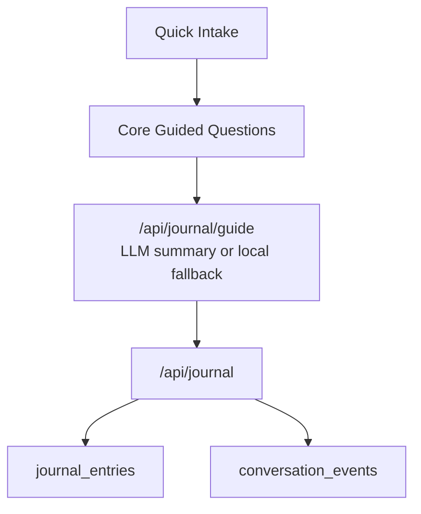
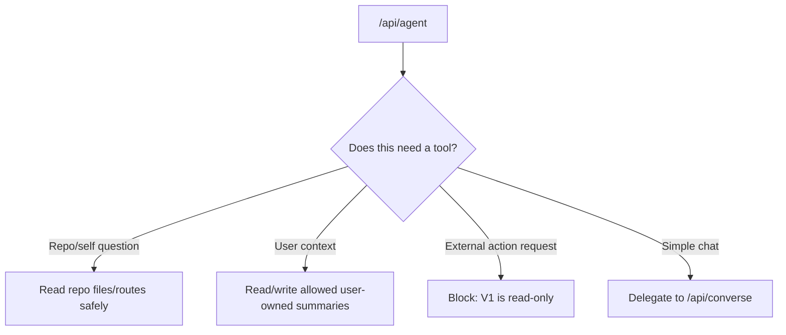
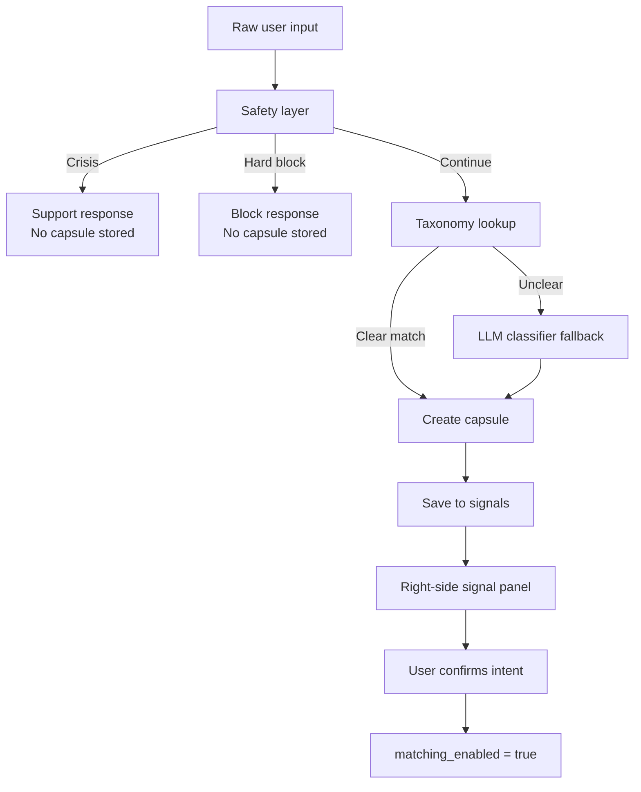
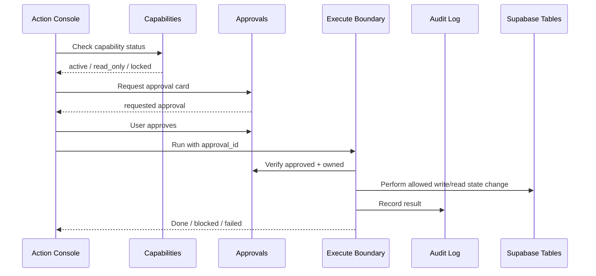
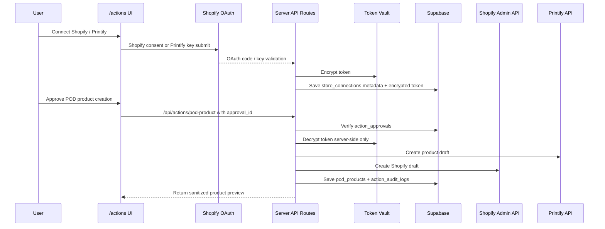
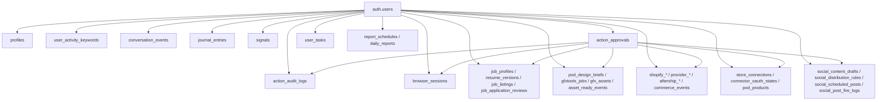
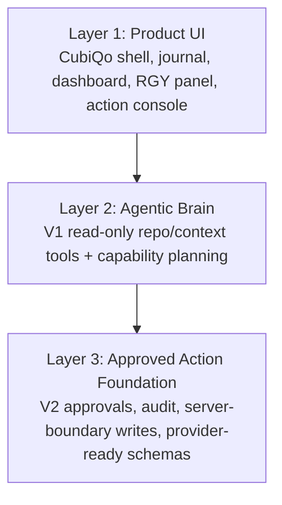

# goodfeatureslegacy Architecture And Feature Audit

Date: 2026-05-10  
Branch: `goodfeatureslegacy`  
Scope: read-only analysis of the current feature branch. QA, prod, and main branches are out of scope.

## Executive Read

`goodfeatureslegacy` is the clean feature branch where CubiQo is becoming an agentic, approval-gated product without touching production. It is not just a visual branch anymore. It now contains:

- The current CubiQo app shell.
- Auth, dashboard, journal, RGY signals, and voice cue wiring.
- A V1 read-only agent that can inspect the repo and user-owned context.
- A V2 approval/action foundation for browser, job hunt, POD, Shopify, social, and reporting workflows.
- A direct Shopify/Printify API connector silo with encrypted server-side token storage and approval-gated POD product actions.
- A large Supabase schema with RLS and server-boundary writes.

The important distinction:

- **Visible product today:** CubiQo shell, journal, dashboard, RGY panel, V2 Action Console, Shopify/Printify connector cards, POD product approval cards.
- **Behind-the-scenes foundation:** browser session container, job application state, resume versions, POD assets, Shopify/POD commerce state, social calendar state, encrypted connector tokens, audit logs.
- **Still not live execution:** autonomous job-board submissions, autonomous social posting, payment/billing operations, coder/write agent, CQ messenger, camera awareness.

## Big Picture



## Current Stack

| Layer | Current State |
| --- | --- |
| App framework | Next.js 16 App Router |
| UI | React 19, legacy React shell dynamically loaded into Next |
| Styling/components | Tailwind, Radix/shadcn-style UI primitives, lucide icons |
| 3D/visuals | Three.js / React Three Fiber assets in frontend components |
| Auth/database | Supabase Auth + Supabase Postgres + RLS |
| AI | Vercel AI SDK `ToolLoopAgent`, OpenAI-compatible model routing, legacy `/api/converse` provider fallback |
| Voice | ElevenLabs cue path, River neutral/androgynous metadata |
| Deployment target | Vercel project `cubiqo-repo` |

Main shell bridge:



## What The User Sees

### Landing

Route: `/`

The first screen remains the CubiQo visual/particle entry experience. It is the front door, not a marketing page.

### Main CubiQo App

Route: `/app`

Visible elements:

- Central CubiQo visual.
- Text input.
- Voice enable/listening path.
- Left tray.
- Right RGY signal panel.
- Agent trace panel called "What I checked" when V1 tools run.
- Auth modal.

Primary flow:



### Daily Journal

Route: `/journal`

Visible elements:

- Quick intake first.
- Core guided journal after intake.
- 15-minute timer.
- Typed input.
- Browser speech capture when supported.
- Summary and save.
- Journal history, edit, delete.

Data flow:



### Dashboard

Route: `/dashboard`

Visible elements:

- Account state.
- Counts for conversations, keywords/signals, journals.
- Durable feature cards only.
- Migration pending notices when a table is missing.

The dashboard is deliberately simple. It does not expose unfinished legacy products as if they are ready.

### V2 Action Console

Route: `/actions`

Visible elements:

- Approval cards.
- Approve/cancel/run flow.
- Active browser session strip and stop button.
- Capability boundary list.
- Job tracker-style state.
- Job profile and resume versions.
- POD/GFX assets.
- Shopify/POD commerce records.
- Shopify API connector card.
- Printify API connector card.
- POD product creation and publish-gate cards.
- Social drafts, rules, scheduled posts, fire logs.
- Audit log.

The Action Console is the "approved actions" lab. It is not the main user experience. Long-term, most work should still feel like it happens inside the CubiQo conversation.

## What Exists Behind The Screen

### V1 Agentic Layer

Route: `/api/agent`

Purpose: let CubiQo answer truthfully about itself and user-owned context without taking unsafe actions.

Capabilities:

- `repo_stack_summary`
- `repo_list_routes`
- `repo_search`
- `repo_read_file`
- `runtime_status`
- `dashboard_summary`
- `journal_read`
- `journal_write_summary`
- `rgy_signal_read`
- `rgy_signal_write`
- `memory_read`
- `memory_write_safe_summary`
- `task_plan_create`
- `content_brief_create`
- `capability_plan`

Boundaries:

- No file writes.
- No deploy.
- No browser control.
- No job submission.
- No social posting.
- No purchasing.
- No workspace command execution.



### RGY Signal System

Route: `/api/rgy/classify`  
Edit/read route: `/api/signals`

RGY is implemented as a **mode reader**, not a person/category label.

Capsule rule:

```json
{
  "color": "green | yellow | red",
  "keyword": "specific activity",
  "intent_status": "pending | suggested | ambiguous | confirmed"
}
```

Supporting saved fields:

- `suggested_intents`
- `confirmed_intents`
- `matching_enabled`
- `confidence`
- `source`
- `raw_input`

Matching rule:

- Classifier can suggest intent.
- Classifier cannot confirm intent.
- Matching remains off until the user confirms at least one intent.
- Red itself is the adult/restricted signal. There is no separate visible risk field.



### V2 Approval Boundary

Main routes:

- `/api/actions/capabilities`
- `/api/actions/approvals`
- `/api/actions/execute`
- `/api/actions/audit`
- `/api/tools/settings`

Rule: every V2 action goes through approval and audit.



Capability status summary:

| Category | State |
| --- | --- |
| Control plane | Active |
| Personal ops | Active, in-app only |
| Diagnostics | Read-only |
| Browser container | Active as session/audit container |
| Job hunt | Active for internal state/review, not external submit |
| POD/GFX/Shopify | Active foundation plus direct API connector silo; real provider calls require credentials and approval |
| Social | Active for drafts/schedules, not platform posting |
| Camera | Permission check only; context read locked |
| Coder/studio | Locked |

### Direct Shopify / Printify API Connector Silo

This is separate from browser automation. It does not use Stagehand, Browserbase, Playwright, Puppeteer, browser sessions, or extension control.

Purpose:

- Connect a Shopify store through OAuth.
- Connect Printify through an API key.
- Store tokens encrypted at rest in Supabase.
- Use tokens only from server-side API routes.
- Create POD product drafts only after a user approval card.
- Publish products only through a separate user-confirmed approval.



Key files:

| Area | File |
| --- | --- |
| Capability manifest | `src/app/api/_lib/v2-capabilities.ts` |
| Token encryption | `src/app/api/_lib/token-vault.ts` |
| Shopify Admin client | `src/app/api/_lib/shopify-client.ts` |
| Printify client | `src/app/api/_lib/printify-client.ts` |
| Shopify OAuth start | `src/app/api/connectors/shopify/auth/route.ts` |
| Shopify OAuth callback | `src/app/api/connectors/shopify/callback/route.ts` |
| Printify connect | `src/app/api/connectors/printify/connect/route.ts` |
| Sanitized connector status | `src/app/api/connectors/status/route.ts` |
| POD create action | `src/app/api/actions/pod-product/route.ts` |
| POD publish gate | `src/app/api/actions/pod-product/publish/route.ts` |

Security rules:

- `access_token` is never selected in client-facing connector status responses.
- Direct browser/client writes to `store_connections` are denied.
- Server routes can read/decrypt tokens only inside the API boundary.
- Tokens are never logged to console or audit rows.
- Shopify billing, payment, checkout, and transaction endpoints are hard-blocked and audit-logged as `blocked_shopify_billing`.
- `shopify_billing`, `payment`, `send_email`, and `deploy` remain locked or hard-stopped.
- Product publish is not autonomous; it requires a separate approved `pod_product_publish` action.

## Feature Matrix

| Feature | Visible? | Backing Code/Data | Current Reality |
| --- | --- | --- | --- |
| Auth | Yes | Supabase Auth, `profiles` | Live foundation |
| Main chat | Yes | `/api/agent`, `/api/converse`, `/api/chat` | Live conversation plus V1 agent doorway |
| RGY panel | Yes | `/api/rgy/classify`, `/api/signals`, `signals` | Live MVP capsule and edit/confirm flow |
| Daily Journal | Yes | `/api/journal`, `/api/journal/guide`, `journal_entries` | Live MVP guided journal |
| Dashboard | Yes | `/api/dashboard` | Live counts and durable feature visibility |
| Voice cue | Yes | `/api/voice-cue`, ElevenLabs | Wired; depends on quota/key |
| V1 self-inspection | Yes, via chat trace | repo-inspection tools | Read-only and live |
| Approval cards | Yes, `/actions` | `action_approvals` | Live |
| Audit logs | Yes, `/actions` | `action_audit_logs` | Live |
| Task write | Yes, `/actions` | `user_tasks` | Active after approval |
| Daily/self report storage | Yes, `/actions` | `daily_reports`, `report_schedules` | In-app only |
| Browser control | Partially | `browser_sessions`, audit logs | Container only; no real browser runtime |
| Job listings | Yes in `/actions` | `job_listings` | Saves approved extracted payloads |
| Job application prepare | Yes in `/actions` | `job_application_reviews` | Review card only |
| Job application submit | Yes as approved state | `job_application_reviews` | Does not externally submit |
| Job profile | Yes in `/actions` | `job_profiles` | Active after approval |
| Resume versions | Yes in `/actions` | `resume_versions` | Append-only after approval |
| POD brief | Yes in `/actions` | `pod_design_briefs` | Active after approval |
| GFXTools job/assets | Yes in `/actions` | `gfxtools_jobs`, `gfx_assets` | Foundation; external call depends on config |
| Shopify API connector | Yes in `/actions` | `store_connections`, OAuth routes, token vault | OAuth path built; token hidden server-side |
| Printify API connector | Yes in `/actions` | `store_connections`, Printify client | API key validation/storage path built; token hidden server-side |
| POD product create/publish | Yes in `/actions` | `pod_products`, Shopify/Printify clients | Create and publish are separate approval-gated actions |
| Shopify product ops | Yes in `/actions` | commerce tables + direct API client | Foundation plus direct draft-create path; blocked if credentials missing |
| Direct POD providers | Yes in manifest/panels | provider tables | Foundation for Printify/Printful/Gelato |
| Shopify app POD providers | Yes as manifest | provider status | Routing/read-only only |
| Social drafts/schedules | Yes in `/actions` | social tables | Internal rows only; no platform posting |
| CQ messenger | No | Not implemented as live feature | Planned only |
| Signal match | No | RGY matching gate only | Matching disabled until explicit future feature |
| Coder/studio | No usable UI | capability entry locked | Not implemented |
| Camera awareness | No usable UI | capability entry locked | Not implemented |
| Wallet/crypto | No | Spec/planning only | Not implemented |

## Supabase Data Model



Tables by migration:

| Migration | Tables / Area |
| --- | --- |
| `20260504000000_cqai_auth_keywords.sql` | `profiles`, `user_activity_keywords`, `conversation_events` |
| `20260506000000_daily_journal.sql` | `journal_entries` |
| `20260507000000_rgy_signals.sql` | `signals` |
| `20260507010000_v2_action_foundation.sql` | approvals, audit, tasks, reports, tool settings |
| `20260508000000_browser_control_foundation.sql` | `browser_sessions`, audit browser session linkage |
| `20260509000000_job_application_workflow.sql` | `job_listings`, `job_application_reviews` |
| `20260510000000_job_profile_resume_versions.sql` | `job_profiles`, `resume_versions` |
| `20260510010000_pod_business_connectors.sql` | `pod_design_briefs`, `gfxtools_jobs` |
| `20260510020000_social_content_distribution.sql` | social drafts, rules, scheduled posts, fire logs |
| `20260510030000_pod_connector_assets.sql` | `gfx_assets`, `asset_ready_events`, Shopify/Printify preparations |
| `20260510040000_shopify_pod_operations.sql` | Shopify, provider, AfterShip, analytics, marketplace, commerce event tables |
| `20260510050000_rgy_classifier_contract.sql` | tightened `signals` contract and matching gate |
| `20260510000003_shopify_pod_connectors.sql` | direct Shopify/Printify API connector silo: `store_connections`, `connector_oauth_states`, `pod_products` |

## Important Use Cases

### Personal / Routine

CubiQo can:

- Help structure a day.
- Create in-session task plans.
- Store approved tasks in V2.
- Store daily/self reports in-app.
- Read journal and memory summaries when signed in.

Not live yet:

- External calendar/email changes.
- Proactive interruption.
- Push/email report delivery.

### Journal / Reflection

CubiQo can:

- Run quick intake.
- Run Core guided questions.
- Listen through browser speech recognition where supported.
- Summarize with OpenAI when available.
- Fall back locally.
- Save to Supabase.

### Career / Job Hunt

CubiQo can:

- Plan job hunt strategy through V1 capability planning.
- Save job profile after approval.
- Append resume versions.
- Save extracted job listings.
- Prepare application review cards.
- Mark an application package approved for visible submission.

Not live yet:

- Fresh job scans from real boards.
- Automatic LinkedIn/Indeed/Dice apply.
- Employer-site browser form completion.
- Resume upload to external sites.
- Recruiter messages.

### Startup / Business Growth

CubiQo can:

- Map startup/business needs.
- Draft strategy, content, POD briefs, and GFXTools-ready concepts.
- Create approved POD/business records.
- Prepare Shopify/POD state.

Not live yet:

- Live market research from search APIs.
- CRM/email outreach.
- Investor/customer messaging.
- Live ad publishing.

### Ecomm / POD / Shopify

CubiQo can:

- Track GFX assets.
- Prepare/rescale asset variants.
- Prepare Shopify/Printify payloads.
- Store Shopify/POD operations state.
- Represent Shopify app providers as routing/read-only.
- Support direct API provider foundations for Printify, Printful, Gelato.
- Start Shopify OAuth from `/actions`.
- Store Shopify Admin API tokens encrypted server-side.
- Validate and store Printify API keys encrypted server-side.
- Create approval-gated Printify and Shopify draft product records through direct APIs.
- Keep product publishing behind a separate explicit approval gate.

Not live yet or credential-dependent:

- Real GFXTools output.
- Real Shopify product creation requires valid Shopify OAuth credentials and store connection QA.
- Real Printify product creation requires valid Printify credentials and provider/product payload QA.
- Direct Printful/Gelato execution remains future work.
- Real AfterShip tracking/returns fetch.
- Shopify billing, checkout, payment, and transaction operations are intentionally not supported.

### Social / Affiliate

CubiQo can:

- Prepare platform-aware social draft rows.
- Store distribution rules.
- Store scheduled post rows and fire logs.

Not live yet:

- Actual LinkedIn/Instagram/X/TikTok/Facebook/Pinterest posting.
- Analytics pull.
- Real 10/10/10 campaign firing.

### Browser / Extension

CubiQo can:

- Create an approved browser session container.
- Record open/click/type/extract/screenshot intents.
- Attach audit rows to `browser_session_id`.
- Stop session from UI.

Not live yet:

- Real Playwright runtime.
- Extension control.
- Cross-site visibility.
- Actual page reading/clicking/typing.

### Coder / Studio

CubiQo can:

- Inspect repo read-only.
- Explain stack/routes/files.
- Plan changes.

Not live yet:

- Writing code.
- Running terminal commands.
- Deploying.
- Acting like Codex inside production.

## Isolation And Safety

The branch uses these guardrails:

- Server-side Supabase service role only in API routes.
- Browser gets public anon key only.
- RLS on user-owned tables.
- Many V2 tables allow user reads but not direct browser writes.
- Writes go through approval APIs and audit logs.
- Capability manifest marks active/read-only/locked.
- Missing credentials return disconnected or blocked, not fake connected.
- Direct connector tokens are encrypted in `store_connections` and never returned through client-facing routes.
- Shopify/Printify direct API calls live in their own silo and do not reuse browser automation.
- Repo inspection denies `.env`, secrets, tokens, `.git`, `.next`, `node_modules`, builds, and large files.
- V1 agent refuses file writes, deploys, browser control, submissions, posting, purchases, and workspace command execution.

## Key Gaps Before This Can Be Called Full Product

1. Real browser runtime or extension is still missing.
2. Real job source connectors/scans are still missing.
3. Real job-board or employer-site submission is still missing.
4. Real Shopify/POD external execution needs live credential QA against the connected store/providers.
5. Real social platform posting and analytics need connector QA.
6. CQ friend messenger is not built yet.
7. Coder/studio write mode is locked.
8. Camera/biometric awareness is not built.
9. Wallet/crypto/payment flows are not built.

## Practical Mental Model

Think of `goodfeatureslegacy` as three layers:



This branch is not "everything is fully automated."  
It is "CubiQo now has a real app shell, a truthful V1 agent doorway, and a serious V2 action foundation."

## Recommended Next Documentation Updates

- Add a dedicated `V2_ACTION_BOUNDARY.md` for exact approval/execution rules.
- Add a `FEATURE_READINESS_MATRIX.md` that can be updated per sprint.
- Add a `SUPABASE_SCHEMA_MAP.md` with each table owner, write boundary, and RLS status.
- Add a `USER_VISIBLE_SURFACES.md` to prevent unfinished features from leaking into the UI.
