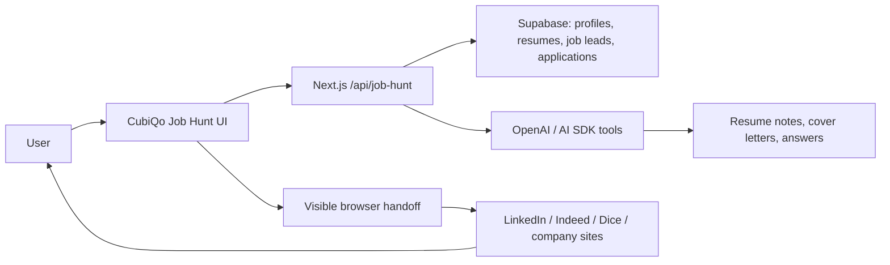

# Job Hunt Mode Scope

Date: 2026-05-06
Target branch: `QA/lagacy_feature_branch`

## Boundary

Job Hunt Mode can become a strong agentic workflow, but it cannot be designed as an undetected bot or anti-detection system.

LinkedIn, Indeed, and Dice each restrict unauthorized automated access, scraping, or automated submission behavior. CubiQo should therefore use a compliant copilot pattern:

- user-owned profile and resume data
- official APIs or permitted integrations where available
- manual/user-reviewed browser handoff where site policies require it
- visible actions, rate limits, and audit logs
- no CAPTCHA bypass, fingerprint spoofing, proxy rotation, stealth plugins, fake human behavior, or hidden automation

## MVP Completion Definition

Job Hunt is complete for QA when:

1. The user can create a job-hunt profile: target titles, locations, visa/work prefs, salary, skills, resume, portfolio links.
2. CubiQo can store and retrieve the profile in Supabase with RLS.
3. The user can add/import job leads manually or from permitted sources.
4. CubiQo can generate tailored resume notes, cover-letter drafts, recruiter messages, and application answers.
5. The user can track each application through `saved`, `drafted`, `ready`, `applied`, `interview`, `offer`, `rejected`.
6. CubiQo can open an application handoff checklist for LinkedIn/Indeed/Dice/company websites.
7. The final submit action remains user-approved unless an official permitted apply API exists.
8. Every generated answer/application packet is logged for review.

## Architecture

## Supabase Tables

- `job_hunt_profiles`
- `job_hunt_resumes`
- `job_hunt_leads`
- `job_hunt_applications`
- `job_hunt_application_events`
- `job_hunt_generated_assets`

## Browser/Extension Strategy

Allowed:

- extension reads the current page URL/title after user click
- user-selected form-field assistance
- copy-ready answer packets
- visible step-by-step checklist
- manual takeover at login, CAPTCHA, identity verification, payment, or final submit
- audit log of what CubiQo suggested

Not allowed:

- stealth automation
- bot detection bypass
- CAPTCHA solving
- fingerprint spoofing
- proxy rotation to evade limits
- hidden page scraping
- fake interaction patterns to look human
- mass applying without user review

## Implementation Phases

### Phase 1: QA Planner

- Add `/job-hunt`.
- Add Supabase schema.
- Add profile, resume, leads, applications, and generated asset APIs.
- Let user create jobs manually and generate application packets.

### Phase 2: Browser Handoff

- Add a small extension or browser handoff panel.
- Detect supported sites by URL.
- Provide field-by-field suggestions.
- Require user click for final submit.

### Phase 3: Approved Integrations

- Add official APIs or partner tooling where available.
- Add import/export for CSV, email, calendar, and CRM-style pipeline.

### Phase 4: Agentic Runs

- CubiQo can run a daily job search plan, prepare drafts, rank opportunities, and ask for approval.
- Any site action remains bounded by site policy and user consent.

## Open Requirements

1. Which sites are P0: LinkedIn, Indeed, Dice, company career pages, or all four?
2. Should CubiQo store resume files in Supabase Storage, Vercel Blob, or only text/structured resume content first?
3. Should final submit always be manual in QA?
4. Is the first user persona US tech jobs, general jobs, or founder/business development?
